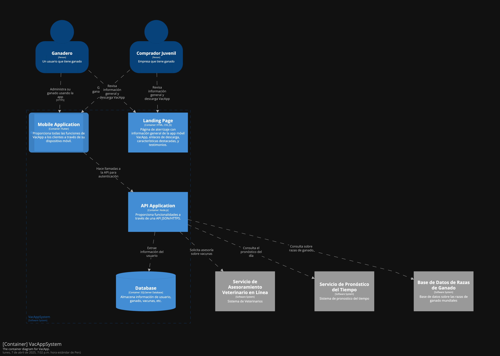

    <h1>UNIVERSIDAD PERUANA  DE CIENCIAS APLICADAS</h1>
        
    <h2>1ACC0238 - Aplicaciones para Dispositivos Móviles</h2>
        
<strong>NRC:</strong> 353

        
<strong>Carrera:</strong> Ingeniería de Software

        
<strong>Ciclo:</strong> 6

        
<strong>Profesor:</strong> Jorge Luis Mayta Guillermo

    <h3>"Informe de Trabajo Final"</h3>
    <h4>TB1</h4>
        
<strong>Tema:</strong> Gestion de ganaderia 

        
<strong>Producto:</strong> VacApp de Bovinova

        
<strong>Abril 2025</strong>

    <h3>Integrantes:</h3>
        <ul>
            <li>Gómez Vallejos, Sergio André - U20221D401</li>
            <li>Rojas Velasquez, Maycol Jhordan - U202219984</li>
            <li>Aranda Vallejos, Oscar Gabriel - U202218167</li>
            <li>Ticona Panduro, Estrella del Pilar - U202210659</li>
            <li>Durand Vera, Gianfranco Angel - U20201f640</li>
            <li>Miranda Sinarahua, Piero Stephano - U20181g752</li>
        </ul>

  <strong>Registro de versiones de informe:</strong> 

| Entregables | Fecha       | Autor                             | Descripción de modificación                                                                                      |  
|-------------|-------------|----------------------------------|------------------------------------------------------------------------------------------------------------------|  
| TB1         | 6/4/2025    | Maycol Jhordan Rojas Velásquez   | Implementación de la estructuración del informe.                                                                 |  
| TB1         | 7/4/2025    | Maycol Jhordan Rojas Velásquez   | Se agregó la descripción y los segmentos objetivos de la Startup.                                                |  
| TB1         | 7/4/2025    | Maycol Jhordan Rojas Velásquez   | Implementación de los diagramas C4: contexto y contenedores.                                                     |  
| TB1         | 23/4/2025   | Maycol Jhordan Rojas Velásquez   | Implementación del diagrama de despliegue.                                                                       |  
| TB1         | 23/4/2025   | Maycol Jhordan Rojas Velásquez   | Agregado parcial del bounded context "Campaign".                                                                 |  
| TB1         | 23/4/2025   | Maycol Jhordan Rojas Velásquez   | Agregado parcial del bounded context "Ranch".                                                                    |  
| TB1         | 23/4/2025   | Maycol Jhordan Rojas Velásquez   | Agregado del "Student Outcome".                                                                                    |  

**Project Report Collaboration Insights**

### URL del Repositorio 
https://github.com/orgs/Bovinova/repositories

  Tabla de contenido
  

1. [CAPÍTULO I: Presentacion](#CAPÍTULO-I-Introducción) 
    1.1. [Startup Profile](#Startup-Profile) 
      1.1.1. [Descripción de la Startup](#Descripción-de-la-Startup) 
      1.1.2. [Perfiles de integrantes del equipo](#Perfiles-de-integrantes-del-equipo) 
   1.2. [Solution Profile](#Solution-Profile) 
      1.2.1. [Antecedentes y problemática](#Antecedentes-y-problemática) 
      1.2.2. [Lean UX Process](#Lean-UX-Process) 
        1.2.2.1 [Lean UX Problem Statements](#Lean-UX-Problem-Statements) 
        1.2.2.2 [Lean UX Assumptions](#Lean-US-Assumptions) 
        1.2.2.3 [Lean UX Hypothesis Statements](#Lean-UX-Hypothesis-Statements) 
        1.2.2.4 [Lean UX Canvas](#Lean-UX-Canvas)  
    1.3. [Segmentos objetivo](#Segmentos-objetivo)  
2. [CAPÍTULO II: Requirements Elicitation & Analysis](#Capítulo-II-Requirements-Elicitation--Analysis)  
   2.1. [Competidores](#Competidores)  
      2.1.1. [Análisis competitivo](#Análisis-competitivo)  
      2.1.2. [Estrategias y tácticas frente a competidores](#Estrategias-y-tácticas-frente-a-competidores)  
   2.2. [Entrevistas](#Entrevistas)  
      2.2.1. [Diseño de entrevistas](#Diseño-de-entrevistas)  
      2.2.2. [Registro de entrevistas](#Registro-de-entrevistas)  
      2.2.3. [Análisis de entrevistas](#Análisis-de-entrevistas)  
   2.3. [Needfinding](#Needfinding)  
      2.3.1. [User Personas](#User-Personas)  
      2.3.2. [User Task Matrix](#User-Task-Matrix)  
      2.3.3. [User Journey Mapping](#User-Journey-Mapping)  
      2.3.4. [Empathy Mapping](#Empathy-Mapping)  
      2.3.5. [As-is Scenario Mapping](#As-is-Scenario-Mapping)  
   2.4. [Ubiquitous Language](#Ubiquitous-Language)  
3. [CAPÍTULO III: Requirements Specification](#Capítulo-III-Requirements-Specification)  
   3.1. [To-Be Scenario Mapping](#To-Be-Scenario-Mapping)  
   3.2. [User Stories](#User-Stories)  
   3.3. [Impact Mapping](#Impact-Mapping)  
   3.4. [Product Backlog](#Product-Backlog)  
4. [CAPÍTULO IV: Solution Software Design](#capítulo-iv-solution-software-design)  
   4.1. [Strategic-Level Domain-Driven Design](#strategic-level-domain-driven-design)  
      4.1.1. [EventStorming](#eventstorming)  
         4.1.1.1. [Candidate Context Discovery](#candidate-context-discovery)  
         4.1.1.2. [Domain Message Flows Modeling](#domain-message-flows-modeling)  
         4.1.1.3. [Bounded Context Canvases](#bounded-context-canvases)  
      4.1.2. [Context Mapping](#context-mapping)  
      4.1.3. [Software Architecture](#software-architecture)  
         4.1.3.1. [Software Architecture Context Level Diagrams](#software-architecture-context-level-diagrams)  
         4.1.3.2. [Software Architecture Container Level Diagrams](#software-architecture-container-level-diagrams)  
         4.1.3.3. [Software Architecture Deployment Diagrams](#software-architecture-deployment-diagrams)  
   4.2. [Tactical-Level Domain-Driven Design](#tactical-level-domain-driven-design)  
      4.2.X. [Bounded Context: &lt;Bounded Context Name&gt;](#bounded-context-bounded-context-name)  
         4.2.X.1. [Domain Layer](#domain-layer)  
         4.2.X.2. [Interface Layer](#interface-layer)  
         4.2.X.3. [Application Layer](#application-layer)  
         4.2.X.4. [Infrastructure Layer](#infrastructure-layer)  
         4.2.X.5. [Bounded Context Software Architecture Component Level Diagrams](#bounded-context-software-architecture-component-level-diagrams)  
         4.2.X.6. [Bounded Context Software Architecture Code Level Diagrams](#bounded-context-software-architecture-code-level-diagrams)  
            4.2.X.6.1. [Bounded Context Domain Layer Class Diagrams](#bounded-context-domain-layer-class-diagrams)  
            4.2.X.6.2. [Bounded Context Database Design Diagram](#bounded-context-database-design-diagram)  

   # STUDENT OUTCOME
El curso contribuye al cumplimiento del Student Outcome ABET: 
##### ABET – EAC - Student Outcome 7 
Criterio: La capacidad de adquirir y aplicar nuevos conocimientos según sea
necesario, utilizando estrategias de aprendizaje apropiadas.

| **Criterio específico** | **Acciones realizadas** | **Conclusiones** |  
|-------------------------|------------------------|------------------|  
| Actualiza conceptos y conocimientos necesarios para su desarrollo profesional y en especial para su proyecto en soluciones de software | 1. Gómez Vallejos, Sergio André ------    2. Rojas Velasquez, Maycol Jhordan: Aplicó los conocimientos necesarios para el proyecto, desarrollando los diagramas C4 y definiendo el segmento objetivo.    3. Aranda Vallejos, Oscar Gabriel ------    4. Ticona Panduro, Estrella del Pilar ------    5. Durand Vera, Gianfranco Angel ------    6. Miranda Sinarahua, Piero Stephano ------    |------- |  
| Reconoce la necesidad del aprendizaje permanente para el desempeño profesional y el desarrollo de proyectos en soluciones de software |  1. Gómez Vallejos, Sergio André ------    2. Rojas Velasquez, Maycol Jhordan: Desarrollé los temas alcanzados en los ciclos anteriores, lo que me permitió adquirir conocimientos sólidos sobre el tema y realizarlos correctamente.    3. Aranda Vallejos, Oscar Gabriel ------    4. Ticona Panduro, Estrella del Pilar ------    5. Durand Vera, Gianfranco Angel ------    6. Miranda Sinarahua, Piero Stephano ------    | ---- |

# OBJETIVOS SMART

| Estudiante | Objetivo SMART |
|------------|-----------|
|Maycol Jhordan Rojas Velasquez | Mi Objetivo es poder alcanzar un desempeño profesional en analisis forense y en el diseño de nuevas apliaciones moviles, que ayuden en la sociedad, siguiendo todo lo aprendido y gestionando correctamente las buenas practicas.

# 1. CAPÍTULO I: Presentacion
## 1.1. Startup Profile
### 1.1.1. Descripción de la Startup

__Nombre del Start:__ VacApp

VacApp es una avanzada aplicación movil diseñada para capacitar a los ganaderos en la gestión eficiente y sostenible de su ganado. Esta plataforma ofrece una amplia gama de herramientas integrales que permiten a los usuarios realizar un seguimiento detallado de la salud, alimentación y reproducción de sus animales, lo que facilita una mejor toma de decisiones en la granja. Con PecuarioPro, los ganaderos pueden optimizar sus operaciones y maximizar sus ingresos, al tiempo que promueven prácticas agrícolas sostenibles y éticas, lo que contribuye al bienestar de los animales y al desarrollo sostenible de la industria ganadera.

### **Colaboraciones Estrategicas:**

En Bovinova, estamos comprometidos a establecer solidad alianzas con cadenas de ganaderia, pequeños ganaderos y empresas ganaderas. Trabajamos en estrecha colaboración con estos socios para garantizar que nuestras soluciones tecnológicas respondan a sus necesidades operativas, facilitando la gestión diaria y mejorando la satisfacción del cliente. Invitamos a los ganaderos a integrar nuestras soluciones para optimizar la administración de ganado, la gestión de alimentacion, y la atención al cliente, creando una experiencia más fluida y eficiente.

### **Innovación y Tecnología**
Nuestra plataforma utiliza tecnologías avanzadas para ofrecer una experiencia optimizada en la gestión ganadera. Desde el monitoreo de la salud, alimentación y reproducción del ganado, hasta la automatización de procesos clave en la granja, **VacApp** busca transformar la forma en que los ganaderos administran sus actividades diarias. Queremos que cada productor pecuario se sienta respaldado por una solución tecnológica que le permita tomar decisiones informadas, mejorar la eficiencia operativa y promover una producción sostenible y ética.

### **Comunidad y Funciones Sociales**
**VacApp** no es solo una herramienta de gestión; es también un espacio de aprendizaje y colaboración entre ganaderos. La plataforma incluye funciones que permiten a los usuarios compartir buenas prácticas, estrategias de manejo y mantenerse actualizados con las últimas innovaciones en el sector pecuario. Esta comunidad activa fomenta la mejora continua, el intercambio de conocimientos y el fortalecimiento de una red ganadera comprometida con el desarrollo sostenible y el bienestar animal.

### **Visión**
Visualizamos un mundo donde la tecnología y la ganadería se integran para impulsar una producción más eficiente, responsable y rentable. Nuestro objetivo es que **VacApp** sea sinónimo de innovación en el manejo ganadero, un aliado indispensable para los productores que desean evolucionar hacia un modelo más moderno, conectado y sostenible. Aspiramos a liderar una transformación positiva en la industria, basada en la tecnología, la ética y el compromiso con el campo.

### **Misión**
Nos esforzamos por ofrecer una plataforma integral que empodere a los ganaderos con herramientas inteligentes de gestión, mejorando su productividad y calidad de vida. Estamos decididos a utilizar la tecnología como motor de cambio en el sector pecuario, contribuyendo al bienestar animal, la sostenibilidad ambiental y el desarrollo económico de las comunidades rurales. **VacApp**, impulsado por **Bovinova**, será símbolo de excelencia, innovación y compromiso con el futuro de la ganadería.

### 1.1.2. Perfiles de integrantes del equipo

| Integrante | Descripción |
| ---- | --- |
|  | Sergio André Gómez Vallejos – Ingeniería de Software – u20221d401   Soy una persona resiliente que, sin importar cuántas veces caiga, siempre encuentra la manera de levantarse. Tengo habilidades sociales sólidas y una amplia experiencia en la resolución de problemas de código. Suelo ser el miembro más activo de mi equipo de trabajo. Me apasionan los lenguajes de programación y la tecnología, y constantemente me esfuerzo por alcanzar mis objetivos y contribuir al desarrollo del startup. |
|  |Aranda Vallejos, Oscar Gabriel - U202218167   |
||Maycol Jhordan Rojas Velasquez – Ingeniería de Software – u202219984 Elegí la carrera de Ingeniería de Software debido a mi gusto por la innovación y la implementación de la tecnología en cualquier rubro  social, de una manera creativa y en todos los aspectos. Me considero una persona creativa, en busca de ideas, estrategias con mente nueva. También me gusta escuchar ideas de mi equipo, dar ideas de mejora, evaluar las ventajas y desventajas . Además, tengo conocimientos de programación en C + +, HTML, Python,Angular,Backend en Java. Además, Tengo un enfoque responsable y dedicado mediante un aprendizaje rápido así puedo ayudar a mis compañeros en sus dudas. Por otro lado, mis hobbies son ver series, jugar , escuchar música, nadar y  manejar.|
| | Ticona Panduro, Estrella del Pilar - U202210659   |
|  | Durand Vera, Gianfranco Angel - U20201f640  |
|| Miranda Sinarahua, Piero Stephano - U20181g752   | 

## 1.2. Solution Profile
## 1.2.1 Antecedentes y problemática
### 1.2.2 Lean UX Process.
#### 1.2.2.1. Lean UX Problem Statements
#### 1.2.2.2. Lean UX Assumptions
#### 1.2.2.3. Lean UX Hypothesis Statements
#### 1.2.2.4. Lean UX Canvas

## 1.3. Segmentos objetivo

### Descripción de cada segmento objetivo:

La aplicación VacApp ha sido diseñada pensando en las diversas realidades del sector ganadero peruano, abarcando tanto a pequeños productores independientes como a grandes empresas dedicadas a la actividad pecuaria. Cada segmento presenta necesidades, objetivos y desafíos específicos que nuestra plataforma busca atender con soluciones tecnológicas prácticas, accesibles y sostenibles.

A continuación, se detalla el perfil de nuestros principales segmentos objetivos, identificando sus características, motivaciones y problemáticas, con el fin de adaptar y mejorar constantemente nuestros servicios para ofrecerles el mayor valor posible.

#### Productores Ganadores independientes:
Este segmento objetivo de nuestra plataforma se centra en los ganaderos independientes comprometidos y preocupados por obtener ganancias de manera ética y sostenible, mientras garantizan una excelente calidad en el cuidado de sus animales en propiedad. Este grupo comprende a ganaderos que poseen una variedad de animales, tales como ovejas, vacas, reses, corderos, gallinas, entre otros, y que residen en Perú. Su principal objetivo es asegurarse de que el estado y cuidado de sus animales sea óptimo, priorizando el bienestar y la salud de estos. Además, están interesados en llevar a cabo prácticas de venta honestas, con un enfoque en productos más naturales y de alta calidad. Como obtener información de nuevos métodos de cuidado animal.

#### Empresas Ganaderas:
El segmento objetivo de nuestra plataforma se dirige específicamente a grandes empresas corporativas involucradas en la gestión y cuidado de animales. Estas empresas se destacan por su firme compromiso con prácticas éticas y sostenibles en la producción ganadera. Su principal preocupación radica en garantizar que sus animales reciban una alimentación precisa, óptima y honesta, priorizando la salud y el bienestar de cada individuo. Asimismo, estas empresas se preocupan por brindar un cuidado individual a cada animal, asegurándose de que reciban la atención necesaria para su desarrollo y bienestar. Asimismo, contar con un sistema integral de gestión veterinaria, que garantiza un acceso constante y adecuado a servicios de atención médica veterinaria para sus animales.

### Datos cuantitativos del problema:

#### Productores Ganadores independientes:
Se han registrado numerosos incidentes en los que los productores ganaderos peruanos no reciben una compensación justa en los mercados, y enfrentan dificultades significativas en la gestión del cuidado de sus animales debido a la escasez de recursos económicos y la limitada accesibilidad a servicios veterinarios para consultas y atención adecuada. Estas circunstancias han creado desafíos sustanciales para los ganaderos, quienes luchan por mantener la salud y el bienestar de sus animales mientras buscan asegurar su propio sustento económico en un entorno cada vez más desafiante y competitivo. Se estima que al menos el 15% de los animales muertos en las granjas se debe a la falta de acceso oportuno a servicios veterinarios adecuados, lo que genera pérdidas económicas significativas para los productores, estimadas en un 20% de sus ingresos anuales debido a la falta de compensación justa de los mercados hacia ellos.

#### Empresas Ganaderas:
En el Perú, el bienestar animal en las empresas ganaderas es a menudo insuficiente, con un preocupante porcentaje del 60% de las operaciones que no cumplen con estándares aceptables en este aspecto. Esta deficiencia se refleja en condiciones de vida inadecuadas para el ganado, como la falta de espacio y la alimentación deficiente, lo que afecta negativamente su salud y bienestar. Además, la gestión de residuos en estas empresas es inadecuada en aproximadamente un 70% de los casos, lo que resulta en una incorrecta disposición de los desechos animales y una potencial contaminación del medio ambiente. Esta situación representa un desafío significativo para la industria ganadera, ya que no solo compromete el bienestar de los animales, sino que también puede tener repercusiones negativas en la salud pública y el medio ambiente.

### Variables geográficas, demográficas y psicológicas:

#### Variable geográfica:
- País: Perú
- Ciudad: zonas rurales 

#### Variable demográfica:
- Género: Femenino / Masculino.
- Ocupación: Productores ganaderos 
- Estado civil: Todos los estados
- Edad y etapa de ciclo de vida:
- Ciudadanos mayores a 18 años.

#### Variable psicográfica:
- Nivel Socioeconómico (NSE): todos los niveles socioeconomicos
- Características de personalidad:
 - Altruismo 
 - Perseverante
 - Honestidad

# 2. CAPÍTULO II: Requirements Elicitation & Analysis
## 2.1. Competidores
### 2.1.1. Análisis competitivo
### 2.1.2. Estrategias y tácticas frente a competidores

## 2.2. Entrevistas
### 2.2.1. Diseño de entrevistas
### 2.2.2. Registro de entrevistas
### 2.2.3. Análisis de entrevistas

## 2.3. Needfinding
### 2.3.1. User Personas
### 2.3.2. User Task Matrix
### 2.3.3. User Journey Mapping
### 2.3.4. Empathy Mapping
### 2.3.5. As-is Scenario Mapping

## 2.4. Ubiquitous Language

# 3. CAPÍTULO III: Requirements Specification
## 3.1. To-Be Scenario Mapping
## 3.2. User Stories
## 3.3. Impact Mapping
## 3.4. Product Backlog

# 4. CAPÍTULO IV: Solution Software Design
## 4.1. Strategic-Level Domain-Driven Design
### 4.1.1. EventStorming
#### 4.1.1.1. Candidate Context Discovery

#### 4.1.1.2. Domain Message Flows Modeling

#### 4.1.1.3. Bounded Context Canvases
### 4.1.2. Context Mapping
### 4.1.3. Software Architecture
En esta sección, se presentan los diagramas C4 que describen la arquitectura del sistema VacApp, una solución integral para la gestión del ganado. Estos diagramas proporcionan una representación clara de cómo se organiza el sistema, cómo interactúan sus componentes y cómo se implementan en el entorno de ejecución.
#### 4.1.3.1. Software Architecture Context Level Diagrams

El Diagrama de Contexto muestra la interacción de VacApp con los actores externos, como los ganaderos y las empresas, así como otros sistemas externos que proporcionan servicios clave, como el pronóstico del tiempo, bases de datos de razas de ganado y servicios veterinarios. Este diagrama proporciona una visión de alto nivel del sistema, ayudando a entender cómo VacApp se integra en el ecosistema de gestión del ganado.

#### 4.1.3.2. Software Architecture Container Level Diagrams
El Diagrama de Contenedores proporciona un nivel de detalle más profundo, mostrando los contenedores principales dentro de VacApp. Estos incluyen la aplicación web, la aplicación móvil, la API y la base de datos. Este diagrama ilustra cómo los diferentes componentes interactúan entre sí, permitiendo que los usuarios gestionen sus ganados, vacunas, salud y alimentación de manera eficiente. También muestra cómo la aplicación se comunica con sistemas externos, como el servicio de pronóstico del tiempo y las bases de datos de razas.

#### 4.1.3.3. Software Architecture Deployment Diagrams

Los Deployment Diagrams (diagramas de despliegue) forman parte de la arquitectura de software y son esenciales para representar cómo los componentes del sistema se distribuyen físicamente en el entorno de ejecución. Estos diagramas muestran la disposición de hardware (nodos) y la manera en que los artefactos de software se instalan en ellos, permitiendo visualizar la infraestructura que soporta la aplicación. Su propósito principal es ilustrar la relación entre el software y el hardware, detallando aspectos como servidores, dispositivos de red, bases de datos, y cómo interactúan entre sí.

## 4.2. Tactical-Level Domain-Driven Design

# 4.2.1. Bounded Context: Campaign Management
En el contexto de VacApp, el módulo de Campaign Management representa una parte clave del sistema encargada de la creación, organización y seguimiento de campañas de comunicación, capacitación y promoción dirigidas a los ganaderos. Estas campañas pueden abarcar desde campañas educativas sobre buenas prácticas ganaderas, hasta promociones de nuevas funcionalidades de la app o actividades colaborativas dentro de la comunidad ganadera.

Este bounded context se encarga de modelar el ciclo de vida completo de una campaña dentro de la plataforma, permitiendo su planificación estructurada mediante la definición de objetivos (como metas de participación o impacto), fechas de inicio y finalización, y canales a través de los cuales se difundirán los mensajes (como notificaciones push, correo electrónico o módulos dentro de la app).

### 4.2.1.1. Domain Layer
    
| Clase                  | Tipo             | Propósito                                                                 | Atributos                                                                                       |
|------------------------|------------------|---------------------------------------------------------------------------|--------------------------------------------------------------------------------------------------|
| Campaign               | Entity           | Representa una campaña y su ciclo de vida                                | `id`, `name`, `description`, `startDate`, `endDate`, `status`, `ownerId`                        |
| Goal                   | Entity           | Define un objetivo medible de la campaña                                 | `id`, `description`, `metric`, `targetValue`, `currentValue`                                    |
| Channel                | Entity           | Medio por el cual se difunde la campaña                                  | `id`, `type`, `details`                                                                         |
| CampaignPeriod         | Value Object     | Representa el rango de fechas de una campaña                             | `start: Date`, `end: Date`                                                                      |
| CampaignAggregateRoot  | Aggregate         | Coordina entidades relacionadas a la campaña                             | `Campaign`, `Goals`, `Channels`                                                                 |
| CampaignFactory        | Factory          | Crea campañas asegurando reglas del dominio                              | `create(name, description, period, ownerId)`                                                    |
| ICampaignRepository    | Repository (interface) | Define acceso a campañas desde almacenamiento                       | `findById(id)`, `save(campaign)`, `delete(id)`                                                  |
| CampaignSchedulerService | Domain Service | Verifica conflictos de tiempo entre campañas                             | `checkOverlap(campaign: Campaign)`                                                              |

4.2.1.2. Interface Layer
| Clase                    | Tipo              | Propósito                                                                   | Atributos / Métodos                                                       |
|--------------------------|-------------------|------------------------------------------------------------------------------|----------------------------------------------------------------------------|
| CampaignController       | Controller         | Maneja endpoints HTTP para gestionar campañas                               | `POST /campaigns`, `GET /:id`, `PATCH /:id/status`, `POST /:id/goals`     |
| CreateCampaignDTO        | DTO               | Objeto para crear campañas vía interfaz                                     | `name`, `description`, `startDate`, `endDate`, `ownerId`                  |
| GoalDTO                  | DTO               | Objeto para crear metas asociadas a campañas                                | `description`, `metric`, `targetValue`                                    |
| CampaignNotificationConsumer | Consumer       | Escucha eventos relacionados con campañas y ejecuta acciones (notificaciones) | `onEvent(CampaignCreated|StatusUpdated)`                                  |

4.2.2.3. Application Layer
| Clase                        | Tipo              | Propósito                                                                                      | Atributos / Métodos                                                                            |
|------------------------------|-------------------|-----------------------------------------------------------------------------------------------|------------------------------------------------------------------------------------------------|
| CreateCampaignCommand        | Command           | Representa la intención de crear una campaña                                                  | `name`, `description`, `startDate`, `endDate`, `ownerId`                                      |
| CreateCampaignCommandHandler| Command Handler   | Maneja el flujo de creación de campaña y coordinación entre capas                             | `handle(command: CreateCampaignCommand)`                                                       |
| DeleteCampaignCommand        | Command           | Representa la intención de eliminar una campaña                                                  | `name`, `description`, `startDate`, `endDate`, `ownerId`                                      |
| DeleteCampaignCommandHandler| Command Handler   | Maneja el flujo para la eliminación de una campaña y coordinación entre capas                             | `handle(command: DeleteCampaignCommand)`                                                       |
| UpdateCampaignStatusCommand | Command           | Encapsula la solicitud de cambio de estado para una campaña                                   | `campaignId`, `newStatus`                                                                     |
| UpdateCampaignStatusHandler | Command Handler   | Ejecuta la lógica de cambio de estado (activar, pausar, completar)                            | `handle(command: UpdateCampaignStatusCommand)`                                                 |
| AddGoalToCampaignCommand     | Command           | Representa la intención de agregar un objetivo a una campaña                                  | `campaignId`, `description`, `metric`, `targetValue`                                           |
| AddGoalToCampaignHandler     | Command Handler   | Agrega un objetivo a la campaña correspondiente                                               | `handle(command: AddGoalToCampaignCommand)`                                                    |
| CampaignCreatedEvent         | Domain Event      | Evento que indica que una campaña ha sido creada                                              | `campaignId`, `name`, `ownerId`                                                                |
| CampaignCreatedEventHandler  | Event Handler     | Reacciona al evento de campaña creada y ejecuta acciones (e.g., notificación, logging)        | `handle(event: CampaignCreatedEvent)`                                                          |

4.2.1.4. Infrastructure Layer

| Clase                              | Tipo                  | Propósito                                                                                 | Atributos / Métodos                                                                            |
|------------------------------------|-----------------------|--------------------------------------------------------------------------------------------|------------------------------------------------------------------------------------------------|
| CampaignRepositoryImpl             | Repository Impl       | Implementación concreta de `ICampaignRepository`, con acceso a base de datos              | `findById()`, `save()`, `delete()`                                                            |
| WeatherService                     | External Service      | Servicio que obtiene datos climáticos relevantes para campañas                            | `getCurrentWeather(location: string): WeatherInfo`                                            |
| CattleBreedService                 | External Service      | Servicio que provee razas de bovinos para campañas enfocadas en agropecuaria              | `getBreedsByRegion(region: string): Breed[]`                                                  |
| EventBusImpl                       | Message Broker Impl   | Publica eventos de dominio hacia otros contextos o servicios                              | `publish(event: DomainEvent)`                                                                 |
| CampaignNotificationConsumer       | Consumer              | Escucha eventos desde cola o broker y dispara lógica asociada                             | `onMessage(event: CampaignCreatedEvent | CampaignStatusChangedEvent)`                          |

### 4.2.1.5. Bounded Context Software Architecture Component Level Diagrams

### 4.2.1.6. Bounded Context Software Architecture Code Level Diagrams
### 4.2.1.6.1. Bounded Context Domain Layer Class Diagrams
### 2.6.1.6.2. Bounded Context Database Design Diagram

# 4.2.2. Bounded Context: Ranch Management 
### 4.2.2.1. Domain Layer

| Clase             | Tipo               | Propósito                                                                 | Atributos                                                                                       |
|-------------------|--------------------|---------------------------------------------------------------------------|--------------------------------------------------------------------------------------------------|
| Bovine            | Entity             | Representa a un bovino dentro del rancho                                  | `id`, `name`, `birthDate`, `breed`, `vaccines: Vaccine[]`, `stableId`                           |
| Vaccine           | Entity             | Representa una vacuna aplicada a un bovino                                | `id`, `name`, `applicationDate`, `bovineId`                                                     |
| Stable            | Entity             | Representa un establo que agrupa varios bovinos                           | `id`, `name`, `location`, `bovines: Bovine[]`                                                   |
| Race             | Value Object       | Representa la raza del bovino, tomada del servicio externo                | `code`, `name`, `originRegion`                                                                  |
| BovineAggregate   | Aggregate           | Coordina la creación y gestión de bovinos y su información sanitaria      | `Bovine`, `Vaccines`, `Stable`                                                                  |
| BovineFactory     | Factory            | Crea un nuevo bovino con datos validados y raza asignada                 | `create(name, birthDate, breedCode, stableId)`                                                  |
| IBovineRepository | Repository (interface) | Interfaz para persistencia y recuperación de bovinos                 | `findById(id)`, `save(bovine)`, `delete(id)`                                                    |

---

### 4.2.2.2. Interface Layer

| Clase                  | Tipo              | Propósito                                                              | Métodos / Endpoints                                                        |
|------------------------|-------------------|------------------------------------------------------------------------|-----------------------------------------------------------------------------|
| BovineController       | Controller        | Gestiona endpoints para registro y manejo de bovinos                   | `POST /bovines`, `GET /bovines/:id`, `PATCH /bovines/:id`, `DELETE /bovines/:id` |
| StableController       | Controller        | Gestión de establos y asignación de bovinos                            | `POST /stables`, `GET /stables/:id`, `POST /stables/:id/bovines`           |
| VaccineController      | Controller        | Registro de vacunas para bovinos                                       | `POST /vaccines`, `GET /vaccines/by-bovine/:bovineId`                      |
| CreateBovineDTO        | DTO               | Datos requeridos para registrar un bovino                              | `name`, `birthDate`, `breedCode`, `stableId`                               |
| CreateStableDTO        | DTO               | Datos requeridos para registrar un establo                             | `name`, `location`                                                         |
| ApplyVaccineDTO        | DTO               | Datos requeridos para registrar una vacuna                             | `bovineId`, `vaccineName`, `applicationDate`                               |

---

### 4.2.2.3. Application Layer

| Clase                      | Tipo             | Propósito                                                                  | Atributos / Métodos                                                          |
|----------------------------|------------------|-----------------------------------------------------------------------------|-------------------------------------------------------------------------------|
| RegisterBovineCommand      | Command          | Representa la intención de registrar un nuevo bovino                       | `name`, `birthDate`, `breedCode`, `stableId`                                 |
| RegisterBovineCommandHandler      | Command Handler  | Lógica para registrar un bovino, obteniendo raza del servicio externo      | `handle(command: RegisterBovineCommand)`                                     |
| ApplyVaccineCommand        | Command          | Encapsula la intención de aplicar una vacuna a un bovino                  | `bovineId`, `vaccineName`, `applicationDate`                                 |
| ApplyVaccineHandler        | Command Handler  | Maneja la lógica de vacunación de un bovino                               | `handle(command: ApplyVaccineCommand)`                                       |
| BovineRegisteredEvent      | Event            | Evento lanzado cuando un bovino es registrado                             | `bovineId`, `name`, `stableId`, `breed`                                      |
| BovineRegisteredHandler    | Event Handler    | Reacciona al evento y puede notificar, auditar o iniciar otras acciones   | `handle(event: BovineRegisteredEvent)`                                       |

---

### 4.2.2.4. Infrastructure Layer

| Clase                         | Tipo                   | Propósito                                                                 | Atributos / Métodos                                                        |
|-------------------------------|------------------------|--------------------------------------------------------------------------|----------------------------------------------------------------------------|
| BovineRepositoryImpl          | Repository Impl        | Implementación de `IBovineRepository`, usa una base de datos relacional | `findById`, `save`, `delete`                                              |
| RaceExternalService          | External Service       | Consulta razas de bovinos desde una base de datos externa               | `getBreedByCode(code: string): Breed`                                     |
| EmailNotificationService      | External Service       | Envia emails tras registro o vacunación                                 | `sendBovineRegisteredEmail(bovine)`                                       |
| EventBusImpl                  | Message Broker Impl    | Publica eventos como `BovineRegisteredEvent`                            | `publish(event: DomainEvent)`                                             |
| VaccineMessageConsumer        | Consumer               | Escucha eventos de campaña o vacunas que afectan a los bovinos          | `onMessage(event: CampaignAppliedEvent)`                                  |

### 4.2.2.5. Bounded Context Software Architecture Component Level Diagrams
### 4.2.2.6. Bounded Context Software Architecture Code Level Diagrams
### 4.2.2.6.1. Bounded Context Domain Layer Class Diagrams
### 2.6.2.6.2. Bounded Context Database Design Diagram

    

