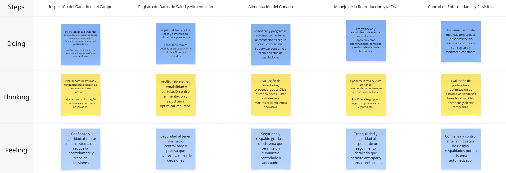

    <h1>UNIVERSIDAD PERUANA  DE CIENCIAS APLICADAS</h1>
        
    <h2>1ACC0238 - Aplicaciones para Dispositivos Móviles</h2>
        
<strong>NRC:</strong> 353

        
<strong>Carrera:</strong> Ingeniería de Software

        
<strong>Ciclo:</strong> 6

        
<strong>Profesor:</strong> Jorge Luis Mayta Guillermo

    <h3>"Informe de Trabajo Final"</h3>
    <h4>TB1</h4>
        
<strong>Tema:</strong> Gestion de ganaderia 

        
<strong>Producto:</strong> VacApp de Bovinova

        
<strong>Abril 2025</strong>

    <h3>Integrantes:</h3>
        <ul>
            <li>Gómez Vallejos, Sergio André - U20221D401</li>
            <li>Rojas Velasquez, Maycol Jhordan - U202219984</li>
            <li>Aranda Vallejos, Oscar Gabriel - U202218167</li>
            <li>Ticona Panduro, Estrella del Pilar - U202210659</li>
            <li>Durand Vera, Gianfranco Angel - U20201f640</li>
            <li>Miranda Sinarahua, Piero Stephano - U20181g752</li>
        </ul>

  <strong>Registro de versiones de informe:</strong> 

| Entregables | Fecha       | Autor                             | Descripción de modificación                                                                                      |  
|-------------|-------------|-----------------------------------|------------------------------------------------------------------------------------------------------------------|

**Project Report Collaboration Insights**

### URL del Repositorio 
https://github.com/orgs/Bovinova/repositories

  Tabla de contenido
  

1. [CAPÍTULO I: Presentacion](#CAPÍTULO-I-Introducción) 
    1.1. [Startup Profile](#Startup-Profile) 
      1.1.1. [Descripción de la Startup](#Descripción-de-la-Startup) 
      1.1.2. [Perfiles de integrantes del equipo](#Perfiles-de-integrantes-del-equipo) 
   1.2. [Solution Profile](#Solution-Profile) 
      1.2.1. [Antecedentes y problemática](#Antecedentes-y-problemática) 
      1.2.2. [Lean UX Process](#Lean-UX-Process) 
        1.2.2.1 [Lean UX Problem Statements](#Lean-UX-Problem-Statements) 
        1.2.2.2 [Lean UX Assumptions](#Lean-US-Assumptions) 
        1.2.2.3 [Lean UX Hypothesis Statements](#Lean-UX-Hypothesis-Statements) 
        1.2.2.4 [Lean UX Canvas](#Lean-UX-Canvas)  
    1.3. [Segmentos objetivo](#Segmentos-objetivo)  
2. [CAPÍTULO II: Requirements Elicitation & Analysis](#Capítulo-II-Requirements-Elicitation--Analysis)  
   2.1. [Competidores](#Competidores)  
      2.1.1. [Análisis competitivo](#Análisis-competitivo)  
      2.1.2. [Estrategias y tácticas frente a competidores](#Estrategias-y-tácticas-frente-a-competidores)  
   2.2. [Entrevistas](#Entrevistas)  
      2.2.1. [Diseño de entrevistas](#Diseño-de-entrevistas)  
      2.2.2. [Registro de entrevistas](#Registro-de-entrevistas)  
      2.2.3. [Análisis de entrevistas](#Análisis-de-entrevistas)  
   2.3. [Needfinding](#Needfinding)  
      2.3.1. [User Personas](#User-Personas)  
      2.3.2. [User Task Matrix](#User-Task-Matrix)  
      2.3.3. [User Journey Mapping](#User-Journey-Mapping)  
      2.3.4. [Empathy Mapping](#Empathy-Mapping)  
      2.3.5. [As-is Scenario Mapping](#As-is-Scenario-Mapping)  
   2.4. [Ubiquitous Language](#Ubiquitous-Language)  
3. [CAPÍTULO III: Requirements Specification](#Capítulo-III-Requirements-Specification)  
   3.1. [To-Be Scenario Mapping](#To-Be-Scenario-Mapping)  
   3.2. [User Stories](#User-Stories)  
   3.3. [Impact Mapping](#Impact-Mapping)  
   3.4. [Product Backlog](#Product-Backlog)  
4. [CAPÍTULO IV: Solution Software Design](#capítulo-iv-solution-software-design)  
   4.1. [Strategic-Level Domain-Driven Design](#strategic-level-domain-driven-design)  
      4.1.1. [EventStorming](#eventstorming)  
         4.1.1.1. [Candidate Context Discovery](#candidate-context-discovery)  
         4.1.1.2. [Domain Message Flows Modeling](#domain-message-flows-modeling)  
         4.1.1.3. [Bounded Context Canvases](#bounded-context-canvases)  
      4.1.2. [Context Mapping](#context-mapping)  
      4.1.3. [Software Architecture](#software-architecture)  
         4.1.3.1. [Software Architecture Context Level Diagrams](#software-architecture-context-level-diagrams)  
         4.1.3.2. [Software Architecture Container Level Diagrams](#software-architecture-container-level-diagrams)  
         4.1.3.3. [Software Architecture Deployment Diagrams](#software-architecture-deployment-diagrams)  
   4.2. [Tactical-Level Domain-Driven Design](#tactical-level-domain-driven-design)  
      4.2.X. [Bounded Context: &lt;Bounded Context Name&gt;](#bounded-context-bounded-context-name)  
         4.2.X.1. [Domain Layer](#domain-layer)  
         4.2.X.2. [Interface Layer](#interface-layer)  
         4.2.X.3. [Application Layer](#application-layer)  
         4.2.X.4. [Infrastructure Layer](#infrastructure-layer)  
         4.2.X.5. [Bounded Context Software Architecture Component Level Diagrams](#bounded-context-software-architecture-component-level-diagrams)  
         4.2.X.6. [Bounded Context Software Architecture Code Level Diagrams](#bounded-context-software-architecture-code-level-diagrams)  
            4.2.X.6.1. [Bounded Context Domain Layer Class Diagrams](#bounded-context-domain-layer-class-diagrams)  
            4.2.X.6.2. [Bounded Context Database Design Diagram](#bounded-context-database-design-diagram)  

   # STUDENT OUTCOME
El curso contribuye al cumplimiento del Student Outcome ABET: 
##### ABET – EAC - Student Outcome 7 
Criterio: La capacidad de adquirir y aplicar nuevos conocimientos según sea
necesario, utilizando estrategias de aprendizaje apropiadas.

| **Criterio específico** | **Acciones realizadas** | **Conclusiones** |  
|-------------------------|------------------------|------------------|  
| Actualiza conceptos y conocimientos necesarios para su desarrollo profesional y en especial para su proyecto en soluciones de software | 1. Gómez Vallejos, Sergio André ------    2. Rojas Velasquez, Maycol Jhordan ------    3. Aranda Vallejos, Oscar Gabriel ------    4. Ticona Panduro, Estrella del Pilar ------    5. Durand Vera, Gianfranco Angel ------    6. Miranda Sinarahua, Piero Stephano ------    |------- |  
| Reconoce la necesidad del aprendizaje permanente para el desempeño profesional y el desarrollo de proyectos en soluciones de software |  1. Gómez Vallejos, Sergio André ------    2. Rojas Velasquez, Maycol Jhordan ------    3. Aranda Vallejos, Oscar Gabriel ------    4. Ticona Panduro, Estrella del Pilar ------    5. Durand Vera, Gianfranco Angel ------    6. Miranda Sinarahua, Piero Stephano ------    | ---- |

# OBJETIVOS SMART

| Estudiante | Objetivo SMART |
|------------|-----------|
|Maycol Jhordan Rojas Velasquez | Mi Objetivo es poder alcanzar un desempeño profesional en analisis forense y en el diseño de nuevas apliaciones moviles, que ayuden en la sociedad, siguiendo todo lo aprendido y gestionando correctamente las buenas practicas.

# 1. CAPÍTULO I: Presentacion
## 1.1. Startup Profile
### 1.1.1. Descripción de la Startup

__Nombre del Start:__ VacApp

VacApp es una avanzada aplicación movil diseñada para capacitar a los ganaderos en la gestión eficiente y sostenible de su ganado. Esta plataforma ofrece una amplia gama de herramientas integrales que permiten a los usuarios realizar un seguimiento detallado de la salud, alimentación y reproducción de sus animales, lo que facilita una mejor toma de decisiones en la granja. Con PecuarioPro, los ganaderos pueden optimizar sus operaciones y maximizar sus ingresos, al tiempo que promueven prácticas agrícolas sostenibles y éticas, lo que contribuye al bienestar de los animales y al desarrollo sostenible de la industria ganadera.

  

### **Colaboraciones Estrategicas:**

En Bovinova, estamos comprometidos a establecer solidad alianzas con cadenas de ganaderia, pequeños ganaderos y empresas ganaderas. Trabajamos en estrecha colaboración con estos socios para garantizar que nuestras soluciones tecnológicas respondan a sus necesidades operativas, facilitando la gestión diaria y mejorando la satisfacción del cliente. Invitamos a los ganaderos a integrar nuestras soluciones para optimizar la administración de ganado, la gestión de alimentacion, y la atención al cliente, creando una experiencia más fluida y eficiente.

### **Innovación y Tecnología**
Nuestra plataforma utiliza tecnologías avanzadas para ofrecer una experiencia optimizada en la gestión ganadera. Desde el monitoreo de la salud, alimentación y reproducción del ganado, hasta la automatización de procesos clave en la granja, **VacApp** busca transformar la forma en que los ganaderos administran sus actividades diarias. Queremos que cada productor pecuario se sienta respaldado por una solución tecnológica que le permita tomar decisiones informadas, mejorar la eficiencia operativa y promover una producción sostenible y ética.

### **Comunidad y Funciones Sociales**
**VacApp** no es solo una herramienta de gestión; es también un espacio de aprendizaje y colaboración entre ganaderos. La plataforma incluye funciones que permiten a los usuarios compartir buenas prácticas, estrategias de manejo y mantenerse actualizados con las últimas innovaciones en el sector pecuario. Esta comunidad activa fomenta la mejora continua, el intercambio de conocimientos y el fortalecimiento de una red ganadera comprometida con el desarrollo sostenible y el bienestar animal.

### **Visión**
Visualizamos un mundo donde la tecnología y la ganadería se integran para impulsar una producción más eficiente, responsable y rentable. Nuestro objetivo es que **VacApp** sea sinónimo de innovación en el manejo ganadero, un aliado indispensable para los productores que desean evolucionar hacia un modelo más moderno, conectado y sostenible. Aspiramos a liderar una transformación positiva en la industria, basada en la tecnología, la ética y el compromiso con el campo.

### **Misión**
Nos esforzamos por ofrecer una plataforma integral que empodere a los ganaderos con herramientas inteligentes de gestión, mejorando su productividad y calidad de vida. Estamos decididos a utilizar la tecnología como motor de cambio en el sector pecuario, contribuyendo al bienestar animal, la sostenibilidad ambiental y el desarrollo económico de las comunidades rurales. **VacApp**, impulsado por **Bovinova**, será símbolo de excelencia, innovación y compromiso con el futuro de la ganadería.

### 1.1.2. Perfiles de integrantes del equipo

| Integrante | Descripción |
| ---- | --- |
|  | Sergio André Gómez Vallejos – Ingeniería de Software – u20221d401   Soy una persona resiliente que, sin importar cuántas veces caiga, siempre encuentra la manera de levantarse. Tengo habilidades sociales sólidas y una amplia experiencia en la resolución de problemas de código. Suelo ser el miembro más activo de mi equipo de trabajo. Me apasionan los lenguajes de programación y la tecnología, y constantemente me esfuerzo por alcanzar mis objetivos y contribuir al desarrollo del startup. |
|  |Aranda Vallejos, Oscar Gabriel - U202218167   |
||Maycol Jhordan Rojas Velasquez – Ingeniería de Software – u202219984 Elegí la carrera de Ingeniería de Software debido a mi gusto por la innovación y la implementación de la tecnología en cualquier rubro  social, de una manera creativa y en todos los aspectos. Me considero una persona creativa, en busca de ideas, estrategias con mente nueva. También me gusta escuchar ideas de mi equipo, dar ideas de mejora, evaluar las ventajas y desventajas . Además, tengo conocimientos de programación en C + +, HTML, Python,Angular,Backend en Java. Además, Tengo un enfoque responsable y dedicado mediante un aprendizaje rápido así puedo ayudar a mis compañeros en sus dudas. Por otro lado, mis hobbies son ver series, jugar , escuchar música, nadar y  manejar.|
| |Ticona Panduro, Estrella del Pilar - U202210659    ctualmente estudio la carrera de Ingeniería de Software en UPC. Opté por estudiar esta carrera porque me interesa programar y crear diferentes aplicativos o programas y emplearlo en la salud. En mis tiempos libres me gusta ver series o películas. Mi compromiso es aportar ideas innovadoras a lo largo del curso, en especial en las tareas en equipo. Mis habilidades son tener una actitud positiva, entusiasta y responsable. | 
|  | Durand Vera, Gianfranco Angel - U20201f640  |
|| Miranda Sinarahua, Piero Stephano - U20181g752   | 

## 1.2. Solution Profile
## 1.2.1 Antecedentes y problemática
### 1.2.2 Lean UX Process.
#### 1.2.2.1. Lean UX Problem Statements
#### 1.2.2.2. Lean UX Assumptions
#### 1.2.2.3. Lean UX Hypothesis Statements
#### 1.2.2.4. Lean UX Canvas

## 1.3. Segmentos objetivo

### Descripción de cada segmento objetivo:

La aplicación VacApp ha sido diseñada pensando en las diversas realidades del sector ganadero peruano, abarcando tanto a pequeños productores independientes como a grandes empresas dedicadas a la actividad pecuaria. Cada segmento presenta necesidades, objetivos y desafíos específicos que nuestra plataforma busca atender con soluciones tecnológicas prácticas, accesibles y sostenibles.

A continuación, se detalla el perfil de nuestros principales segmentos objetivos, identificando sus características, motivaciones y problemáticas, con el fin de adaptar y mejorar constantemente nuestros servicios para ofrecerles el mayor valor posible.

#### Productores Ganadores independientes:
Este segmento objetivo de nuestra plataforma se centra en los ganaderos independientes comprometidos y preocupados por obtener ganancias de manera ética y sostenible, mientras garantizan una excelente calidad en el cuidado de sus animales en propiedad. Este grupo comprende a ganaderos que poseen una variedad de animales, tales como ovejas, vacas, reses, corderos, gallinas, entre otros, y que residen en Perú. Su principal objetivo es asegurarse de que el estado y cuidado de sus animales sea óptimo, priorizando el bienestar y la salud de estos. Además, están interesados en llevar a cabo prácticas de venta honestas, con un enfoque en productos más naturales y de alta calidad. Como obtener información de nuevos métodos de cuidado animal.

#### Empresas Ganaderas:
El segmento objetivo de nuestra plataforma se dirige específicamente a grandes empresas corporativas involucradas en la gestión y cuidado de animales. Estas empresas se destacan por su firme compromiso con prácticas éticas y sostenibles en la producción ganadera. Su principal preocupación radica en garantizar que sus animales reciban una alimentación precisa, óptima y honesta, priorizando la salud y el bienestar de cada individuo. Asimismo, estas empresas se preocupan por brindar un cuidado individual a cada animal, asegurándose de que reciban la atención necesaria para su desarrollo y bienestar. Asimismo, contar con un sistema integral de gestión veterinaria, que garantiza un acceso constante y adecuado a servicios de atención médica veterinaria para sus animales.

### Datos cuantitativos del problema:

#### Productores Ganadores independientes:
Se han registrado numerosos incidentes en los que los productores ganaderos peruanos no reciben una compensación justa en los mercados, y enfrentan dificultades significativas en la gestión del cuidado de sus animales debido a la escasez de recursos económicos y la limitada accesibilidad a servicios veterinarios para consultas y atención adecuada. Estas circunstancias han creado desafíos sustanciales para los ganaderos, quienes luchan por mantener la salud y el bienestar de sus animales mientras buscan asegurar su propio sustento económico en un entorno cada vez más desafiante y competitivo. Se estima que al menos el 15% de los animales muertos en las granjas se debe a la falta de acceso oportuno a servicios veterinarios adecuados, lo que genera pérdidas económicas significativas para los productores, estimadas en un 20% de sus ingresos anuales debido a la falta de compensación justa de los mercados hacia ellos.

#### Empresas Ganaderas:
En el Perú, el bienestar animal en las empresas ganaderas es a menudo insuficiente, con un preocupante porcentaje del 60% de las operaciones que no cumplen con estándares aceptables en este aspecto. Esta deficiencia se refleja en condiciones de vida inadecuadas para el ganado, como la falta de espacio y la alimentación deficiente, lo que afecta negativamente su salud y bienestar. Además, la gestión de residuos en estas empresas es inadecuada en aproximadamente un 70% de los casos, lo que resulta en una incorrecta disposición de los desechos animales y una potencial contaminación del medio ambiente. Esta situación representa un desafío significativo para la industria ganadera, ya que no solo compromete el bienestar de los animales, sino que también puede tener repercusiones negativas en la salud pública y el medio ambiente.

### Variables geográficas, demográficas y psicológicas:

#### Variable geográfica:
- País: Perú
- Ciudad: zonas rurales 

#### Variable demográfica:
- Género: Femenino / Masculino.
- Ocupación: Productores ganaderos 
- Estado civil: Todos los estados
- Edad y etapa de ciclo de vida:
- Ciudadanos mayores a 18 años.

#### Variable psicográfica:
- Nivel Socioeconómico (NSE): todos los niveles socioeconomicos
- Características de personalidad:
 - Altruismo 
 - Perseverante
 - Honestidad

# 2. CAPÍTULO II: Requirements Elicitation & Analysis
## 2.1. Competidores
### 2.1.1. Análisis competitivo
### 2.1.2. Estrategias y tácticas frente a competidores

## 2.2. Entrevistas
### 2.2.1. Diseño de entrevistas
**Segmento #1: Productores Ganaderos Independientes**

VacApp ha desarrollado preguntas específicas para conocer las necesidades, experiencias y expectativas de los productores ganaderos independientes. Buscamos ayudarlos a gestionar mejor sus operaciones, optimizar el cuidado de sus animales y evaluar su impacto ambiental y social. A través de una plataforma intuitiva, VacApp ofrece herramientas que mejoran la eficiencia, el control de calidad y la conexión con los consumidores, simplificando los procesos diarios del productor.

**Datos Generales del Entrevistado:**

- Nombre:
- Edad:
- Tiempo de experiencia en la ganadería:

**Preguntas de la Entrevista:**

1. ¿Nos podría indicar su nombre, edad y cuánto tiempo lleva dedicándose a la ganadería?
1. ¿Cómo decide la dieta de sus animales y qué factores considera al elegir su alimentación? 

   (¿Sigue asesoría veterinaria, experiencia personal o recomendaciones externas?)

1. ¿Qué medidas toma para garantizar la salud y el bienestar de sus animales?
1. ¿Qué aspectos considera más importantes en la gestión de la salud veterinaria de su ganado?
1. ¿Lleva algún tipo de registro sobre la salud y el crecimiento de sus animales? ¿Cómo lo hace?

   (¿Utiliza cuadernos, hojas de cálculo, aplicaciones móviles, etc.?)

1. ¿Cuáles son los principales desafíos que enfrenta al administrar su ganadería?
1. ¿Cómo cree que una aplicación podría ayudarle a resolver esos desafíos?
1. Si contara con una aplicación para apoyar su trabajo ganadero, ¿qué funciones le serían más útiles?
1. ¿Qué tipo de información le gustaría tener siempre disponible desde su celular o computadora?
1. ¿Cómo le gustaría registrar la alimentación y consumo de sus animales dentro de la aplicación?
1. ¿Qué beneficios espera lograr al implementar una solución como VacApp en su ganadería?

**Segmento #2: Empresas Ganaderas** 

VacApp se orienta a mejorar la eficiencia y sostenibilidad en empresas ganaderas de gran escala. Mediante entrevistas con administradores, identificamos sus necesidades y estrategias clave para una gestión efectiva. Preguntamos qué herramientas consideran esenciales y cómo esperan apoyo para mejorar el bienestar animal y la productividad. Así, VacApp adapta sus soluciones a los retos específicos de la ganadería corporativa.

**Datos Generales del Entrevistado:**

- Nombre:
- Edad:
- Tiempo de experiencia en la ganadería:

**Preguntas de la Entrevista:**

1. ¿Cuántos animales maneja actualmente su empresa y cómo varía esa cantidad durante el año?
1. Si su empresa tuviera acceso a una plataforma digital para gestión ganadera, ¿qué funciones considera imprescindibles para mejorar la eficiencia?
1. ¿Cuáles son los mayores retos que enfrentan en la gestión ganadera a gran escala y cómo los abordan hoy en día?
1. ¿Qué tipo de información o datos son clave para la toma de decisiones en su operación ganadera?
1. ¿Qué funcionalidades le gustaría tener para facilitar la gestión del personal y la planificación de tareas?
1. ¿Qué tipo de informes o análisis considera importantes para evaluar el desempeño de su empresa?
1. ¿Cómo le gustaría interactuar con proveedores y socios comerciales a través de una plataforma como VacApp?
1. ¿Qué tan importante es que una aplicación como VacApp se adapte a los procesos actuales de su empresa?
1. ¿Qué aspectos considera que deberían ser completamente personalizables dentro de la plataforma?
1. ¿Qué mejoras espera obtener al integrar una solución como VacApp en su operación ganadera?

### 2.2.2. Registro de entrevistas
### 2.2.3. Análisis de entrevistas

## 2.3. Needfinding
### 2.3.1. User Personas
### 2.3.2. User Task Matrix
### 2.3.3. User Journey Mapping
### 2.3.4. Empathy Mapping
### 2.3.5. As-is Scenario Mapping

## 2.4. Ubiquitous Language

# 3. CAPÍTULO III: Requirements Specification
## 3.1. To-Be Scenario Mapping

## 3.2. User Stories
|Epic ID|Título|Descripción|||
| :-: | :-: | :-: | :- | :- |
|EP001|Registrar Vacuna|Como ganadero quiero poder registrar mi vacuna para que tenga control sobre la salud de mi bovino|||
|Story ID|Título|Descripción|Criterios de Aceptación|Relacionado con (Epic ID)|
|US001|Agregar Vacuna al Registro|Como ganadero, quiero agregar una nueva vacuna al registro de mis bovinos para mantener un control actualizado y efectivo de la salud de mi rebaño|
- **E01: Acceso al formulario para agregar vacuna**   **Dado que** un ganadero autenticado.   **Cuando** Accede al módulo/vacunas de la aplicación.   **Entonces** Se muestra el formulario para el registro de una nueva vacuna, permitiéndole ingresar todos los datos necesarios.

- **E02: Registro exitoso de la vacuna**   **Dado que** El ganadero tiene el formulario abierto.   **Cuando** Ingresa todos los datos requeridos correctamente y envía el formulario.   **Entonces:** La vacuna se registra exitosamente y se muestra una confirmación del registro.

- **E03: Manejo de errores en el formulario**   **Dado que:** Un ganadero autenticado.   **Cuando:** Ingresa datos incompletos o erróneos en el formulario.   **Entonces:** El sistema muestra un mensaje de error específico, indicando los campos que deben corregirse.

|EP001|
|US002|Búsqueda de Vacunas|Como ganadero, quiero buscar vacunas previamente registradas para evitar la duplicación y garantizar que se administre la vacuna correcta a cada bovino.|
- **E01: Búsqueda por fecha de administración**   **Dado que** el ganadero posee múltiples vacunas registradas.   **Cuando:** Realiza una búsqueda filtrando por fecha de administración.   **Entonces:** Se despliega una lista de vacunas administradas en la fecha especificada.

- **E02: Búsqueda por tipo de vacuna**   **Dado que** el ganadero tiene varias vacunas en el registro.   **Cuando** filtra la búsqueda por el tipo específico de vacuna.   **Entonces** se muestran únicamente las vacunas que coinciden con el tipo seleccionado.

- **E03: Sin resultados en la búsqueda**   **Dado que** el ganadero tiene vacunas registradas.   **Cuando** busca con criterios que no concuerdan con ningún registro.   **Entonces** se muestra un mensaje informando que no se encontraron coincidencias.

|EP001|
|US003 |Gestión de Registros de Vacunas|Como ganadero, necesito poder editar o eliminar el registro de una vacuna para garantizar que la información se mantenga precisa y actualizada.|
- **E01: Eliminación exitosa de vacuna**   **Dado que** el ganadero selecciona una vacuna del registro.   **Cuando** solicita eliminar dicha vacuna y confirma la acción.   **Entonces** el sistema elimina la vacuna y muestra una confirmación de la eliminación.

- **E02: Edición exitosa de vacuna**   **Dado que** el ganadero visualiza el registro de una vacuna.   **Cuando** modifica los datos y guarda los cambios.   **Entonces** el sistema actualiza la información de la vacuna y muestra un mensaje de confirmación.

- **E03: Error al eliminar vacuna**   **Dado que** el ganadero intenta eliminar una vacuna.   **Cuando** se produce un error interno en el sistema.   **Entonces** no se elimina la vacuna y se muestra un mensaje de error descriptivo.

- **Escenario 4: Error al editar vacuna**   **Dado que** el ganadero intenta modificar una vacuna.   **Cuando** se produce un error durante la actualización (por ejemplo, validación fallida).   **Entonces** el sistema no actualiza los datos y se notifica el error con detalle de los problemas encontrados.
|EP001|
|TS001|Crear Vacuna vía API|Como desarrollador, necesito exponer un endpoint para registrar una vacuna vía API, de modo que los features de la aplicación dispongan de este registro.|
- **E01: Registro exitoso**   **Dado que** el endpoint /vacunas está disponible.   **Cuando** se envía una solicitud POST con datos válidos.   **Entonces** se recibe respuesta 201 (Created) con el recurso de vacuna recién creado.

- **E02: Error por datos inválidos**   **Dado que** el endpoint /vacunas está disponible.   **Cuando** se envía una solicitud POST sin el campo obligatorio "nombre" (u otro dato requerido).   **Entonces:** Se recibe respuesta 400 (Bad Request) con el mensaje: "Falta el nombre de la vacuna".

- **E03: Error por formato incorrecto**   **Dado que** El endpoint /vacunas está disponible.   **Cuando:** Se envía una solicitud POST con un formato incorrecto (p.ej., fecha inválida).   **Entonces:** Se recibe respuesta 400 con el mensaje: "Formato de fecha de vacunación no válido".

- **E04: Error por vacuna duplicada**   **Dado que:** El endpoint /vacunas está disponible y ya existe una vacuna con el mismo nombre.   **Cuando:** Se envía una solicitud POST con datos para una vacuna existente.   **Entonces:** Se recibe respuesta 409 (Conflict) con el mensaje: "Ya existe una vacuna con el mismo nombre".

&emsp;
|EP001|
|TS002|API para Búsqueda de Vacunas|Como desarrollador, quiero implementar un endpoint para buscar vacunas mediante criterios específicos, permitiendo filtrar y obtener registros de manera eficiente.|
- **E01: Búsqueda exitosa**   **Dado que:** El endpoint /vacunas está disponible.   **Cuando:** Se realiza una solicitud GET con parámetros de búsqueda válidos.   **Entonces:** Se recibe respuesta 200 (OK) con una lista de vacunas que cumplen los criterios.

- **E02: Búsqueda sin resultados**   **Dado que:** El endpoint /vacunas está disponible.   **Cuando:** Se realiza una solicitud GET con parámetros que no arrojan coincidencias.   **Entonces:** Se recibe respuesta 200 con un mensaje informando que no se encontraron resultados.

|EP001|
|TS003|API para Gestión de Vacunas|Como desarrollador, necesito implementar endpoints para editar y eliminar registros de vacunas, asegurando que se mantenga la integridad y actualización de los datos.|
- **E01: Edición exitosa**   **Dado que:** Existe un registro de vacuna y el endpoint /vacunas/{id} está disponible.   **Cuando:** Se envía una solicitud PUT con datos válidos para actualizar.   **Entonces:** Se recibe respuesta 200 (OK) con la vacuna actualizada.

- **E02: Error al editar vacuna**   **Dado que:** El endpoint /vacunas/{id} está disponible.   **Cuando:** Se envía una solicitud PUT con datos inválidos.   **Entonces:** Se recibe respuesta 400 con un mensaje de error descriptivo.

&emsp;**E03: Eliminación exitosa** &emsp;**Dado que:** Existe un registro de vacuna y el endpoint /vacunas/{id} está disponible. &emsp;**Cuando:** Se envía una solicitud DELETE para eliminar la vacuna. &emsp;**Entonces:** Se recibe respuesta 200 (OK) confirmando la eliminación.
|EP001|
|Epic ID|Título|Descripción|||
|EP002|Registrar Ganado|Como ganadero quiero registrar para llevar un control detallado de mi inventario de ganado y su trazabilidad sanitaria |||
|Story ID|Título|Descripción|Criterios de Aceptación|Relacionado con (Epic ID)|
|US004|Registro de Bovino en Lote|Como usuario autenticado, quiero registrar un bovino en un lote específico para tener control detallado de la crianza y manejo del animal.|
- **E01: Registro completo de un bovino**   **Dado que** un usuario autenticado.   **Cuando** selecciona la opción de registrar un nuevo bovino e ingresa los datos: procedencia, raza, peso inicial, fecha de registro, fotografía, estado de salud, fecha de nacimiento o edad, y observaciones.   **Entonces** el sistema genera un ID único, asocia el bovino a un lote específico y confirma el registro exitoso.

- **E02: Registro sin autenticación**   **Dado que** un usuario no autenticado.   **Cuando** intenta acceder al módulo de gestión de lotes para registrar un bovino.   **Entonces** se redirige al usuario a la página de inicio de sesión.

- **E03: Registro incompleto**   **Dado que** un usuario autenticado en el registro de un bovino.   **Cuando** envía el formulario sin completar todos los campos obligatorios.   **Entonces** se muestra un mensaje de error solicitando la información faltante.

- **Escenario 4: Registro con datos inválidos**   **Dado que** un usuario autenticado al registrar un bovino.   **Cuando** ingresa datos en un formato incorrecto o no conforme a lo esperado.   **Entonces** el sistema rechaza el registro y muestra un mensaje de error especificando el formato correcto.

|EP002|
|US005|Buscar Información de Bovinos|Como usuario, quiero poder buscar animales registrados para acceder de forma rápida y ordenada a la información necesaria.|
- **E01: Búsqueda exitosa**   **Dado que:** El usuario autenticado en la plataforma.   **Cuando:** Realiza una búsqueda (con filtros y criterios) desde el módulo respectivo.   **Entonces:** Se muestra una lista clara y ordenada con los resultados correspondientes.

|EP002|
|US006|Actualizar Información de Bovinos|Como usuario, quiero gestionar la información de los animales registrados para mantener la base de datos actualizada y precisa.|
- **E01: Actualización exitosa**   **Dado que** el usuario autenticado y accediendo al módulo de gestión de animales.   **Cuando** actualiza la información requerida y guarda los cambios.   **Entonces** el sistema confirma la actualización mediante un mensaje de éxito.

|EP002|
|TS004|API para Registro de Animales|Como desarrollador, quiero implementar un endpoint para registrar un bovino en un lote específico, permitiendo la correcta integración de los datos en la aplicación.|
- **E01: Registro exitoso**   **Dado que** el endpoint /animales está disponible.   **Cuando** se envía una solicitud POST con todos los datos válidos.   **Entonces** se recibe respuesta 201 (Created) con el registro del animal.

- **E02: Error en el registro**   **Dado que** el endpoint /animales está disponible.   **Cuando** se envía una solicitud POST con datos inválidos o incompletos.   **Entonces** se recibe respuesta 400 (Bad Request) con un mensaje de error.

|EP002|
|TS005|API para Búsqueda de Animales|Como desarrollador, necesito un endpoint que permita buscar animales registrados usando parámetros de búsqueda, facilitando la localización de registros específicos.|
- **E01: Búsqueda exitosa**   **Dado que** el endpoint /animales está disponible.   **Cuando** se realiza una solicitud GET con parámetros válidos.   **Entonces** se recibe respuesta 200 (OK) con la lista de animales que cumplen los criterios.

- **E02:** En caso de parámetros sin resultados, se indica adecuadamente que no se encontraron animales.

|EP002|
|TS006|API para Gestión de Animales|Como desarrollador, quiero implementar funcionalidades para editar y eliminar animales registrados, asegurando la actualización y manejo correcto de la información.|
- **E01: Edición exitosa**   **Dado que** el endpoint /animales/{id} está disponible y existe el animal.   **Cuando** se envía una solicitud PUT con información actualizada y válida.   **Entonces** se recibe respuesta 200 (OK) con el animal actualizado.

- **E02:  Eliminación exitosa**   **Dado que** el endpoint /animales/{id} está disponible.   **Cuando** se realiza una solicitud DELETE para el animal.   **Entonces** se recibe respuesta 200 con un mensaje de éxito.

|EP002|
|Epic ID|Título|Descripción|||
|EP003|Registrar Campaña|Como usuario de la plataforma, quiero crear y gestionar campañas ganaderas para mejorar el rendimiento y control de las actividades relacionadas con el engorde del ganado.|||
|Story ID|Título|Descripción|Criterios de Aceptación|Relacionado con (Epic ID)|
|US007|Crear Campaña para Engorde de Ganado|Como usuario de la plataforma, quiero crear una campaña para engordar el ganado asignado, definiendo parámetros como duración, objetivo y selección de animales o establos.|**E01: Creación de campaña** **Dado que** el usuario autenticado. **Cuando** selecciona la opción de crear una campaña y completa los campos (duración, objetivo, selección de animales o establos). **Entonces** se crea la campaña y se muestra una confirmación|EP003|
|US008|Asociar Empleados a Campaña|
Como empresario ganadero, quiero asignar empleados a una campaña para organizar mejor el personal durante la ejecución de esta.

|
- **E01: Asociación exitosa**   **Dado que:** El empresario ganadero autenticado.   **Cuando:** Selecciona una campaña existente y asigna empleados válidos.   **Entonces:** Los empleados quedan asociados a la campaña y se muestra una notificación de éxito.

|EP003|
|US009|Gestión de Campañas|Como usuario, quiero gestionar (editar o modificar) la campaña creada para ajustarla según las necesidades y cambios en la planificación.|
- **E01: Gestión para ganadero independiente**   **Dado que:** El usuario autenticado con una campaña creada.   **Cuando:** Realiza cambios (añadir/eliminar tiempo, animales, establos o modificar el objetivo).   **Entonces:** Los cambios se reflejan instantáneamente y se confirma la actualización.

- **E02: Gestión para empresa ganadera**   **Dado que:** La empresa con campaña activa.   **Cuando:** Realiza cambios adicionales como la asignación o eliminación de personal, además de otros ajustes en el objetivo.   **Entonces:** El sistema actualiza y confirma los cambios en la campaña.

|EP003|
|TS007|API para Creación de Campaña|Como desarrollador, necesito crear un endpoint que permita la creación de campañas, de modo que se puedan iniciar campañas de engorde en la aplicación.|
- **E01: Creación exitosa**   **Dado que** el endpoint /campanas está disponible.   **Cuando** se envía una solicitud POST con datos válidos para la campaña.   **Entonces**  Se recibe respuesta 201 (Created) con el registro de la campaña.

- **E02: Error en la creación**   **Dado que** el endpoint /campanas está disponible.   **Cuando** se envía una solicitud POST con datos incompletos o inválidos.   **Entonces** se recibe respuesta 400 (Bad Request) con un mensaje de error.

|EP003|
|TS008|API para Asociar Empleados a Campaña|Como desarrollador, necesito un endpoint para asociar empleados a campañas, permitiendo la asignación de personal a cada campaña desde la aplicación.|
- **E01:  Asociación exitosa**   **Dado que** el endpoint /campanas/{id}/empleados está disponible.   **Cuando** se envía una solicitud POST con los datos de un empleado válido para la campaña seleccionada.   **Entonces** se recibe respuesta 201 (Created) confirmando la asociación.

- **E02: Error al asociar**   **Dado que** el endpoint /campanas/{id}/empleados está disponible.   **Cuando** se envía una solicitud POST con un empleado inválido.   **Entonces** se recibe respuesta 400 (Bad Request) con el mensaje de error correspondiente.

|EP003|
|TS009|API para Gestión de Campañas|Como desarrollador, necesito implementar endpoints que permitan editar y eliminar campañas, facilitando su gestión integral desde la plataforma.|
- **E01: Edición exitosa**   **Dado que** el endpoint /campanas/{id} está disponible.   **Cuando** se envía una solicitud PUT con información válida para actualizar la campaña.   **Entonces** se recibe respuesta 200 (OK) con la campaña actualizada.

- **E02  Error al editar campaña**   **Dado que** el endpoint /campanas/{id} está disponible.   **Cuando** se envía una solicitud PUT con datos inválidos.   **Entonces** se recibe respuesta 400 (Bad Request) con un mensaje de error.

- **E03  Eliminación exitosa**   **Dado que** el endpoint /campanas/{id} está disponible.   **Cuando** se envía una solicitud DELETE para eliminar la campaña.   **Entonces** se recibe respuesta 200 (OK) con un mensaje confirmando la eliminación.
|EP003|
|Epic ID|Título|Descripción|||
|EP0044|Contacto de Veterinario|Como usuario, quiero tener acceso al registro y contacto de veterinarios para poder solicitar asistencia sanitaria cuando sea necesario.|||
|Story ID|Título|Descripción|Criterios de Aceptación|Relacionado con (Epic ID)|
|US010|Registrar Veterinario |Como usuario, quiero que el sistema me permita registrar veterinarios (a través del administrador) para que los ganaderos puedan contactarlos cuando sea necesario.|
- **E01: Registro exitoso de veterinario**   **Dado que:** Un veterinario es registrado por un usuario administrador.   **Cuando:** Se completa el proceso de registro y se envía la confirmación.   **Entonces:** El veterinario queda registrado y aparece en la lista de contacto para ganaderos.

|EP004|
|US011|Búsqueda de Veterinarios|Como usuario, quiero acceder a un menú de búsqueda de veterinarios para solicitar asistencia cuando mis animales lo requieran, realizando incluso el proceso de pago para la consulta|
- **E01: Búsqueda y solicitud de visita**   **Dado que:** El usuario autenticado y en el portal de búsqueda de veterinarios.   **Cuando:** Realiza una búsqueda basada en sus preferencias y selecciona un veterinario.   **Entonces:** Procede al pago correspondiente y se registra la solicitud de visita.

|EP004|
|TS010|API para Registro de Veterinarios|Como desarrollador, necesito exponer un endpoint que permita registrar veterinarios en la aplicación, para que luego puedan ser contactados por los ganaderos.|
- **E01: Registro exitoso**   **Dado que** el endpoint /veterinarios está disponible.   **Cuando** se envía una solicitud POST con datos válidos para el veterinario.   **Entonces** se recibe respuesta 201 (Created) con el registro del veterinario.

- **E02:  Error en el registro**   **Dado que** el endpoint /veterinarios está disponible.   **Cuando** se envía una solicitud POST con datos incompletos o inválidos.   **Entonces**  se recibe respuesta 400 (Bad Request) con el mensaje de error correspondiente.

|EP004|
|TS011|API para Búsqueda de Veterinarios|Como desarrollador, necesito un endpoint que permita buscar veterinarios mediante criterios específicos, para brindar opciones de contacto efectivas.|
- **E01: Búsqueda exitosa**   **Dado que**  el endpoint /veterinarios está disponible.   **Cuando**  se realiza una solicitud GET con parámetros válidos.   **Entonces**  se recibe respuesta 200 (OK) con una lista de veterinarios coincidentes.

- **E02: Búsqueda sin resultados**   **Dado que** el endpoint /veterinarios está disponible.   **Cuando** se realiza una solicitud GET con parámetros que no arrojan coincidencias.   **Entonces** se recibe respuesta 200 con un mensaje indicando que no se encontraron registros.

|EP004|
|Epic ID|Título|Descripción|||
|EP005|Registrar Personal|Como empresario ganadero, quiero poder registrar y gestionar a mis empleados para organizar eficazmente los recursos humanos de mi empresa,|||
|Story ID|Título|Descripción|Criterios de Aceptación|Relacionado con (Epic ID)|
|US012|Registro de Personal|Como empresario ganadero, quiero poder registrar a mis empleados para organizar y gestionar de forma efectiva los recursos humanos de mi empresa.|
- **E01: Registro completo de empleado**   **Dado que:** El empresario autenticado.   **Cuando:** Ingresa correctamente todos los datos requeridos para un empleado.   **Entonces:** El sistema registra al empleado y muestra una confirmación exitosa.

- **E02: Registro incompleto o incorrecto**   **Dado que:** El empresario autenticado.   **Cuando:** Intenta registrar a un empleado sin ingresar toda la información esencial.   **Entonces:** Se muestra un mensaje de error indicando la carencia de información requerida
|EP005|
|US013|Búsqueda de Personal|Como empresario ganadero, quiero buscar entre los empleados registrados para localizar y, de ser necesario, gestionar la información de un empleado en específico.|**E01: Búsqueda exitosa** **Dado que:** El empresario con sesión iniciada. **Cuando:** Realiza la búsqueda utilizando filtros (por nombre, cargo, etc.). **Entonces:** Se muestra el empleado que cumple con los criterios de búsqueda.|EP005|
|US014|Gestión de Personal|Como empresario ganadero, necesito gestionar la plantilla de empleados, pudiendo agregar o eliminar registros para mantener la base de datos actualizada.|
- **E01: Agregar y eliminar empleados**   **Dado que:** El empresario autenticado y accediendo al módulo de gestión de personal.   **Cuando:** Realiza las operaciones de agregar y/o eliminar empleados.   **Entonces:** El sistema confirma con un mensaje de éxito cada uno de los cambios efectuados.

|EP005|
|TS012|API para Registro de Empleados|Como desarrollador, necesito crear un endpoint para registrar empleados, asegurando que la información de cada uno se almacene correctamente y se confirme la creación.|
- **E01: Registro exitoso**   **Dado que** el endpoint /empleados está disponible.   **Cuando** se envía una solicitud POST con datos válidos para el empleado.   **Entonces** se recibe respuesta 201 (Created) con el registro del empleado.

- **E02: Error al registrar empleado**   **Dado que** el endpoint /empleados está disponible.   **Cuando** se envía una solicitud POST con datos incompletos o inválidos.   **Entonces** se recibe respuesta 400 (Bad Request) con el mensaje de error.

|EP005|
|TS013|API para Búsqueda de Empleados|Como desarrollador, necesito implementar un endpoint que permita buscar empleados utilizando filtros específicos, para facilitar la administración de los recursos humanos.|
- **E01: Búsqueda exitosa**   **Dado que** el endpoint /empleados está disponible.   **Cuando** se realiza una solicitud GET con parámetros válidos.   **Entonces** se recibe respuesta 200 (OK) y se devuelve una lista de empleados que cumplen los criterios.

- **E02: Búsqueda sin resultados**   **Dado que** el endpoint /empleados está disponible.   **Cuando** se realiza una solicitud GET con parámetros que no arrojan resultados.   **Entonces** se recibe respuesta 200 con un mensaje informando que no se encontraron empleados.

|EP005|
|TS014|API para Gestión de Empleados|Como desarrollador, necesito implementar funcionalidades para editar y eliminar empleados mediante la API, permitiendo que el empresario administre correctamente su plantilla.|
- **E01: Edición exitosa**   **Dado que** el endpoint /empleados/{id} está disponible y existe el empleado.   **Cuando** se envía una solicitud PUT con información válida para actualizar los datos del empleado.   **Entonces** se recibe respuesta 200 (OK) con el registro actualizado.

- **E02 : Error al editar empleado**   **Dado que** el endpoint /empleados/{id} está disponible.   **Cuando** se envía una solicitud PUT con datos inválidos o incompletos.   **Entonces** se recibe respuesta 400 (Bad Request) con el mensaje de error correspondiente.

- **E03: Eliminación exitosa**   **Dado que** el endpoint /empleados/{id} está disponible y existe el empleado a eliminar.   **Cuando** se envía una solicitud DELETE.   **Entonces** se recibe respuesta 200 (OK) confirmando la eliminación con un mensaje de éxito.

|EP005|
|Epic ID|Título|Descripción|||
|EP006|Informarse sobre el Producto|Como visitante, quiero explorar la Landing Page de la aplicación para conocer sus funcionalidades y evaluar si satisface mis necesidades.|||
|Story ID|Título|Descripción|Criterios de Aceptación|Relacionado con (Epic ID)|
|US015|Explorar la Landing Page|
Como visitante, quiero explorar la Landing Page de la aplicación para conocer sus funcionalidades y determinar si satisface mis necesidades.

|
- **E01: Sección “Quiénes Somos”**   **Dado que:** El visitante accede a la Landing Page.   **Cuando:** Navega a la sección “Quiénes Somos”.   **Entonces:** Encuentra información detallada sobre la misión, visión y valores de la empresa.

|EP006|
|US016|` `Explorar Secciones Informativas|
Como visitante, quiero explorar las secciones informativas (Quiénes Somos, Planes y Funciones) para entender completamente las características y beneficios de la aplicación.

|
- **E01: Navegación en secciones informativas**   **Dado que:** El visitante ingresa a la Landing Page.   **Cuando:** Navega por las secciones “Quiénes Somos”, “Planes” y “Funciones”.   **Entonces:** Se le presenta información detallada y estructurada sobre la empresa, los distintos planes ofrecidos y las funcionalidades de la aplicación.

|EP006|

## 3.3. Impact Mapping
A continuación presentaremos 3 Business Goals que consideramos importantes en nuestro proyecto: 

**Business Goal 1**

 

**Business Goal 2**

 

**Business Goal 3**

 

## 3.4. Product Backlog
|**Orden**|**User Story ID**|**Título**|**Descripción**|**Story Points (1/2/3)**|
| :- | :- | :- | :- | :- |
|1|US001|Agregar Vacuna al Registro|Como ganadero, quiero agregar una nueva vacuna al registro de mis bovinos para mantener un control actualizado y efectivo de la salud de mi rebaño|2|
|2|TS001|Crear Vacuna vía API|Como desarrollador, necesito exponer un endpoint para registrar una vacuna vía API, de modo que los features de la aplicación dispongan de este registro.|2|
|3|TS002|API para Búsqueda de Vacunas|Como desarrollador, quiero implementar un endpoint para buscar vacunas mediante criterios específicos, permitiendo filtrar y obtener registros de manera eficiente.|2|
|4|US002|Búsqueda de Vacunas|Como ganadero, quiero buscar vacunas previamente registradas para evitar la duplicación y garantizar que se administre la vacuna correcta a cada bovino.|1|
|5|TS003|API para Gestión de Vacunas|Como desarrollador, necesito implementar endpoints para editar y eliminar registros de vacunas, asegurando que se mantenga la integridad y actualización de los datos.|2|
|6|TS004|API para Registro de Animales|Como desarrollador, quiero implementar un endpoint para registrar un bovino en un lote específico, permitiendo la correcta integración de los datos en la aplicación.|2|
|7|US003|Gestión de Registros de Vacunas|Como ganadero, necesito poder editar o eliminar el registro de una vacuna para garantizar que la información se mantenga precisa y actualizada.|2|
|8|TS005|API para Búsqueda de Animales|Como desarrollador, necesito un endpoint que permita buscar animales registrados usando parámetros de búsqueda, facilitando la localización de registros específicos.|2|
|9|TS006|API para Gestión de Animales|Como desarrollador, quiero implementar funcionalidades para editar y eliminar animales registrados, asegurando la actualización y manejo correcto de la información.|2|
|10|US004|Registro de Bovino en Lote|Como usuario autenticado, quiero registrar un bovino en un lote específico para tener control detallado de la crianza y manejo del animal.|3|
|11|TS007|API para Creación de Campaña|Como desarrollador, necesito crear un endpoint que permita la creación de campañas, de modo que se puedan iniciar campañas de engorde en la aplicación.|2|
|12|TS008|API para Asociar Empleados a Campaña|Como desarrollador, necesito un endpoint para asociar empleados a campañas, permitiendo la asignación de personal a cada campaña desde la aplicación.|2|
|13|US005|Buscar Información de Bovinos|Como usuario, quiero poder buscar animales registrados para acceder de forma rápida y ordenada a la información necesaria.|2|
|14|TS009|API para Gestión de Campañas|Como desarrollador, necesito implementar endpoints que permitan editar y eliminar campañas, facilitando su gestión integral desde la plataforma.|2|
|15|TS010|API para Registro de Veterinarios|Como desarrollador, necesito exponer un endpoint que permita registrar veterinarios en la aplicación, para que luego puedan ser contactados por los ganaderos.|2|
|16|US006|Actualizar Información de Bovinos|Como usuario, quiero gestionar la información de los animales registrados para mantener la base de datos actualizada y precisa.|1|
|17|TS011|API para Búsqueda de Veterinarios|Como desarrollador, necesito un endpoint que permita buscar veterinarios mediante criterios específicos, para brindar opciones de contacto efectivas.|1|
|18|TS012|API para Registro de Empleados|Como desarrollador, necesito crear un endpoint para registrar empleados, asegurando que la información de cada uno se almacene correctamente y se confirme la creación.|1|
|19|US07|Crear Campaña para Engorde de Ganado|Como usuario de la plataforma, quiero crear una campaña para engordar el ganado asignado, definiendo parámetros como duración, objetivo y selección de animales o establos.|1|
|20|TS013|API para Búsqueda de Empleados|Como desarrollador, necesito implementar un endpoint que permita buscar empleados utilizando filtros específicos, para facilitar la administración de los recursos humanos.|1|
|21|TS014|API para Gestión de Empleados|Como desarrollador, necesito implementar funcionalidades para editar y eliminar empleados mediante la API, permitiendo que el empresario administre correctamente su plantilla.|1|

# 4. CAPÍTULO IV: Solution Software Design
## 4.1. Strategic-Level Domain-Driven Design
### 4.1.1. EventStorming
#### 4.1.1.1. Candidate Context Discovery

#### 4.1.1.2. Domain Message Flows Modeling

#### 4.1.1.3. Bounded Context Canvases
### 4.1.2. Context Mapping
### 4.1.3. Software Architecture
#### 4.1.3.1. Software Architecture Context Level Diagrams
#### 4.1.3.2. Software Architecture Container Level Diagrams
#### 4.1.3.3. Software Architecture Deployment Diagrams

## 4.2. Tactical-Level Domain-Driven Design
### 4.2.X. Bounded Context: <Bounded Context Name>
#### 4.2.X.1. Domain Layer
#### 4.2.X.2. Interface Layer
#### 4.2.X.3. Application Layer
#### 4.2.X.4. Infrastructure Layer
#### 4.2.X.5. Bounded Context Software Architecture Component Level Diagrams
#### 4.2.X.6. Bounded Context Software Architecture Code Level Diagrams
##### 4.2.X.6.1. Bounded Context Domain Layer Class Diagrams
##### 4.2.X.6.2. Bounded Context Database Design Diagram

