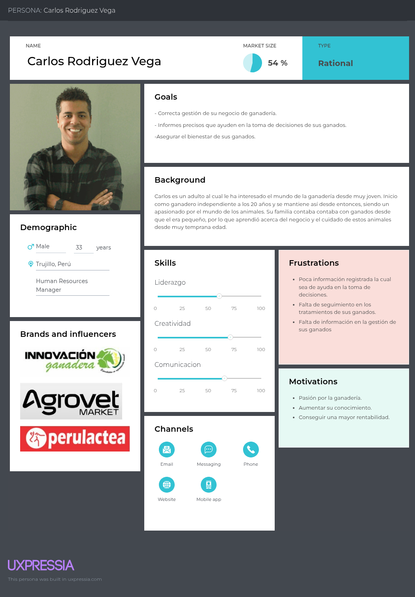
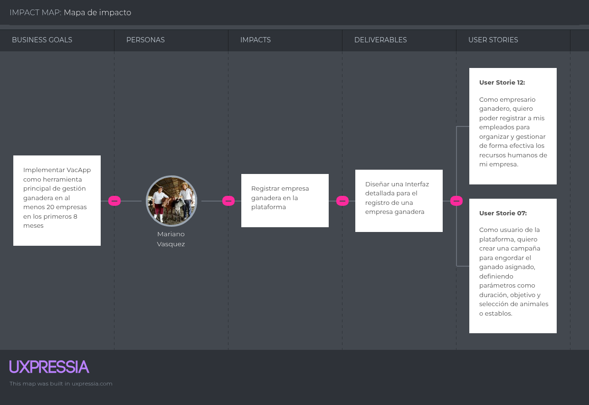
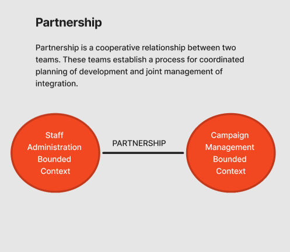
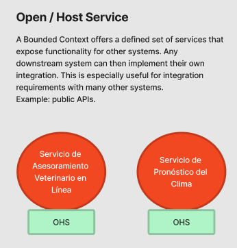

    <h1>UNIVERSIDAD PERUANA  DE CIENCIAS APLICADAS</h1>
        
    <h2>1ACC0238 - Aplicaciones para Dispositivos Móviles</h2>
        
<strong>NRC:</strong> 353

        
<strong>Carrera:</strong> Ingeniería de Software

        
<strong>Ciclo:</strong> 6

        
<strong>Profesor:</strong> Jorge Luis Mayta Guillermo

    <h3>"Informe de Trabajo Final"</h3>
    <h4>TB1</h4>
        
<strong>Tema:</strong> Gestion de ganaderia 

        
<strong>Producto:</strong> VacApp de Bovinova

        
<strong>Abril 2025</strong>

    <h3>Integrantes:</h3>
        <ul>
            <li>Gómez Vallejos, Sergio André - U20221D401</li>
            <li>Rojas Velasquez, Maycol Jhordan - U202219984</li>
            <li>Aranda Vallejos, Oscar Gabriel - U202218167</li>
            <li>Ticona Panduro, Estrella del Pilar - U202210659</li>
            <li>Durand Vera, Gianfranco Angel - U20201f640</li>
            <li>Miranda Sinarahua, Piero Stephano - U20181g752</li>
        </ul>

  <strong>Registro de versiones de informe:</strong> 

| Entregables | Fecha       | Autor                             | Descripción de modificación                                                                                      |  
|-------------|-------------|-----------------------------------|------------------------------------------------------------------------------------------------------------------|  
| TB1         | 23/08/2024  | Sergio André Gómez Vallejos       | Implementación de contenido en el Student Outcome   | 
| TB1         | 23/08/2024  | Sergio André Gómez Vallejos       | Solution Profile y Antecendetes y problemática  | 
| TB1         | 23/08/2024  | Sergio André Gómez Vallejos       |  Competidores y Desarrollo del perfil de integrante  | 
| TB1         | 23/08/2024  | Sergio André Gómez Vallejos       |  Analisis Competitivo  |  
| TB1         | 24/08/2024  | Sergio André Gómez Vallejos       | Registro de 1 entrevista del segmento objetivo Productores Ganadores independientes |    
| TB1         | 6/4/2025    | Maycol Jhordan Rojas Velásquez   | Implementación de la estructuración del informe.                                                                 |  
| TB1         | 7/4/2025    | Maycol Jhordan Rojas Velásquez   | Se agregó la descripción y los segmentos objetivos de la Startup.                                                |  
| TB1         | 7/4/2025    | Maycol Jhordan Rojas Velásquez   | Implementación de los diagramas C4: contexto y contenedores.                                                     |  
| TB1         | 23/4/2025   | Maycol Jhordan Rojas Velásquez   | Implementación del diagrama de despliegue.                                                                       |  
| TB1         | 23/4/2025   | Maycol Jhordan Rojas Velásquez   | Agregado parcial del bounded context "Campaign".                                                                 |  
| TB1         | 23/4/2025   | Maycol Jhordan Rojas Velásquez   | Agregado parcial del bounded context "Ranch".                                                                    |  
| TB1         | 23/4/2025   | Maycol Jhordan Rojas Velásquez   | Agregado del "Student Outcome".                                                                                    |  
| TB1         | 7/4/2025    | Gianfranco Durand   | Lean UX Process.                                                             |  
| TB1         | 23/4/2025    | Gianfranco Durand   | Bounded Context Staff Administration: Domain Layer, Interface Layer, Component Level Diagrams|  
| TB1         | 21/4/2025    | Gianfranco Durand   | Entrevista para el segmento 2.                                                |  
| TB1         | 10/04/2025  | Estrella del Pilar Ticona Panduro  | Diseño de entrevistas                              |
| TB1         | 23/04/2025  | Estrella del Pilar Ticona Panduro  | Registro de entrevistas                            |
| TB1         | 09/04/2025  | Estrella del Pilar Ticona Panduro  | To-Be Scenario Mapping                             |
| TB1         | 09/04/2025  | Estrella del Pilar Ticona Panduro  | User Stories                                        |
| TB1         | 10/04/2025  | Estrella del Pilar Ticona Panduro  | Impact Mapping                                      |
| TB1         | 10/04/2025  | Estrella del Pilar Ticona Panduro  | Product Backlog                                     |
| TB1         | 21/04/2025  | Estrella del Pilar Ticona Panduro  | Application Layer                                   |
| TB1         | 21/04/2025  | Estrella del Pilar Ticona Panduro  | Infrastructure Layer                                |
| TB1         | 21/04/2025  | Estrella del Pilar Ticona Panduro  | Bounded Context Domain Layer Class Diagrams         |
| TB1         | 21/04/2025  | Estrella del Pilar Ticona Panduro  | Bounded Context Database Design Diagram             |

**Project Report Collaboration Insights**

### URL del Repositorio 
https://github.com/orgs/Bovinova/repositories

  Tabla de contenido
  

1. [CAPÍTULO I: Presentacion](#CAPÍTULO-I-Introducción) 
    1.1. [Startup Profile](#Startup-Profile) 
      1.1.1. [Descripción de la Startup](#Descripción-de-la-Startup) 
      1.1.2. [Perfiles de integrantes del equipo](#Perfiles-de-integrantes-del-equipo) 
   1.2. [Solution Profile](#Solution-Profile) 
      1.2.1. [Antecedentes y problemática](#Antecedentes-y-problemática) 
      1.2.2. [Lean UX Process](#Lean-UX-Process) 
        1.2.2.1 [Lean UX Problem Statements](#Lean-UX-Problem-Statements) 
        1.2.2.2 [Lean UX Assumptions](#Lean-US-Assumptions) 
        1.2.2.3 [Lean UX Hypothesis Statements](#Lean-UX-Hypothesis-Statements) 
        1.2.2.4 [Lean UX Canvas](#Lean-UX-Canvas)  
    1.3. [Segmentos objetivo](#Segmentos-objetivo)  
2. [CAPÍTULO II: Requirements Elicitation & Analysis](#Capítulo-II-Requirements-Elicitation--Analysis)  
   2.1. [Competidores](#Competidores)  
      2.1.1. [Análisis competitivo](#Análisis-competitivo)  
      2.1.2. [Estrategias y tácticas frente a competidores](#Estrategias-y-tácticas-frente-a-competidores)  
   2.2. [Entrevistas](#Entrevistas)  
      2.2.1. [Diseño de entrevistas](#Diseño-de-entrevistas)  
      2.2.2. [Registro de entrevistas](#Registro-de-entrevistas)  
      2.2.3. [Análisis de entrevistas](#Análisis-de-entrevistas)  
   2.3. [Needfinding](#Needfinding)  
      2.3.1. [User Personas](#User-Personas)  
      2.3.2. [User Task Matrix](#User-Task-Matrix)  
      2.3.3. [User Journey Mapping](#User-Journey-Mapping)  
      2.3.4. [Empathy Mapping](#Empathy-Mapping)  
      2.3.5. [As-is Scenario Mapping](#As-is-Scenario-Mapping)  
   2.4. [Ubiquitous Language](#Ubiquitous-Language)  
3. [CAPÍTULO III: Requirements Specification](#Capítulo-III-Requirements-Specification)  
   3.1. [To-Be Scenario Mapping](#To-Be-Scenario-Mapping)  
   3.2. [User Stories](#User-Stories)  
   3.3. [Impact Mapping](#Impact-Mapping)  
   3.4. [Product Backlog](#Product-Backlog)  
4. [CAPÍTULO IV: Solution Software Design](#capítulo-iv-solution-software-design)  
   4.1. [Strategic-Level Domain-Driven Design](#strategic-level-domain-driven-design)  
      4.1.1. [EventStorming](#eventstorming)  
         4.1.1.1. [Candidate Context Discovery](#candidate-context-discovery)  
         4.1.1.2. [Domain Message Flows Modeling](#domain-message-flows-modeling)  
         4.1.1.3. [Bounded Context Canvases](#bounded-context-canvases)  
      4.1.2. [Context Mapping](#context-mapping)  
      4.1.3. [Software Architecture](#software-architecture)  
         4.1.3.1. [Software Architecture Context Level Diagrams](#software-architecture-context-level-diagrams)  
         4.1.3.2. [Software Architecture Container Level Diagrams](#software-architecture-container-level-diagrams)  
         4.1.3.3. [Software Architecture Deployment Diagrams](#software-architecture-deployment-diagrams)  
   4.2. [Tactical-Level Domain-Driven Design](#tactical-level-domain-driven-design)  
      4.2.1. [Bounded Context: Campaign Managment](#bounded-context-bounded-context-name)  
         4.2.1.1. [Domain Layer](#domain-layer)  
         4.2.1.2. [Interface Layer](#interface-layer)  
         4.2.1.3. [Application Layer](#application-layer)  
         4.2.1.4. [Infrastructure Layer](#infrastructure-layer)  
         4.2.1.5. [Bounded Context Software Architecture Component Level Diagrams](#bounded-context-software-architecture-component-level-diagrams)  
         4.2.1.6. [Bounded Context Software Architecture Code Level Diagrams](#bounded-context-software-architecture-code-level-diagrams)  
            4.2.1.6.1. [Bounded Context Domain Layer Class Diagrams](#bounded-context-domain-layer-class-diagrams)  
            4.2.1.6.2. [Bounded Context Database Design Diagram](#bounded-context-database-design-diagram)  
            4.2.2. [Bounded Context: Ranch Managment](#bounded-context-bounded-context-name)  
         4.2.2.1. [Domain Layer](#domain-layer)  
         4.2.2.2. [Interface Layer](#interface-layer)  
         4.2.2.3. [Application Layer](#application-layer)  
         4.2.2.4. [Infrastructure Layer](#infrastructure-layer)  
         4.2.2.5. [Bounded Context Software Architecture Component Level Diagrams](#bounded-context-software-architecture-component-level-diagrams)  
         4.2.2.6. [Bounded Context Software Architecture Code Level Diagrams](#bounded-context-software-architecture-code-level-diagrams)  
            4.2.2.6.1. [Bounded Context Domain Layer Class Diagrams](#bounded-context-domain-layer-class-diagrams)  
            4.2.2.6.2. [Bounded Context Database Design Diagram](#bounded-context-database-design-diagram)  
            4.2.3. [Bounded Context: Staff Administration ](#bounded-context-bounded-context-name)  
         4.2.2.1. [Domain Layer](#domain-layer)  
         4.2.2.2. [Interface Layer](#interface-layer)  
         4.2.2.3. [Application Layer](#application-layer)  
         4.2.2.4. [Infrastructure Layer](#infrastructure-layer)  
         4.2.2.5. [Bounded Context Software Architecture Component Level Diagrams](#bounded-context-software-architecture-component-level-diagrams)  
         4.2.2.6. [Bounded Context Software Architecture Code Level Diagrams](#bounded-context-software-architecture-code-level-diagrams)  
            4.2.2.6.1. [Bounded Context Domain Layer Class Diagrams](#bounded-context-domain-layer-class-diagrams)  
            4.2.2.6.2. [Bounded Context Database Design Diagram](#bounded-context-database-design-diagram)  

   # STUDENT OUTCOME
El curso contribuye al cumplimiento del Student Outcome ABET: 
##### ABET – EAC - Student Outcome 7 
Criterio: La capacidad de adquirir y aplicar nuevos conocimientos según sea
necesario, utilizando estrategias de aprendizaje apropiadas.

| **Criterio específico** | **Acciones realizadas** | **Conclusiones** |  
|-------------------------|------------------------|------------------|  
| Actualiza conceptos y conocimientos necesarios para su desarrollo profesional y en especial para su proyecto en soluciones de software |  1. Gómez Vallejos, Sergio André: desarrollo de secciones clave como el Solution Profile, Antecedentes y problemática, el análisis de Competidores, y el Análisis competitivo. También realicé el Tactical-Level Domain-Driven Design y el Bounded Context Database Design Diagram. Para ello, estudié conceptos de diseño táctico, arquitectura basada en dominios y modelado de datos.    2. Rojas Velasquez, Maycol Jhordan: Aplicó los conocimientos necesarios para el proyecto, desarrollando los diagramas C4 y definiendo el segmento objetivo.   3. Aranda Vallejos, Oscar Gabriel   TB1   Participé en el proceso del eventstorming, actualizando los conceptos y técnicas aprendidas del Domain Driven Design.  4. Ticona Panduro, Estrella del Pilar: TB1 Actualicé conceptos clave al diseñar entrevistas y realizar una con productores ganaderos, aplicando técnicas de investigación de usuario. A través del To Be Scenario Mapping, User Stories, Impact Mapping y Product Backlog, reforcé conocimientos en metodologías ágiles y diseño centrado en el usuario. Además, al desarrollar el Bounded Context, las capas de arquitectura (Application, Infrastructure, Domain), diagramas de clases y diseño de base de datos, fortalecí mi dominio en modelado de software y arquitectura orientada al dominio.n el desarrollo del proyecto de soluciones de software, llevé a cabo una serie de actividades clave que reflejan el compromiso con la actualización de conocimientos y el aprendizaje continuo. Estas acciones incluyeron: Diseño de entrevistas, una entrevista del segmento 1 (Productores Ganadores independientes), To be Scenario Mapping, User Stories, Impact Mapping, Product Backlog, Bounded Context: Staff administration, Application Layer, Infrastructure Layer, Bounded Context Domain Layer Class Diagrams y Bounded Context Database Design Diagram.Las actividades desarrolladas me permitieron actualizar conocimientos esenciales para mi crecimiento profesional, especialmente en metodologías ágiles, diseño centrado en el usuario y arquitectura de software. Esto refuerza mi capacidad para abordar proyectos tecnológicos con una base técnica actualizada y alineada a las mejores prácticas del sector.  5. Durand Vera, Gianfranco Angel:  TB1   Realice las capas de Domain e Interface, además de el Component Level Diagrams, para el Bounded Context Staff Administration, asi como entrevistas hacia el segundo segmento    6. Miranda Sinarahua, Piero Stephano: Estuve encargado de realizar secciones dentro del Needfinding, entre estos estan el desarrollo de los user persona, task matrix, journey mapping, empathy mapping y as is scenario mapping. Al igual que reuní informacion clave dentro de una entrevista realizada, lo cual sirvió para obtener datos que serían útil durante el proceso de desarrollo.    |TB1: A lo largo del desarrollo del proyecto de soluciones de software, los integrantes del equipo demostraron un fuerte compromiso con la actualización de conocimientos y la aplicación de metodologías modernas, lo cual contribuyó significativamente a su crecimiento profesional. Se evidenció una sólida comprensión y uso de principios del Domain-Driven Design, diseño centrado en el usuario, y metodologías ágiles, mediante la elaboración de artefactos clave como diagramas C4, mapeos de escenarios, backlog de producto, y diseño de base de datos por contexto. Las contribuciones individuales, desde la investigación de usuarios hasta el diseño de arquitectura por capas, muestran un trabajo colaborativo bien fundamentado y orientado a las mejores prácticas del desarrollo de software actual. Esto no solo enriqueció el proyecto, sino que también fortaleció las competencias técnicas y analíticas de cada miembro del equipo.|  
| Reconoce la necesidad del aprendizaje permanente para el desempeño profesional y el desarrollo de proyectos en soluciones de software |  1. Gómez Vallejos, Sergio André:  Para cada sección del trabajo investigué nuevas metodologías de análisis competitivo, bases de Domain-Driven Design, y enfoques de diseño de bases de datos adaptados a contextos delimitados. Utilicé documentación especializada, artículos académicos y experiencias de la industria como base para mis decisiones de diseño.     2. Rojas Velasquez, Maycol Jhordan: Desarrollé los temas alcanzados en los ciclos anteriores, lo que me permitió adquirir conocimientos sólidos sobre el tema y realizarlos correctamente.   3. Aranda Vallejos, Oscar Gabriel   TB1   Participé en el proceso del eventstorming, actualizando los conceptos y técnicas aprendidas del Domain Driven Design.  4. Ticona Panduro, Estrella del Pilar:  Reconocí la necesidad del aprendizaje permanente al enfrentar retos que exigieron investigar nuevas herramientas y enfoques, como la validación de usuarios, metodologías ágiles y principios de diseño de software moderno. La evolución constante del proyecto me impulsó a seguir aprendiendo para tomar mejores decisiones técnicas y aportar soluciones más efectivas y alineadas con las necesidades del usuario. A lo largo del proyecto confirmé que el aprendizaje permanente es fundamental en el desarrollo de software, ya que cada etapa presentó nuevos desafíos que me motivaron a investigar, adaptarme y mejorar. Este proceso me permitió evolucionar como profesional comprometido con la mejora continua y con la entrega de soluciones efectivas.   5. Durand Vera, Gianfranco Angel:  TB1   Durante esta entrega, comprendí la importancia del aprendizaje permanente en mi desarrollo profesional y en la creación de soluciones de software efectivas. Al desarrollar declaraciones de problemas y suposiciones bajo Lean UX, reforcé mi compromiso con la actualización constante de conocimientos para garantizar que cada proyecto se ejecute con la máxima eficiencia y calidad.   6. Miranda Sinarahua, Piero Stephano: Tomé en cuenta la importancia de adquirir e implementar nuevos conocimientos con el fin de lograr un desarrollo superior dentro de las tareas asignadas.   | TB1: El equipo demostró una clara conciencia sobre la importancia del aprendizaje permanente como pilar fundamental para el desarrollo profesional y la ejecución efectiva de proyectos en soluciones de software. A través de la investigación constante, la aplicación de nuevas metodologías y la adaptación a desafíos técnicos, cada integrante fortaleció sus competencias y mostró un compromiso genuino con la mejora continua. La necesidad de mantenerse actualizado frente a las exigencias del sector tecnológico fue reconocida y asumida con responsabilidad, permitiendo no solo el cumplimiento exitoso de sus tareas, sino también una evolución profesional sostenible y alineada con las mejores prácticas de la industria.|

# OBJETIVOS SMART
| Estudiante                             | Objetivo SMART                                                                                                                                                                                                                          |
|----------------------------------------|------------------------------------------------------------------------------------------------------------------------------------------------------------------------------------------------------------------------------------------|
| Maycol Jhordan Rojas Velasquez         | Mi objetivo es poder alcanzar un desempeño profesional en análisis forense y en el diseño de nuevas aplicaciones móviles, que ayuden en la sociedad, siguiendo todo lo aprendido y gestionando correctamente las buenas prácticas.     |
| Gianfranco Durand Vera                 | Mi objetivo es profundizar en el uso de la arquitectura clean en el desarrollo de aplicaciones móviles con el fin de construir aplicaciones robustas y escalables que mejoren la experiencia de usuario y la eficiencia de los productos digitales. |
| Estrella del Pilar Ticona Panduro      | Al finalizar este curso, quiero haber fortalecido mis habilidades técnicas y profesionales en el área del desarrollo y diseño de aplicaciones móviles, logrando aplicar los conocimientos adquiridos en al menos un proyecto funcional, con el fin de especializarme en esta rama y mejorar mi perfil profesional en los próximos 6 meses. |
|Oscar Gabriel Aranda Vallejos | Mi objetivo es poder especializarme en el desarrollo web full stack, integrando tecnologías emergentes para crear soluciones innovadoras que impacten positivamente en la sociedad. Para ello continuaré aprendiendo y participando en proyectos de desarrollo de aplicaciones web.
|Piero Stephano Miranda Sinarahua | Mi objetivo es desarrollar en un plazo de 3 meses una version funcional de un aplicativo movil el cual este destinado a mejorar la experiencia de los usuarios objetivos, implementando por lo menos las funcionalidades principales que se plantearan, esto con el fin de incrementar la eficiencia y autonomia. 
|Sergio André Gómez Vallejos | Mi objetivo es desarrollarme profesionalmente en el área de ciberseguridad (SOC) y en el desarrollo de aplicaciones móviles, demostrando los conocimientos adquiridos y creciendo continuamente a través de la experiencia y el tiempo.

# 1. CAPÍTULO I: Presentacion
## 1.1. Startup Profile
### 1.1.1. Descripción de la Startup

__Nombre del Start:__ VacApp

VacApp es una avanzada aplicación movil diseñada para capacitar a los ganaderos en la gestión eficiente y sostenible de su ganado. Esta plataforma ofrece una amplia gama de herramientas integrales que permiten a los usuarios realizar un seguimiento detallado de la salud, alimentación y reproducción de sus animales, lo que facilita una mejor toma de decisiones en la granja. Con VacApp, los ganaderos pueden optimizar sus operaciones y maximizar sus ingresos, al tiempo que promueven prácticas agrícolas sostenibles y éticas, lo que contribuye al bienestar de los animales y al desarrollo sostenible de la industria ganadera.

  

### **Colaboraciones Estrategicas:**

En va, estamos comprometidos a establecer solidad alianzas con cadenas de ganaderia, pequeños ganaderos y empresas ganaderas. Trabajamos en estrecha colaboración con estos socios para garantizar que nuestras soluciones tecnológicas respondan a sus necesidades operativas, facilitando la gestión diaria y mejorando la satisfacción del cliente. Invitamos a los ganaderos a integrar nuestras soluciones para optimizar la administración de ganado, la gestión de alimentacion, y la atención al cliente, creando una experiencia más fluida y eficiente.

### **Innovación y Tecnología**
Nuestra plataforma utiliza tecnologías avanzadas para ofrecer una experiencia optimizada en la gestión ganadera. Desde el monitoreo de la salud, alimentación y reproducción del ganado, hasta la automatización de procesos clave en la granja, **VacApp** busca transformar la forma en que los ganaderos administran sus actividades diarias. Queremos que cada productor VacApp se sienta respaldado por una solución tecnológica que le permita tomar decisiones informadas, mejorar la eficiencia operativa y promover una producción sostenible y ética.

### **Comunidad y Funciones Sociales**
**VacApp** no es solo una herramienta de gestión; es también un espacio de aprendizaje y colaboración entre ganaderos. La plataforma incluye funciones que permiten a los usuarios compartir buenas prácticas, estrategias de manejo y mantenerse actualizados con las últimas innovaciones en el sector VacApp. Esta comunidad activa fomenta la mejora continua, el intercambio de conocimientos y el fortalecimiento de una red ganadera comprometida con el desarrollo sostenible y el bienestar animal.

### **Visión**
Visualizamos un mundo donde la tecnología y la ganadería se integran para impulsar una producción más eficiente, responsable y rentable. Nuestro objetivo es que **VacApp** sea sinónimo de innovación en el manejo ganadero, un aliado indispensable para los productores que desean evolucionar hacia un modelo más moderno, conectado y sostenible. Aspiramos a liderar una transformación positiva en la industria, basada en la tecnología, la ética y el compromiso con el campo.

### **Misión**
Nos esforzamos por ofrecer una plataforma integral que empodere a los ganaderos con herramientas inteligentes de gestión, mejorando su productividad y calidad de vida. Estamos decididos a utilizar la tecnología como motor de cambio en el sector VacApp, contribuyendo al bienestar animal, la sostenibilidad ambiental y el desarrollo económico de las comunidades rurales. **VacApp**, impulsado por **va**, será símbolo de excelencia, innovación y compromiso con el futuro de la ganadería.

### 1.1.2. Perfiles de integrantes del equipo

| Integrante | Descripción |
| ---- | --- |
|  | Sergio André Gómez Vallejos – Ingeniería de Software – u20221d401   Soy una persona resiliente que, sin importar cuántas veces caiga, siempre encuentra la manera de levantarse. Tengo habilidades sociales sólidas y una amplia experiencia en la resolución de problemas de código. Suelo ser el miembro más activo de mi equipo de trabajo. Me apasionan los lenguajes de programación y la tecnología, y constantemente me esfuerzo por alcanzar mis objetivos y contribuir al desarrollo del startup. |
|  |Aranda Vallejos, Oscar Gabriel - U202218167   Tengo 20 años y soy estudiante de la carrera de Ingeniería de Software, poseo conocimientos intermedios en Unity, C++, Java, Spring Boot y diseño web. Me considero una persona responsable y perseverante. Siempre estoy dispuesto a aprender nuevos conceptos y elegí esta carrera porque me apasiona el desarrollo de software y la posibilidad de crear soluciones que impacten positivamente en la sociedad. |
||Maycol Jhordan Rojas Velasquez – Ingeniería de Software – u202219984 Elegí la carrera de Ingeniería de Software debido a mi gusto por la innovación y la implementación de la tecnología en cualquier rubro  social, de una manera creativa y en todos los aspectos. Me considero una persona creativa, en busca de ideas, estrategias con mente nueva. También me gusta escuchar ideas de mi equipo, dar ideas de mejora, evaluar las ventajas y desventajas . Además, tengo conocimientos de programación en C + +, HTML, Python,Angular,Backend en Java. Además, Tengo un enfoque responsable y dedicado mediante un aprendizaje rápido así puedo ayudar a mis compañeros en sus dudas. Por otro lado, mis hobbies son ver series, jugar , escuchar música, nadar y  manejar.|
| |Ticona Panduro, Estrella del Pilar - U202210659    actualmente estudio la carrera de Ingeniería de Software en UPC. Opté por estudiar esta carrera porque me interesa programar y crear diferentes aplicativos o programas y emplearlo en la salud. En mis tiempos libres me gusta ver series o películas. Mi compromiso es aportar ideas innovadoras a lo largo del curso, en especial en las tareas en equipo. Mis habilidades son tener una actitud positiva, entusiasta y responsable. | 
|  | Durand Vera, Gianfranco Angel - U20201f640   Soy estudiante de la carrera de Ingeniería de Software en la Universidad Peruana de Ciencias Aplicadas, actualmente me encuentro en el septimo ciclo, escogí esta carrera porque me gusta mucho la programación. Tengo experiencia en lenguajes de programación como C#, Python, Kotlin y TypeScript.|
|| Miranda Sinarahua, Piero Stephano - U20181g752   Estudiante de la carrera de Ingeniería de Software. Considero que soy una persona responsable y que puedo aportar al equipo en cualquier aspecto que se requiera. De igual manera, siento que los conocimientos que he ido adquiriendo en ciclos anteriores serán de gran ayuda para llevar a cabo el presente trabajo. | 

## 1.2. **Solution Profile**

### **Descripción General de la Solución**

**VacApp** es una innovadora aplicación móvil diseñada específicamente para los ganaderos peruanos, tanto independientes como empresas ganaderas. La plataforma proporciona un conjunto integral de herramientas para la gestión eficiente y sostenible del ganado, incluyendo el monitoreo de la salud, la alimentación y la reproducción de los animales. VacApp tiene como objetivo mejorar la productividad de los ganaderos y promover prácticas éticas y responsables que contribuyan al bienestar animal y al desarrollo sostenible de la ganadería en Perú.

### **Características Clave de la Solución**

- **Monitoreo Integral del Ganado:** La plataforma permite a los usuarios llevar un seguimiento detallado de la salud y el bienestar de sus animales, asegurando que reciban atención adecuada en tiempo y forma.

- **Gestión de Alimentación:** VacApp ayuda a los ganaderos a planificar y gestionar la alimentación del ganado, garantizando que los animales reciban las raciones necesarias para su crecimiento y producción de manera saludable.

- **Gestión Reproductiva:** La aplicación facilita el seguimiento de los ciclos reproductivos, desde el celo hasta el parto, optimizando la producción y la calidad del ganado.

- **Acceso a Servicios Veterinarios:** Ofrece un sistema integrado para gestionar el acceso a consultas veterinarias, mejorando la atención médica de los animales y reduciendo pérdidas económicas por falta de cuidados adecuados.

- **Automatización de Procesos:** Facilita la gestión de los procesos operativos en la granja, ayudando a los ganaderos a ahorrar tiempo y recursos en tareas rutinarias.

- **Espacio Comunitario de Colaboración:** VacApp no solo es una herramienta de gestión, sino también un espacio donde los ganaderos pueden compartir buenas prácticas, consejos y mantenerse informados sobre innovaciones en el sector ganadero.

### **Beneficios de la Solución**

- **Mejor Gestión y Salud Animal:** Los ganaderos tienen acceso a herramientas que les permiten realizar un seguimiento eficiente de la salud y el bienestar de su ganado, reduciendo las pérdidas económicas causadas por enfermedades y accidentes.

- **Optimización de Recursos:** La solución permite una mejor administración de la alimentación y reproducción del ganado, lo que se traduce en una mayor productividad y rentabilidad.

- **Acceso a Tecnología Sostenible:** VacApp promueve prácticas de ganadería sostenible, mejorando las condiciones de vida del ganado y promoviendo el respeto por el medio ambiente.

- **Reducción de Costos:** La automatización y la mejora en la gestión operativa ayudan a reducir los costos en diversas áreas de la granja, mejorando la eficiencia general.

- **Educación y Soporte Continuo:** La plataforma ofrece recursos educativos que permiten a los ganaderos mantenerse actualizados con las mejores prácticas y desarrollos tecnológicos del sector.

### **Tecnología y Arquitectura**

VacApp está diseñada para ser una solución móvil accesible en plataformas Android e iOS, desarrollada con las tecnologías más avanzadas para asegurar su rendimiento y facilidad de uso. La plataforma utiliza un enfoque basado en datos para proporcionar recomendaciones personalizadas y predicciones que mejoren la gestión de la granja. Además, ofrece integración con sistemas de salud animal y automatización de tareas administrativas.

### 1.2.1 **Antecedentes y problemática**

Mediante la técnica de **“5W's & 2H’s”**, hemos identificado los antecedentes y la problemática que enfrentan los ganaderos peruanos en su día a día, lo que ha llevado al desarrollo de **VacApp**.

#### **What? (¿Qué?)**

El sector ganadero en Perú enfrenta desafíos significativos relacionados con la gestión del ganado, la salud, la alimentación, la reproducción y la producción de los animales. Sin embargo, la falta de herramientas tecnológicas adecuadas ha dificultado una gestión eficiente. Los ganaderos, especialmente los pequeños productores, carecen de acceso a sistemas que permitan un seguimiento detallado de sus animales y una toma de decisiones informada, lo que reduce su capacidad para optimizar operaciones y mejorar los ingresos.

#### **When? (¿Cuándo?)**

Este problema es de carácter continuo. La necesidad de una plataforma tecnológica que ayude a gestionar el ganado y optimizar la producción es actual y permanente. Los ganaderos deben contar con un sistema que les permita acceder a información en tiempo real, actualizando constantemente los datos sobre salud, alimentación, reproducción y venta del ganado.

#### **Where? (¿Dónde?)**

La problemática afecta principalmente a las zonas rurales y áreas productivas de Perú, donde la mayoría de los ganaderos se encuentran en condiciones de acceso limitado a servicios veterinarios y tecnológicos. La falta de acceso a internet en algunas regiones también limita el uso de soluciones digitales, pero con el crecimiento de la conectividad móvil, **VacApp** tiene la capacidad de operar en dispositivos móviles accesibles desde cualquier ubicación rural.

#### **Who? (¿Quién?)**

Los principales afectados son los ganaderos peruanos, tanto independientes como grandes empresas ganaderas. Los productores independientes, que poseen pequeñas cantidades de ganado, tienen recursos limitados para acceder a tecnologías y servicios de salud adecuados para sus animales. Por otro lado, las grandes empresas ganaderas también enfrentan dificultades relacionadas con la gestión masiva del ganado y el cumplimiento de estándares de bienestar animal. Además, veterinarios, encargados de alimentación y otros actores del sector ganadero son usuarios clave de la plataforma.

#### **Why? (¿Por qué?)**

La falta de herramientas adecuadas para la gestión eficiente del ganado genera una serie de problemas, como una mala alimentación, enfermedades no tratadas a tiempo, baja productividad, y pérdida económica. La toma de decisiones basadas en información incompleta o errónea afecta directamente el bienestar de los animales y las ganancias de los productores. **VacApp** busca resolver esta problemática proporcionando a los ganaderos una herramienta que les permita optimizar sus operaciones, mejorar la trazabilidad de los animales y facilitar la toma de decisiones informadas.

#### **How? (¿Cómo?)**

La solución propuesta por **VacApp** es una plataforma web y móvil que integra herramientas de gestión ganadera. La aplicación permite a los usuarios realizar un seguimiento detallado de la salud, alimentación y reproducción de sus animales, generar informes, y recibir notificaciones sobre eventos importantes relacionados con su ganado. Utilizando tecnologías modernas de desarrollo web y móvil, **VacApp** se adapta a las necesidades de los ganaderos en zonas rurales, brindando acceso a los datos en tiempo real desde cualquier dispositivo con conexión a internet.

#### **How much? (¿Cuánto?)**

El costo de desarrollar y mantener **VacApp** dependerá de la inversión en infraestructura tecnológica, desarrollo de funcionalidades adicionales y la implementación de soporte técnico. Sin embargo, el impacto económico para los ganaderos será positivo, ya que les permitirá mejorar su rentabilidad, optimizar los recursos y reducir pérdidas derivadas de la mala gestión. La plataforma también permitirá reducir costos en atención veterinaria mediante el acceso oportuno a datos que puedan prevenir enfermedades y mejorar la productividad del ganado.

### 1.2.2 Lean UX Process.

#### 1.2.2.1. Lean UX Problem Statements

En un entorno donde los pequeños y medianos productores pecuarios dependían de métodos manuales y poco eficientes para gestionar la información de su ganado, nuestra aplicación móvil **VacApp** se destacó al ofrecer una solución moderna, accesible y optimizada para el trabajo en campo.
Esta propuesta atrajo inicialmente a ganaderos que buscaban digitalizar sus operaciones y mejorar su productividad.
Sin embargo, con el tiempo, el mercado ha comenzado a saturarse debido al ingreso de nuevos competidores con soluciones móviles similares y mayor presupuesto.
Esto ha generado un aumento en los costos de adquisición de nuevos usuarios, un estancamiento en nuestra participación de mercado y mayores exigencias en soporte, lo cual afecta nuestra rentabilidad y limita la inversión en nuevas funcionalidades.

#### 1.2.2.2. Lean UX Assumptions

**User Assumptions**

1. Los ganaderos, sin importar su nivel tecnológico, valorarán una app móvil fácil de usar, con interfaz intuitiva y accesible desde diferentes dispositivos.

2. Los usuarios están dispuestos a adoptar tecnología si les permite ahorrar tiempo y mejorar la gestión de su ganado.

3. Los usuarios usarán la aplicación incluso en áreas de baja conectividad si funciona correctamente offline.

4. Los usuarios confiarán en la app si ven beneficios concretos en su productividad y en la salud del ganado.

5. Los ganaderos prefieren soluciones prácticas y rápidas, por lo tanto, las funciones más utilizadas deben estar siempre accesibles con pocos pasos.

**Business Assumptions**

1. Si digitalizamos los registros del ganado, los usuarios podrán mejorar la organización y el control de su inventario animal.

2. Si ofrecemos recordatorios automáticos y herramientas para gestionar la salud del ganado, los ganaderos reducirán los costos por enfermedades y mejorarán el bienestar animal.

3. Si proporcionamos herramientas para planificar la alimentación, los productores optimizarán el uso de recursos y reducirán desperdicios.

4. Si permitimos un seguimiento eficiente de la fertilidad y reproducción, los ganaderos incrementarán la productividad de sus animales.

5. Si ofrecemos una experiencia fluida y confiable en dispositivos móviles incluso sin conexión, mejoraremos la adopción en zonas rurales con conectividad limitada.

6. Si garantizamos privacidad y seguridad de los datos, los usuarios confiarán más en la plataforma y estarán dispuestos a almacenar información crítica en ella.

#### 1.2.2.3. Lean UX Hypothesis Statements

1. **Creemos que** los ganaderos valorarán una app fácil de usar con interfaz intuitiva,
**porque** podrán gestionar su ganado sin necesidad de capacitación extensa.
**Lo sabremos** cuando al menos el 70% complete el registro de animales en su primer uso sin asistencia.

2. **Creemos que** los usuarios adoptarán la aplicación si les permite ahorrar tiempo en tareas diarias,
**porque** desean enfocarse en actividades productivas más que en tareas administrativas.
**Lo sabremos** cuando se reduzca en un 40% el tiempo promedio que reportan en registros manuales.

3. **Creemos que** los ganaderos en zonas rurales usarán la app si funciona offline,
**porque** tienen conectividad limitada en sus áreas de trabajo.
**Lo sabremos** cuando el 60% de los usuarios active la app en modo sin conexión al menos una vez por semana.

4. **Creemos que** los usuarios confiarán en la plataforma si garantizamos la privacidad de sus datos,
**porque** manejan información sensible sobre su producción y operaciones.
**Lo sabremos** cuando menos del 5% exprese preocupaciones sobre seguridad en encuestas de retroalimentación.

5. **Creemos que** si destacamos funciones clave como salud animal, alimentación y reproducción,
**los usuarios las usarán frecuentemente** para gestionar su ganado.
**Lo sabremos** cuando estas funciones representen al menos el 70% del uso total dentro de la app.

6. **Creemos que** los usuarios percibirán beneficios concretos en productividad y salud del ganado,
**porque** tendrán herramientas para tomar decisiones informadas.
**Lo sabremos** cuando el 60% reporte mejoras en rendimiento animal tras tres meses de uso.

#### 1.2.2.4. Lean UX Canvas

## 1.3. Segmentos objetivo

### Descripción de cada segmento objetivo:

La aplicación VacApp ha sido diseñada pensando en las diversas realidades del sector ganadero peruano, abarcando tanto a pequeños productores independientes como a grandes empresas dedicadas a la actividad pecuaria. Cada segmento presenta necesidades, objetivos y desafíos específicos que nuestra plataforma busca atender con soluciones tecnológicas prácticas, accesibles y sostenibles.

A continuación, se detalla el perfil de nuestros principales segmentos objetivos, identificando sus características, motivaciones y problemáticas, con el fin de adaptar y mejorar constantemente nuestros servicios para ofrecerles el mayor valor posible.

#### Productores Ganadores independientes:
Este segmento objetivo de nuestra plataforma se centra en los ganaderos independientes comprometidos y preocupados por obtener ganancias de manera ética y sostenible, mientras garantizan una excelente calidad en el cuidado de sus animales en propiedad. Este grupo comprende a ganaderos que poseen una variedad de animales, tales como ovejas, vacas, reses, corderos, gallinas, entre otros, y que residen en Perú. Su principal objetivo es asegurarse de que el estado y cuidado de sus animales sea óptimo, priorizando el bienestar y la salud de estos. Además, están interesados en llevar a cabo prácticas de venta honestas, con un enfoque en productos más naturales y de alta calidad. Como obtener información de nuevos métodos de cuidado animal.

#### Empresas Ganaderas:
El segmento objetivo de nuestra plataforma se dirige específicamente a grandes empresas corporativas involucradas en la gestión y cuidado de animales. Estas empresas se destacan por su firme compromiso con prácticas éticas y sostenibles en la producción ganadera. Su principal preocupación radica en garantizar que sus animales reciban una alimentación precisa, óptima y honesta, priorizando la salud y el bienestar de cada individuo. Asimismo, estas empresas se preocupan por brindar un cuidado individual a cada animal, asegurándose de que reciban la atención necesaria para su desarrollo y bienestar. Asimismo, contar con un sistema integral de gestión veterinaria, que garantiza un acceso constante y adecuado a servicios de atención médica veterinaria para sus animales.

### Datos cuantitativos del problema:

#### Productores Ganadores independientes:
Se han registrado numerosos incidentes en los que los productores ganaderos peruanos no reciben una compensación justa en los mercados, y enfrentan dificultades significativas en la gestión del cuidado de sus animales debido a la escasez de recursos económicos y la limitada accesibilidad a servicios veterinarios para consultas y atención adecuada. Estas circunstancias han creado desafíos sustanciales para los ganaderos, quienes luchan por mantener la salud y el bienestar de sus animales mientras buscan asegurar su propio sustento económico en un entorno cada vez más desafiante y competitivo. Se estima que al menos el 15% de los animales muertos en las granjas se debe a la falta de acceso oportuno a servicios veterinarios adecuados, lo que genera pérdidas económicas significativas para los productores, estimadas en un 20% de sus ingresos anuales debido a la falta de compensación justa de los mercados hacia ellos.

#### Empresas Ganaderas:
En el Perú, el bienestar animal en las empresas ganaderas es a menudo insuficiente, con un preocupante porcentaje del 60% de las operaciones que no cumplen con estándares aceptables en este aspecto. Esta deficiencia se refleja en condiciones de vida inadecuadas para el ganado, como la falta de espacio y la alimentación deficiente, lo que afecta negativamente su salud y bienestar. Además, la gestión de residuos en estas empresas es inadecuada en aproximadamente un 70% de los casos, lo que resulta en una incorrecta disposición de los desechos animales y una potencial contaminación del medio ambiente. Esta situación representa un desafío significativo para la industria ganadera, ya que no solo compromete el bienestar de los animales, sino que también puede tener repercusiones negativas en la salud pública y el medio ambiente.

### Variables geográficas, demográficas y psicológicas:

#### Variable geográfica:
- País: Perú
- Ciudad: zonas rurales 

#### Variable demográfica:
- Género: Femenino / Masculino.
- Ocupación: Productores ganaderos 
- Estado civil: Todos los estados
- Edad y etapa de ciclo de vida:
- Ciudadanos mayores a 18 años.

#### Variable psicográfica:
- Nivel Socioeconómico (NSE): todos los niveles socioeconomicos
- Características de personalidad:
 - Altruismo 
 - Perseverante
 - Honestidad

# 2. CAPÍTULO II: Requirements Elicitation & Analysis
## 2.1. Competidores
### 2.1.1. Análisis competitivo

<table>
   <tr>
      <td align="center" colspan="6">Competitive Analysis Landscaspe</td>
   </tr>
   <tr>
      <td colspan="2">¿Porqué llevar a cabo este análisis?</td><td colspan="4">¿Cómo podemos proporcionar un buen servicio entre los restaurantes y los consumidores de manera que la comunicación entre ambos sea efectiva y agradable?</td>
   </tr>
   <tr align="center">
      <td colspan="2"><td>VacApp</td><td>Control Ganadero</td><td>Agroptima</td><td>App Ganadera</td>
   </tr>
   <tr>
      <td rowspan="2">Perfil</td><td>Overview</td><td> VacApp es una plataforma móvil accesible que optimiza la gestión ganadera con enfoque en sostenibilidad, bienestar animal y eficiencia, adaptada a pequeños y grandes productores. </td><td> Es una aplicación español, británico y brasileño en el sector de la ganadería. </td><td> Agroptima es un sitio web multiplataforma cofundado por la unión europea para los países de España, Francia e Inglaterra </td><td> Es una empresa fundada en Colombia que cuenta con una para la gestión de ganado. </td>
   </tr>
   <tr>
      <td>Ventaja competitiva. ¿Qué valor ofrece a los clientes?</td><td>La plataforma se diferencia al integrar tecnología accesible con enfoque en sostenibilidad y bienestar animal, ofreciendo soluciones prácticas para productores de todos los tamaños. </td><td> es una app para la gestión de vacas y enfocada para móviles </td><td> cuenta con multiplataforma cuenta con algoritmos matemáticos para una mayor gestión del ganado. </td><td> Tiene gran variedad de herramientas y gran cantidad de distribuidores </td>
   </tr>
   <tr>
      <td rowspan="2">Perfil de Marketing</td><td>Mercado Objetivo</td><td> Productores ganaderos, tanto independientes como empresas, que buscan optimizar el cuidado del ganado y mejorar su rentabilidad. </td><td> Para ganaderos españoles, brasileños e ingleses. </td><td> Para ganaderos españoles,franceses e ingleses. </td><td> Para ganaderos colombianos </td>
   </tr>
   <tr>
      <td>Estrategias de Marketing</td><td> Difusión en redes sociales y anuncios pagados </td><td> Estrategia de posicionamiento </td><td> Estrategia de segmentación </td><td> Estrategia </td>
   </tr>
   <tr>
      <td rowspan="3">Perfil de Producto</td><td>Productos & Servicios</td><td> Aplicación móvil con herramientas de gestión de ganado, monitoreo de salud, alimentación y reproducción.

 </td><td> Web app de gestión de ganado. </td><td> Web app de gestión de ganado. </td><td> Web app de gestión de ganado. </td>
   </tr>
   <tr>
      <td>Precios & Costos</td><td> Subscripcion Bajo costo </td><td> Subscripcion Bajo costo </td><td> Subscripcion Bajo costo </td><td> Subscripcion Bajo costo </td>
   </tr>
   <tr>
      <td>Canales de distribución (Web y/o Móvil)</td><td> App </td><td> App </td><td> Web y móvil </td><td> App </td>
   </tr>

   <tr>
      <td rowspan="5">Análisis SWOT</td><td>Fortalezas</td><td> Contamos con lo último en tecnología e implementamos lo nuevo en desarrollo para mejorar la productividad del servicio </td><td> Es una app netamente para la gestión de vacas cuenta con buena personalización </td><td> Es famoso por ser bueno en gestión ya que usa algoritmos matemáticos para un mejor cálculo del ganado. </td><td> Su ecosistema está basado en un país de origen conoce muy bien a sus clientes y se adapta a ellos </td>
   </tr>
   <tr>
      <td>Debilidades</td><td> Está en pleno desarrollo puede ser un éxito o fracaso </td><td> Solo es de móvil eso limita que sea multiplataforma </td><td> Solo opera en Europa y se basa en reglas ya establecidas por la unión europea </td><td> Solo es una app y para la zona de Colombia por lo tanto solo está disponible en su país de origen </td>
   </tr>
   <tr>
      <td>Oportunidades</td><td> Puede hacer productivos a los ganaderos y empresas de este rubro mejorando sus tomas de decisiones y eficiencia </td><td> Si planeas ir a Europa es buena idea ya que ese es su público objetivo y contará con más servicios. </td><td> Si planeas ir a Europa es buena idea ya que ese es su público objetivo y contará con más servicios. </td><td> Si eres colombiano estarás contento con la app ya que es de uso nacional. </td>
   </tr>
   <tr>
      <td>Amenazas</td><td> Competencia de otras aplicaciones móviles y el riesgo de cambios regulatorios en la industria ganadera que puedan afectar las operaciones de la plataforma. </td><td> No cuenta con muchos clientes la ganadería sigue siendo a la antigua por tanto no hace falta usarla. </td><td> No cuenta con muchos clientes la ganadería sigue siendo a la antigua por tanto no hace falta usarla. </td><td> Falta de apoyo económico los gobiernos locales de Colombia no ven viable esta innovación puede llegar a su desaparición </td>
   </tr>

</table> 

 

### 2.1.2. Estrategias y tácticas frente a competidores.
Para enfrentarnos a la competencia en el sector ganadero, nuestra estrategia se centrará en ofrecer una plataforma accesible, intuitiva y adaptada a las necesidades locales de los ganaderos peruanos. A diferencia de competidores como Agroptima o Control Ganadero, VacApp destacará por su simplicidad y enfoque en la sostenibilidad y el bienestar animal, facilitando la gestión de la salud, alimentación y reproducción del ganado. Utilizaremos tácticas de marketing digital segmentadas, como campañas en redes sociales y alianzas con organizaciones locales, para aumentar la visibilidad de la aplicación y educar a los usuarios sobre sus beneficios. Además, ofreceremos precios flexibles y modelos de suscripción accesibles, lo que permitirá a pequeños y grandes productores optimizar sus operaciones sin complicaciones, mientras seguimos mejorando continuamente la plataforma para adaptarnos a las necesidades cambiantes del sector ganadero.

## 2.2. Entrevistas
### 2.2.1. Diseño de entrevistas
**Segmento #1: Productores Ganaderos Independientes**

VacApp ha desarrollado preguntas específicas para conocer las necesidades, experiencias y expectativas de los productores ganaderos independientes. Buscamos ayudarlos a gestionar mejor sus operaciones, optimizar el cuidado de sus animales y evaluar su impacto ambiental y social. A través de una plataforma intuitiva, VacApp ofrece herramientas que mejoran la eficiencia, el control de calidad y la conexión con los consumidores, simplificando los procesos diarios del productor.

**Datos Generales del Entrevistado:**

- Nombre:
- Edad:
- Tiempo de experiencia en la ganadería:

**Preguntas de la Entrevista:**

1. ¿Cómo decide la dieta de sus animales y qué factores considera al elegir su alimentación? 

   (¿Sigue asesoría veterinaria, experiencia personal o recomendaciones externas?)

1. ¿Qué medidas toma para garantizar la salud y el bienestar de sus animales?
1. ¿Qué aspectos considera más importantes en la gestión de la salud veterinaria de su ganado?
1. ¿Lleva algún tipo de registro sobre la salud y el crecimiento de sus animales? ¿Cómo lo hace?

   (¿Utiliza cuadernos, hojas de cálculo, aplicaciones móviles, etc.?)

1. ¿Cuáles son los principales desafíos que enfrenta al administrar su ganadería?
1. ¿Cómo cree que una aplicación podría ayudarle a resolver esos desafíos?
1. Si contara con una aplicación para apoyar su trabajo ganadero, ¿qué funciones le serían más útiles?
1. ¿Qué tipo de información le gustaría tener siempre disponible desde su celular o computadora?
1. ¿Cómo le gustaría registrar la alimentación y consumo de sus animales dentro de la aplicación?
1. ¿Qué beneficios espera lograr al implementar una solución como VacApp en su ganadería?

**Segmento #2: Empresas Ganaderas** 

VacApp se orienta a mejorar la eficiencia y sostenibilidad en empresas ganaderas de gran escala. Mediante entrevistas con administradores, identificamos sus necesidades y estrategias clave para una gestión efectiva. Preguntamos qué herramientas consideran esenciales y cómo esperan apoyo para mejorar el bienestar animal y la productividad. Así, VacApp adapta sus soluciones a los retos específicos de la ganadería corporativa.

**Datos Generales del Entrevistado:**

- Nombre:
- Edad:
- Tiempo de experiencia en la ganadería:

**Preguntas de la Entrevista:**

1. ¿Cuántos animales maneja actualmente su empresa y cómo varía esa cantidad durante el año?
1. Si su empresa tuviera acceso a una plataforma digital para gestión ganadera, ¿qué funciones considera imprescindibles para mejorar la eficiencia?
1. ¿Cuáles son los mayores retos que enfrentan en la gestión ganadera a gran escala y cómo los abordan hoy en día?
1. ¿Qué tipo de información o datos son clave para la toma de decisiones en su operación ganadera?
1. ¿Qué funcionalidades le gustaría tener para facilitar la gestión del personal y la planificación de tareas?
1. ¿Qué tipo de informes o análisis considera importantes para evaluar el desempeño de su empresa?
1. ¿Cómo le gustaría interactuar con proveedores y socios comerciales a través de una plataforma como VacApp?
1. ¿Qué tan importante es que una aplicación como VacApp se adapte a los procesos actuales de su empresa?
1. ¿Qué aspectos considera que deberían ser completamente personalizables dentro de la plataforma?
1. ¿Qué mejoras espera obtener al integrar una solución como VacApp en su operación ganadera?

### 2.2.2. Registro de entrevistas

## Segmento 1: Productores Ganadores independientes:

*Entrevistado:* Luis Raimundo  
*Sexo:* Masculino  
*Edad:* 25  
*Domicilio:* Lima, Peru  
*Inicio de la Entrevista:* 07:12  
*Duración de la Entrevista:* 10:30  

*Resumen de la Entrevista*:

Luis Raimundo, estudiante de cuarto año de Medicina Veterinaria con experiencia empírica y académica en la crianza de bovinos, comparte su experiencia en la gestión de una ganadería familiar en Oxapampa. Comenzó en el sector hace seis o siete años, primero de forma práctica con veterinarios y luego con enfoque más técnico por su formación académica. En cuanto al manejo, adapta la alimentación según el propósito del animal (leche o carne), implementa protocolos sanitarios como desinfección, control de parásitos y suplementación vitamínica, y ha evolucionado del registro manual a hojas de cálculo en Excel, aunque la falta de organización sigue siendo un desafío importante.
Luis considera valiosa una aplicación especializada para la gestión ganadera que incluya notificaciones sobre la salud animal, registros históricos de enfermedades, seguimiento del ciclo productivo de cada lote y programación de tareas con recordatorios. También destaca la importancia de centralizar la información sobre alimentación con detalles de cantidades y tipos de alimento. Los beneficios principales que espera de una solución como "VacApp" son: mejor organización del fundo, mayor control sanitario para reducir pérdidas por enfermedades y gestión más eficiente del alimento para optimizar gastos, elementos clave para la digitalización del manejo ganadero y el fortalecimiento de la productividad rural.

---

*Entrevistado* : Jorge Torres 
*Edad*: 50 años 
*Experiencia en la ganaderia*: 30 años 
*Inicio de la Entrevista:* 17:43  
*Duración de la Entrevista:* 06:19  

*Resumen:* 

El señor Jorge, ganadero desde hace ya varios años, cuenta como desde muy joven estuvo involucrado en temas ganaderos. Él habla acerca de como realiza la mayor parte de la gestion de su negocio por cuenta propia, desde el ciudado de la alimentacion de sus ganados, al igual que actividades de salud o limpieza que garanticen el bienestar de los animales. Tambien habla acerca de como lleva un registro de las actividades que realiza de manera tradicional, empleando un cuaderno de apuntes. Él considera que enfrenta varios desafios dentro de su negocio, como por ejemplo una falta de organizacion y eficiencia dentro del control de los ganados, que no cuenta con ayuda profesional, y que ciertos factores externos como el clima no siempre estan a su favor. Considera que una aplicacion movil podria ser de gran ayuda, y si contara con funciones que le ayudaran a superar esas dificultades que menciona, podria hacer crecer aun mas su negocio y volverlo mas rentable con el tiempo.
 
---

*Entrevistado*: Christian Matos 
*Edad*: 25 
*Tiempo de experiencia en la ganadería*: 5 años 
*Inicio de la Entrevista:* 29:40  
*Duración de la Entrevista:* 02:30  

*Resumen de la Entrevista*:

Christian Matos, un ganadero de 25 años con cinco años de experiencia, gestiona su negocio basándose principalmente en conocimientos prácticos adquiridos con el tiempo, consultando ocasionalmente a veterinarios para decisiones sobre alimentación. Su rutina incluye revisiones diarias, limpieza del corral y seguimiento de un calendario de vacunación, demostrando su compromiso con el bienestar animal. Actualmente, registra manualmente en una libreta los nacimientos, enfermedades y tratamientos, un método funcional pero limitado que dificulta el acceso rápido a la información y puede resultar en pérdidas de datos importantes.
La falta de tiempo representa su mayor desafío administrativo, impidiéndole completar todas sus tareas y afectando su capacidad organizativa. Christian ve positivamente la implementación de una aplicación móvil que funcione como recordatorio de actividades, facilite consultas rápidas de datos y mejore su eficiencia general. Desea una interfaz sencilla con acceso desde múltiples dispositivos que le permita registrar digitalmente nacimientos, vacunas y alimentación, recibir alertas para revisiones periódicas y consultar información clave como peso y tratamientos individuales de sus animales, lo que optimizaría su tiempo y fortalecería su toma de decisiones.
 
## Segmento 2: Productores Ganadores independientes:

*Entrevistado:* Edgar Parry  
*Sexo:* Masculino  
*Edad:* 29  
*Domicilio:* Lima, Peru  
*Inicio de la Entrevista:*  24:02 
*Duración de la Entrevista:* 05:27  

*Resumen de la Entrevista*:
Edgar Parry, ganadero con operaciones a gran escala que maneja aproximadamente 3,000 cabezas de ganado,tiene  experiencia directa, forma parte de una empresa consolidada en el sector. Edgar enfatiza la importancia de monitorear con precisión el rendimiento de cada vaca productora, especialmente en términos de producción láctea, para detectar irregularidades y tomar decisiones correctivas oportunas. Además, señala desafíos estructurales del mercado nacional, como la concentración de compra en una empresa dominante (Gloria), lo que limita las opciones de venta para los productores.
Para Edgar, los indicadores productivos, reproductivos, de engorde y particularmente los sanitarios son cruciales para la toma de decisiones y la rentabilidad del negocio, aunque actualmente muchos registros se manejan en formatos físicos poco estructurados. Considera esencial que una plataforma digital como VacApp ofrezca seguimiento individualizado de cada animal (ciclo reproductivo, producción láctea y estado sanitario), integración de la gestión de alimentos y distribución del producto final, y alta personalización adaptada a sus procesos específicos. La nutrición representa un punto crítico, por lo que valora herramientas que permitan gestionar proveedores de alimentos y monitorear el consumo por lote o animal. En síntesis, ve en la tecnología especializada una oportunidad para transformar la ganadería tradicional y adaptarla a la realidad del productor peruano.

---

*Entrevistada:* Camila Sanchez 
*Sexo:*  Femenino 
*Edad:* 23 
*Inicio de la Entrevista:* 32:10 
*Duración de la Entrevista:* 05:43 

*Resumen de la Entrevista*:

Camila Sánchez, de 23 años, cuenta con cinco años de experiencia como trabajadora en el sector ganadero. Actualmente participa en la gestión de una empresa con más de 2000 cabezas de ganado, número que puede variar según nacimientos o ventas estacionales. La gestión actual se basa mayormente en registros manuales y hojas de Excel, lo cual genera errores y retrasos.

Camila considera fundamental contar con una plataforma digital que centralice la información, mejore la coordinación del personal y permita una mejor toma de decisiones. Entre los retos más importantes que enfrentan están la gestión de recursos, el bienestar animal y la rentabilidad del negocio.

En cuanto a funcionalidades deseadas, menciona la planificación de tareas, seguimiento del desempeño del personal, generación de reportes, comunicación interna y gestión de incidentes. También valora informes sobre producción, análisis de costos, salud animal y herramientas para identificar áreas de mejora.

Para la interacción con proveedores, ve útil una plataforma que facilite la comunicación, el seguimiento de pedidos, la gestión de inventarios y la negociación. Finalmente, destaca la importancia de que la plataforma se adapte a sus procesos y sea personalizable en aspectos como roles, alertas, datos del ganado e informes, con el fin de mejorar la eficiencia y reducir errores, siempre priorizando el bienestar animal y la rentabilidad.

### 2.2.3. Análisis de entrevistas
Se realizaron entrevistas a dos segmentos clave del sector ganadero: Productores Ganaderos Independientes y Empresas Ganaderas. El objetivo fue identificar necesidades, desafíos, herramientas utilizadas y expectativas sobre una posible solución digital como VacApp. A continuación, se resumen los principales hallazgos por segmento.

#### **Segmento 1: Productores Ganaderos Independientes**

##### Entrevistados
- Luis Raimundo
- Jorge Torres
- Christian Matos

##### Principales Hallazgos

###### Manejo de la Ganadería
- La alimentación del ganado se decide por experiencia personal o con ayuda de veterinarios.
- Hay una fuerte conexión práctica con el cuidado directo de los animales.
- Se aplican prácticas sanitarias básicas como limpieza, vacunación, desparasitación y suplementación.

###### Registro de Información
- Uso común de métodos manuales (libretas) o rudimentarios (Excel).
- Dificultades para mantener organización y acceso rápido a información.
- Pérdida de datos o desactualización son riesgos frecuentes.

###### Desafíos Identificados
- Falta de organización y sistematización.
- Limitaciones por tiempo para realizar tareas administrativas.
- Clima y factores externos afectan productividad.
- Falta de personal o asesoría profesional.

###### Requerimientos para VacApp
- Recordatorios y alertas para actividades críticas (vacunas, alimentación).
- Registro digital de salud, peso, nacimientos y tratamientos.
- Visualización del historial por animal o lote.
- Acceso multiplataforma (celular/computadora) con interfaz sencilla.

###### Beneficios Esperados
- Mejor organización y control.
- Reducción de pérdidas por enfermedades.
- Gestión eficiente del alimento y reducción de costos.
- Mayor productividad y posibilidad de expansión.

#### **Segmento 2: Empresas Ganaderas**

##### Entrevistados
- Edgar Parry
- Camila Sánchez

##### Principales Hallazgos

###### Gestión de Gran Escala
- Número de animales puede llegar a 3000 y fluctúa según la temporada.
- Registro de datos aún en formatos físicos o Excel, con errores frecuentes.
- Necesitan tomar decisiones basadas en datos productivos, sanitarios y reproductivos.

###### Información Clave
- Indicadores de producción láctea, estado sanitario, engorde y fertilidad.
- Seguimiento individual por animal es esencial.
- Análisis de costos y rendimiento como herramienta estratégica.

###### Gestión del Personal y Proveedores
- Requieren funcionalidades para:
  - Asignación de tareas.
  - Control de desempeño del personal.
  - Comunicación interna.
  - Registro de incidentes.
- Interacción con proveedores: seguimiento de pedidos, inventarios y negociación.

###### Personalización y Adaptabilidad
- Alta necesidad de personalizar roles, informes, alertas y datos.
- La plataforma debe adaptarse a los procesos existentes, no al revés.

###### Beneficios Esperados
- Reducción de errores en registros.
- Mayor eficiencia en toma de decisiones.
- Mejora en rentabilidad, bienestar animal y sostenibilidad.

#### **Conclusiones Generales**

| Categoría                         | Independientes                             | Empresas Ganaderas                        |
|----------------------------------|--------------------------------------------|-------------------------------------------|
| Registro de datos                | Manual o Excel, poco estructurado           | Similar situación, pero a mayor escala     |
| Desafíos principales             | Organización, tiempo, clima                 | Coordinación, errores, análisis de datos   |
| Interacción con tecnología       | Abiertos a soluciones móviles               | Necesidad crítica de digitalización        |
| Funciones clave esperadas        | Recordatorios, historial, salud, alimentación | Reportes, planificación, gestión de personal |
| Relevancia de personalización    | Media                                       | Alta                                       |

## 2.3. Needfinding
### 2.3.1. User Personas
Para construir nuestros User Persona, nos basamos en la información obtenida y analizada a partir de las entrevistas realizadas. Se identificó que ambos segmentos debían estar representados por perfiles masculinos.
A partir de las respuestas recopiladas, se elaboró un User Persona que refleja los objetivos, motivaciones y frustraciones más comunes entre los participantes.
Finalmente, se realizó un análisis que permitió definir los valores y habilidades que resume las características más destacadas de cada uno de los segmentos definidos.

**Segmento Ganadero Independiente**

**Segmento Empresa Ganadera**

### 2.3.2. User Task Matrix

| Tarea                                       | Ganadero Independiente                       | Empresa Ganadera                          |
|---------------------------------------------|----------------------------------------------|-------------------------------------------|
| Registrar nuevos animales                   | Alta (Manualmente con papel y lápiz)        | Alta (Manualmente con registros en cuadernos) |
| Controlar la alimentación del ganado        | Alta (Registro manual en cuadernos)          | Alta (Registro manual en registros de alimentación) |
| Programar citas con el veterinario          | Media (Llamadas telefónicas)                | Alta (Agenda manual de citas)             |
| Gestionar vacunaciones                      | Alta (Registro manual en registros de vacunación) | Alta (Registro manual en cuadernos de vacunación) |
| Realizar seguimiento del estado de salud    | Alta (Observación manual del ganado)        | Alta (Registro manual de síntomas y signos) |
| Verificar el pronóstico del tiempo          | Media (Consultando en línea o escuchando el pronóstico) | Alta (Consultando en línea o por radio) |
| Consultar información sobre razas de ganado| Media (Investigación en línea o en libros)  | Alta (Investigación en línea o en libros) |
| Mantenimiento de infraestructura y equipos  | Alta (Reparaciones manuales y limpieza)     | Alta (Reparaciones manuales y limpieza)   |
| Manejo de la reproducción y cría de ganado | Alta (Observación y gestión manual del ciclo reproductivo) | Alta (Observación y gestión manual del ciclo reproductivo) |
| Registro de movimientos de ganado           | Alta (Registro manual de traslados, compra y venta) | Alta (Registro manual de traslados, compra y venta) |

### 2.3.3. User Journey Mapping

**Journey Map for Ganadero Indepeniente**

**Journey Map for Empresa Ganadera**

### 2.3.4. Empathy Mapping

**Empathy Map for Ganadero Indepeniente**

**Empathy Map for Empresa Ganadera**

### 2.3.5. As-is Scenario Mapping

## 2.4. Ubiquitous Language

| Palabra                         | Descripción                                                                                                                                                     |
|-------------------------------|-----------------------------------------------------------------------------------------------------------------------------------------------------------------|
| Animal Health (Salud Animal) | Mantener la salud y prevenir enfermedades en el ganado.                                                                                                       |
| Balanced Feeding (Alimentación Equilibrada) | Proporcionar una dieta equilibrada que cumpla con los requisitos nutricionales específicos de los animales.                                                    |
| Artificial Insemination (Inseminación Artificial) | Introducir esperma en el tracto reproductivo de una hembra sin necesidad de apareamiento natural.                                                             |
| Rectal Palpation (Palpación Rectal) | Examen para evaluar la condición reproductiva de una hembra, especialmente en el ganado vacuno.                                                               |
| Deworming (Desparasitación) | Administrar medicamentos antiparasitarios para controlar y prevenir la infestación de parásitos internos y externos en el ganado.                              |
| Branding (Marcado) | Identificación de ganado mediante la aplicación de un sello metálico caliente en la piel del animal.                                                          |
| Weaning (Destete) | Separación gradual de los terneros de sus madres para cesar la lactancia y promover la independencia alimentaria.                                             |
| Grazing Rotation (Rotación de Pastoreo) | Mover el ganado entre diferentes áreas de pastoreo para optimizar el uso del suelo y prevenir el sobrepastoreo.                                               |
| Dystocia (Distocia) | Dificultades durante el parto que pueden requerir intervención veterinaria.                                                                                   |
| Dusting (Aplicación de Polvos) | Aplicación de insecticidas en polvo o en aerosol sobre el pelaje del ganado para controlar infestaciones de insectos y parásitos externos.                    |
| Campaign (Campaña) | Período durante el cual se llevan a cabo actividades específicas en la gestión de ganadería, con objetivos definidos y metas establecidas.                   |
| Batch (Lote) | Grupo de animales criados o tratados juntos, que se manejan y monitorean como una unidad durante un período específico de tiempo.                              |
| Fumigation (Fumigación) | Aplicación de productos químicos o biológicos para eliminar o controlar plagas, insectos, parásitos o enfermedades en el ganado y su entorno.                |

# 3. CAPÍTULO III: Requirements Specification
Con el objetivo de diseñar una solución de software centrada en las necesidades reales de los usuarios, se desarrollaron una serie de herramientas y técnicas que permiten comprender, planificar y proyectar el comportamiento del sistema desde una perspectiva empática y funcional.
## 3.1. To-Be Scenario Mapping
El To-Be Scenario Mapping permite proyectar el escenario ideal de interacción del usuario con el sistema, describiendo cómo deberían desarrollarse los procesos una vez implementada la solución. A través de esta técnica se identifican los cambios esperados respecto al estado actual, destacando mejoras en la experiencia del usuario, eficiencia operativa y cumplimiento de objetivos del proyecto. Este mapeo resulta clave para alinear el diseño del sistema con las verdaderas necesidades de los usuarios y los objetivos estratégicos de la solución.

## 3.2. User Stories

Las User Stories representan una herramienta fundamental dentro de las metodologías ágiles para capturar los requerimientos funcionales desde la perspectiva del usuario. Cada historia describe una necesidad concreta, quién la necesita y con qué propósito, facilitando la planificación, priorización y desarrollo iterativo del sistema. Esta técnica garantiza que cada funcionalidad responda a una necesidad real, fomentando un desarrollo orientado al valor y alineado con las expectativas del usuario final.

|Epic ID|Título|Descripción|||
| :-: | :-: | :-: | :- | :- |
|EP001|Registrar Vacuna|Como ganadero quiero poder registrar mi vacuna para que tenga control sobre la salud de mi bovino|||
|Story ID|Título|Descripción|Criterios de Aceptación|Relacionado con (Epic ID)|
|US001|Agregar Vacuna al Registro|Como ganadero, quiero agregar una nueva vacuna al registro de mis bovinos para mantener un control actualizado y efectivo de la salud de mi rebaño|
- **E01: Acceso al formulario para agregar vacuna**   **Dado que** un ganadero autenticado.   **Cuando** Accede al módulo/vacunas de la aplicación.   **Entonces** Se muestra el formulario para el registro de una nueva vacuna, permitiéndole ingresar todos los datos necesarios.

- **E02: Registro exitoso de la vacuna**   **Dado que** El ganadero tiene el formulario abierto.   **Cuando** Ingresa todos los datos requeridos correctamente y envía el formulario.   **Entonces:** La vacuna se registra exitosamente y se muestra una confirmación del registro.

- **E03: Manejo de errores en el formulario**   **Dado que:** Un ganadero autenticado.   **Cuando:** Ingresa datos incompletos o erróneos en el formulario.   **Entonces:** El sistema muestra un mensaje de error específico, indicando los campos que deben corregirse.

|EP001|
|US002|Búsqueda de Vacunas|Como ganadero, quiero buscar vacunas previamente registradas para evitar la duplicación y garantizar que se administre la vacuna correcta a cada bovino.|
- **E01: Búsqueda por fecha de administración**   **Dado que** el ganadero posee múltiples vacunas registradas.   **Cuando:** Realiza una búsqueda filtrando por fecha de administración.   **Entonces:** Se despliega una lista de vacunas administradas en la fecha especificada.

- **E02: Búsqueda por tipo de vacuna**   **Dado que** el ganadero tiene varias vacunas en el registro.   **Cuando** filtra la búsqueda por el tipo específico de vacuna.   **Entonces** se muestran únicamente las vacunas que coinciden con el tipo seleccionado.

- **E03: Sin resultados en la búsqueda**   **Dado que** el ganadero tiene vacunas registradas.   **Cuando** busca con criterios que no concuerdan con ningún registro.   **Entonces** se muestra un mensaje informando que no se encontraron coincidencias.

|EP001|
|US003 |Gestión de Registros de Vacunas|Como ganadero, necesito poder editar o eliminar el registro de una vacuna para garantizar que la información se mantenga precisa y actualizada.|
- **E01: Eliminación exitosa de vacuna**   **Dado que** el ganadero selecciona una vacuna del registro.   **Cuando** solicita eliminar dicha vacuna y confirma la acción.   **Entonces** el sistema elimina la vacuna y muestra una confirmación de la eliminación.

- **E02: Edición exitosa de vacuna**   **Dado que** el ganadero visualiza el registro de una vacuna.   **Cuando** modifica los datos y guarda los cambios.   **Entonces** el sistema actualiza la información de la vacuna y muestra un mensaje de confirmación.

- **E03: Error al eliminar vacuna**   **Dado que** el ganadero intenta eliminar una vacuna.   **Cuando** se produce un error interno en el sistema.   **Entonces** no se elimina la vacuna y se muestra un mensaje de error descriptivo.

- **Escenario 4: Error al editar vacuna**   **Dado que** el ganadero intenta modificar una vacuna.   **Cuando** se produce un error durante la actualización (por ejemplo, validación fallida).   **Entonces** el sistema no actualiza los datos y se notifica el error con detalle de los problemas encontrados.
|EP001|
|TS001|Crear Vacuna vía API|Como desarrollador, necesito exponer un endpoint para registrar una vacuna vía API, de modo que los features de la aplicación dispongan de este registro.|
- **E01: Registro exitoso**   **Dado que** el endpoint /vacunas está disponible.   **Cuando** se envía una solicitud POST con datos válidos.   **Entonces** se recibe respuesta 201 (Created) con el recurso de vacuna recién creado.

- **E02: Error por datos inválidos**   **Dado que** el endpoint /vacunas está disponible.   **Cuando** se envía una solicitud POST sin el campo obligatorio "nombre" (u otro dato requerido).   **Entonces:** Se recibe respuesta 400 (Bad Request) con el mensaje: "Falta el nombre de la vacuna".

- **E03: Error por formato incorrecto**   **Dado que** El endpoint /vacunas está disponible.   **Cuando:** Se envía una solicitud POST con un formato incorrecto (p.ej., fecha inválida).   **Entonces:** Se recibe respuesta 400 con el mensaje: "Formato de fecha de vacunación no válido".

- **E04: Error por vacuna duplicada**   **Dado que:** El endpoint /vacunas está disponible y ya existe una vacuna con el mismo nombre.   **Cuando:** Se envía una solicitud POST con datos para una vacuna existente.   **Entonces:** Se recibe respuesta 409 (Conflict) con el mensaje: "Ya existe una vacuna con el mismo nombre".

&emsp;
|EP001|
|TS002|API para Búsqueda de Vacunas|Como desarrollador, quiero implementar un endpoint para buscar vacunas mediante criterios específicos, permitiendo filtrar y obtener registros de manera eficiente.|
- **E01: Búsqueda exitosa**   **Dado que:** El endpoint /vacunas está disponible.   **Cuando:** Se realiza una solicitud GET con parámetros de búsqueda válidos.   **Entonces:** Se recibe respuesta 200 (OK) con una lista de vacunas que cumplen los criterios.

- **E02: Búsqueda sin resultados**   **Dado que:** El endpoint /vacunas está disponible.   **Cuando:** Se realiza una solicitud GET con parámetros que no arrojan coincidencias.   **Entonces:** Se recibe respuesta 200 con un mensaje informando que no se encontraron resultados.

|EP001|
|TS003|API para Gestión de Vacunas|Como desarrollador, necesito implementar endpoints para editar y eliminar registros de vacunas, asegurando que se mantenga la integridad y actualización de los datos.|
- **E01: Edición exitosa**   **Dado que:** Existe un registro de vacuna y el endpoint /vacunas/{id} está disponible.   **Cuando:** Se envía una solicitud PUT con datos válidos para actualizar.   **Entonces:** Se recibe respuesta 200 (OK) con la vacuna actualizada.

- **E02: Error al editar vacuna**   **Dado que:** El endpoint /vacunas/{id} está disponible.   **Cuando:** Se envía una solicitud PUT con datos inválidos.   **Entonces:** Se recibe respuesta 400 con un mensaje de error descriptivo.

&emsp;**E03: Eliminación exitosa** &emsp;**Dado que:** Existe un registro de vacuna y el endpoint /vacunas/{id} está disponible. &emsp;**Cuando:** Se envía una solicitud DELETE para eliminar la vacuna. &emsp;**Entonces:** Se recibe respuesta 200 (OK) confirmando la eliminación.
|EP001|
|Epic ID|Título|Descripción|||
|EP002|Registrar Ganado|Como ganadero quiero registrar para llevar un control detallado de mi inventario de ganado y su trazabilidad sanitaria |||
|Story ID|Título|Descripción|Criterios de Aceptación|Relacionado con (Epic ID)|
|US004|Registro de Bovino en Lote|Como usuario autenticado, quiero registrar un bovino en un lote específico para tener control detallado de la crianza y manejo del animal.|
- **E01: Registro completo de un bovino**   **Dado que** un usuario autenticado.   **Cuando** selecciona la opción de registrar un nuevo bovino e ingresa los datos: procedencia, raza, peso inicial, fecha de registro, fotografía, estado de salud, fecha de nacimiento o edad, y observaciones.   **Entonces** el sistema genera un ID único, asocia el bovino a un lote específico y confirma el registro exitoso.

- **E02: Registro sin autenticación**   **Dado que** un usuario no autenticado.   **Cuando** intenta acceder al módulo de gestión de lotes para registrar un bovino.   **Entonces** se redirige al usuario a la página de inicio de sesión.

- **E03: Registro incompleto**   **Dado que** un usuario autenticado en el registro de un bovino.   **Cuando** envía el formulario sin completar todos los campos obligatorios.   **Entonces** se muestra un mensaje de error solicitando la información faltante.

- **Escenario 4: Registro con datos inválidos**   **Dado que** un usuario autenticado al registrar un bovino.   **Cuando** ingresa datos en un formato incorrecto o no conforme a lo esperado.   **Entonces** el sistema rechaza el registro y muestra un mensaje de error especificando el formato correcto.

|EP002|
|US005|Buscar Información de Bovinos|Como usuario, quiero poder buscar animales registrados para acceder de forma rápida y ordenada a la información necesaria.|
- **E01: Búsqueda exitosa**   **Dado que:** El usuario autenticado en la plataforma.   **Cuando:** Realiza una búsqueda (con filtros y criterios) desde el módulo respectivo.   **Entonces:** Se muestra una lista clara y ordenada con los resultados correspondientes.

|EP002|
|US006|Actualizar Información de Bovinos|Como usuario, quiero gestionar la información de los animales registrados para mantener la base de datos actualizada y precisa.|
- **E01: Actualización exitosa**   **Dado que** el usuario autenticado y accediendo al módulo de gestión de animales.   **Cuando** actualiza la información requerida y guarda los cambios.   **Entonces** el sistema confirma la actualización mediante un mensaje de éxito.

|EP002|
|TS004|API para Registro de Animales|Como desarrollador, quiero implementar un endpoint para registrar un bovino en un lote específico, permitiendo la correcta integración de los datos en la aplicación.|
- **E01: Registro exitoso**   **Dado que** el endpoint /animales está disponible.   **Cuando** se envía una solicitud POST con todos los datos válidos.   **Entonces** se recibe respuesta 201 (Created) con el registro del animal.

- **E02: Error en el registro**   **Dado que** el endpoint /animales está disponible.   **Cuando** se envía una solicitud POST con datos inválidos o incompletos.   **Entonces** se recibe respuesta 400 (Bad Request) con un mensaje de error.

|EP002|
|TS005|API para Búsqueda de Animales|Como desarrollador, necesito un endpoint que permita buscar animales registrados usando parámetros de búsqueda, facilitando la localización de registros específicos.|
- **E01: Búsqueda exitosa**   **Dado que** el endpoint /animales está disponible.   **Cuando** se realiza una solicitud GET con parámetros válidos.   **Entonces** se recibe respuesta 200 (OK) con la lista de animales que cumplen los criterios.

- **E02:** En caso de parámetros sin resultados, se indica adecuadamente que no se encontraron animales.

|EP002|
|TS006|API para Gestión de Animales|Como desarrollador, quiero implementar funcionalidades para editar y eliminar animales registrados, asegurando la actualización y manejo correcto de la información.|
- **E01: Edición exitosa**   **Dado que** el endpoint /animales/{id} está disponible y existe el animal.   **Cuando** se envía una solicitud PUT con información actualizada y válida.   **Entonces** se recibe respuesta 200 (OK) con el animal actualizado.

- **E02:  Eliminación exitosa**   **Dado que** el endpoint /animales/{id} está disponible.   **Cuando** se realiza una solicitud DELETE para el animal.   **Entonces** se recibe respuesta 200 con un mensaje de éxito.

|EP002|
|Epic ID|Título|Descripción|||
|EP003|Registrar Campaña|Como usuario de la plataforma, quiero crear y gestionar campañas ganaderas para mejorar el rendimiento y control de las actividades relacionadas con el engorde del ganado.|||
|Story ID|Título|Descripción|Criterios de Aceptación|Relacionado con (Epic ID)|
|US007|Crear Campaña para Engorde de Ganado|Como usuario de la plataforma, quiero crear una campaña para engordar el ganado asignado, definiendo parámetros como duración, objetivo y selección de animales o establos.|**E01: Creación de campaña** **Dado que** el usuario autenticado. **Cuando** selecciona la opción de crear una campaña y completa los campos (duración, objetivo, selección de animales o establos). **Entonces** se crea la campaña y se muestra una confirmación|EP003|
|US008|Asociar Empleados a Campaña|
Como empresario ganadero, quiero asignar empleados a una campaña para organizar mejor el personal durante la ejecución de esta.

|
- **E01: Asociación exitosa**   **Dado que:** El empresario ganadero autenticado.   **Cuando:** Selecciona una campaña existente y asigna empleados válidos.   **Entonces:** Los empleados quedan asociados a la campaña y se muestra una notificación de éxito.

|EP003|
|US009|Gestión de Campañas|Como usuario, quiero gestionar (editar o modificar) la campaña creada para ajustarla según las necesidades y cambios en la planificación.|
- **E01: Gestión para ganadero independiente**   **Dado que:** El usuario autenticado con una campaña creada.   **Cuando:** Realiza cambios (añadir/eliminar tiempo, animales, establos o modificar el objetivo).   **Entonces:** Los cambios se reflejan instantáneamente y se confirma la actualización.

- **E02: Gestión para empresa ganadera**   **Dado que:** La empresa con campaña activa.   **Cuando:** Realiza cambios adicionales como la asignación o eliminación de personal, además de otros ajustes en el objetivo.   **Entonces:** El sistema actualiza y confirma los cambios en la campaña.

|EP003|
|TS007|API para Creación de Campaña|Como desarrollador, necesito crear un endpoint que permita la creación de campañas, de modo que se puedan iniciar campañas de engorde en la aplicación.|
- **E01: Creación exitosa**   **Dado que** el endpoint /campanas está disponible.   **Cuando** se envía una solicitud POST con datos válidos para la campaña.   **Entonces**  Se recibe respuesta 201 (Created) con el registro de la campaña.

- **E02: Error en la creación**   **Dado que** el endpoint /campanas está disponible.   **Cuando** se envía una solicitud POST con datos incompletos o inválidos.   **Entonces** se recibe respuesta 400 (Bad Request) con un mensaje de error.

|EP003|
|TS008|API para Asociar Empleados a Campaña|Como desarrollador, necesito un endpoint para asociar empleados a campañas, permitiendo la asignación de personal a cada campaña desde la aplicación.|
- **E01:  Asociación exitosa**   **Dado que** el endpoint /campanas/{id}/empleados está disponible.   **Cuando** se envía una solicitud POST con los datos de un empleado válido para la campaña seleccionada.   **Entonces** se recibe respuesta 201 (Created) confirmando la asociación.

- **E02: Error al asociar**   **Dado que** el endpoint /campanas/{id}/empleados está disponible.   **Cuando** se envía una solicitud POST con un empleado inválido.   **Entonces** se recibe respuesta 400 (Bad Request) con el mensaje de error correspondiente.

|EP003|
|TS009|API para Gestión de Campañas|Como desarrollador, necesito implementar endpoints que permitan editar y eliminar campañas, facilitando su gestión integral desde la plataforma.|
- **E01: Edición exitosa**   **Dado que** el endpoint /campanas/{id} está disponible.   **Cuando** se envía una solicitud PUT con información válida para actualizar la campaña.   **Entonces** se recibe respuesta 200 (OK) con la campaña actualizada.

- **E02  Error al editar campaña**   **Dado que** el endpoint /campanas/{id} está disponible.   **Cuando** se envía una solicitud PUT con datos inválidos.   **Entonces** se recibe respuesta 400 (Bad Request) con un mensaje de error.

- **E03  Eliminación exitosa**   **Dado que** el endpoint /campanas/{id} está disponible.   **Cuando** se envía una solicitud DELETE para eliminar la campaña.   **Entonces** se recibe respuesta 200 (OK) con un mensaje confirmando la eliminación.
|EP003|
|Epic ID|Título|Descripción|||
|EP0044|Contacto de Veterinario|Como usuario, quiero tener acceso al registro y contacto de veterinarios para poder solicitar asistencia sanitaria cuando sea necesario.|||
|Story ID|Título|Descripción|Criterios de Aceptación|Relacionado con (Epic ID)|
|US010|Registrar Veterinario |Como usuario, quiero que el sistema me permita registrar veterinarios (a través del administrador) para que los ganaderos puedan contactarlos cuando sea necesario.|
- **E01: Registro exitoso de veterinario**   **Dado que:** Un veterinario es registrado por un usuario administrador.   **Cuando:** Se completa el proceso de registro y se envía la confirmación.   **Entonces:** El veterinario queda registrado y aparece en la lista de contacto para ganaderos.

|EP004|
|US011|Búsqueda de Veterinarios|Como usuario, quiero acceder a un menú de búsqueda de veterinarios para solicitar asistencia cuando mis animales lo requieran, realizando incluso el proceso de pago para la consulta|
- **E01: Búsqueda y solicitud de visita**   **Dado que:** El usuario autenticado y en el portal de búsqueda de veterinarios.   **Cuando:** Realiza una búsqueda basada en sus preferencias y selecciona un veterinario.   **Entonces:** Procede al pago correspondiente y se registra la solicitud de visita.

|EP004|
|TS010|API para Registro de Veterinarios|Como desarrollador, necesito exponer un endpoint que permita registrar veterinarios en la aplicación, para que luego puedan ser contactados por los ganaderos.|
- **E01: Registro exitoso**   **Dado que** el endpoint /veterinarios está disponible.   **Cuando** se envía una solicitud POST con datos válidos para el veterinario.   **Entonces** se recibe respuesta 201 (Created) con el registro del veterinario.

- **E02:  Error en el registro**   **Dado que** el endpoint /veterinarios está disponible.   **Cuando** se envía una solicitud POST con datos incompletos o inválidos.   **Entonces**  se recibe respuesta 400 (Bad Request) con el mensaje de error correspondiente.

|EP004|
|TS011|API para Búsqueda de Veterinarios|Como desarrollador, necesito un endpoint que permita buscar veterinarios mediante criterios específicos, para brindar opciones de contacto efectivas.|
- **E01: Búsqueda exitosa**   **Dado que**  el endpoint /veterinarios está disponible.   **Cuando**  se realiza una solicitud GET con parámetros válidos.   **Entonces**  se recibe respuesta 200 (OK) con una lista de veterinarios coincidentes.

- **E02: Búsqueda sin resultados**   **Dado que** el endpoint /veterinarios está disponible.   **Cuando** se realiza una solicitud GET con parámetros que no arrojan coincidencias.   **Entonces** se recibe respuesta 200 con un mensaje indicando que no se encontraron registros.

|EP004|
|Epic ID|Título|Descripción|||
|EP005|Registrar Personal|Como empresario ganadero, quiero poder registrar y gestionar a mis empleados para organizar eficazmente los recursos humanos de mi empresa,|||
|Story ID|Título|Descripción|Criterios de Aceptación|Relacionado con (Epic ID)|
|US012|Registro de Personal|Como empresario ganadero, quiero poder registrar a mis empleados para organizar y gestionar de forma efectiva los recursos humanos de mi empresa.|
- **E01: Registro completo de empleado**   **Dado que:** El empresario autenticado.   **Cuando:** Ingresa correctamente todos los datos requeridos para un empleado.   **Entonces:** El sistema registra al empleado y muestra una confirmación exitosa.

- **E02: Registro incompleto o incorrecto**   **Dado que:** El empresario autenticado.   **Cuando:** Intenta registrar a un empleado sin ingresar toda la información esencial.   **Entonces:** Se muestra un mensaje de error indicando la carencia de información requerida
|EP005|
|US013|Búsqueda de Personal|Como empresario ganadero, quiero buscar entre los empleados registrados para localizar y, de ser necesario, gestionar la información de un empleado en específico.|**E01: Búsqueda exitosa** **Dado que:** El empresario con sesión iniciada. **Cuando:** Realiza la búsqueda utilizando filtros (por nombre, cargo, etc.). **Entonces:** Se muestra el empleado que cumple con los criterios de búsqueda.|EP005|
|US014|Gestión de Personal|Como empresario ganadero, necesito gestionar la plantilla de empleados, pudiendo agregar o eliminar registros para mantener la base de datos actualizada.|
- **E01: Agregar y eliminar empleados**   **Dado que:** El empresario autenticado y accediendo al módulo de gestión de personal.   **Cuando:** Realiza las operaciones de agregar y/o eliminar empleados.   **Entonces:** El sistema confirma con un mensaje de éxito cada uno de los cambios efectuados.

|EP005|
|TS012|API para Registro de Empleados|Como desarrollador, necesito crear un endpoint para registrar empleados, asegurando que la información de cada uno se almacene correctamente y se confirme la creación.|
- **E01: Registro exitoso**   **Dado que** el endpoint /empleados está disponible.   **Cuando** se envía una solicitud POST con datos válidos para el empleado.   **Entonces** se recibe respuesta 201 (Created) con el registro del empleado.

- **E02: Error al registrar empleado**   **Dado que** el endpoint /empleados está disponible.   **Cuando** se envía una solicitud POST con datos incompletos o inválidos.   **Entonces** se recibe respuesta 400 (Bad Request) con el mensaje de error.

|EP005|
|TS013|API para Búsqueda de Empleados|Como desarrollador, necesito implementar un endpoint que permita buscar empleados utilizando filtros específicos, para facilitar la administración de los recursos humanos.|
- **E01: Búsqueda exitosa**   **Dado que** el endpoint /empleados está disponible.   **Cuando** se realiza una solicitud GET con parámetros válidos.   **Entonces** se recibe respuesta 200 (OK) y se devuelve una lista de empleados que cumplen los criterios.

- **E02: Búsqueda sin resultados**   **Dado que** el endpoint /empleados está disponible.   **Cuando** se realiza una solicitud GET con parámetros que no arrojan resultados.   **Entonces** se recibe respuesta 200 con un mensaje informando que no se encontraron empleados.

|EP005|
|TS014|API para Gestión de Empleados|Como desarrollador, necesito implementar funcionalidades para editar y eliminar empleados mediante la API, permitiendo que el empresario administre correctamente su plantilla.|
- **E01: Edición exitosa**   **Dado que** el endpoint /empleados/{id} está disponible y existe el empleado.   **Cuando** se envía una solicitud PUT con información válida para actualizar los datos del empleado.   **Entonces** se recibe respuesta 200 (OK) con el registro actualizado.

- **E02 : Error al editar empleado**   **Dado que** el endpoint /empleados/{id} está disponible.   **Cuando** se envía una solicitud PUT con datos inválidos o incompletos.   **Entonces** se recibe respuesta 400 (Bad Request) con el mensaje de error correspondiente.

- **E03: Eliminación exitosa**   **Dado que** el endpoint /empleados/{id} está disponible y existe el empleado a eliminar.   **Cuando** se envía una solicitud DELETE.   **Entonces** se recibe respuesta 200 (OK) confirmando la eliminación con un mensaje de éxito.

|EP005|
|Epic ID|Título|Descripción|||
|EP006|Informarse sobre el Producto|Como visitante, quiero explorar la Landing Page de la aplicación para conocer sus funcionalidades y evaluar si satisface mis necesidades.|||
|Story ID|Título|Descripción|Criterios de Aceptación|Relacionado con (Epic ID)|
|US015|Explorar la Landing Page|
Como visitante, quiero explorar la Landing Page de la aplicación para conocer sus funcionalidades y determinar si satisface mis necesidades.

|
- **E01: Sección “Quiénes Somos”**   **Dado que:** El visitante accede a la Landing Page.   **Cuando:** Navega a la sección “Quiénes Somos”.   **Entonces:** Encuentra información detallada sobre la misión, visión y valores de la empresa.

|EP006|
|US016|` `Explorar Secciones Informativas|
Como visitante, quiero explorar las secciones informativas (Quiénes Somos, Planes y Funciones) para entender completamente las características y beneficios de la aplicación.

|
- **E01: Navegación en secciones informativas**   **Dado que:** El visitante ingresa a la Landing Page.   **Cuando:** Navega por las secciones “Quiénes Somos”, “Planes” y “Funciones”.   **Entonces:** Se le presenta información detallada y estructurada sobre la empresa, los distintos planes ofrecidos y las funcionalidades de la aplicación.

|EP006|

## 3.3. Impact Mapping
A continuación presentaremos 3 Business Goals que consideramos importantes en nuestro proyecto: 

**Business Goal 1**

 

**Business Goal 2**

 

**Business Goal 3**

 

## 3.4. Product Backlog

El Product Backlog es un elemento esencial en la gestión ágil de proyectos, ya que representa una lista priorizada de funcionalidades, mejoras y tareas necesarias para el desarrollo del producto. Este backlog fue construido a partir de las necesidades identificadas en las entrevistas, el To-Be Scenario Mapping y las User Stories, permitiendo organizar y planificar el trabajo del equipo de forma estructurada y alineada con los objetivos del proyecto. Cada ítem del backlog está enfocado en generar valor para el usuario final y facilitar una entrega incremental y efectiva de la solución.

|**Orden**|**User Story ID**|**Título**|**Descripción**|**Story Points (1/2/3)**|
| :- | :- | :- | :- | :- |
|1|US001|Agregar Vacuna al Registro|Como ganadero, quiero agregar una nueva vacuna al registro de mis bovinos para mantener un control actualizado y efectivo de la salud de mi rebaño|2|
|2|TS001|Crear Vacuna vía API|Como desarrollador, necesito exponer un endpoint para registrar una vacuna vía API, de modo que los features de la aplicación dispongan de este registro.|2|
|3|TS002|API para Búsqueda de Vacunas|Como desarrollador, quiero implementar un endpoint para buscar vacunas mediante criterios específicos, permitiendo filtrar y obtener registros de manera eficiente.|2|
|4|US002|Búsqueda de Vacunas|Como ganadero, quiero buscar vacunas previamente registradas para evitar la duplicación y garantizar que se administre la vacuna correcta a cada bovino.|1|
|5|TS003|API para Gestión de Vacunas|Como desarrollador, necesito implementar endpoints para editar y eliminar registros de vacunas, asegurando que se mantenga la integridad y actualización de los datos.|2|
|6|TS004|API para Registro de Animales|Como desarrollador, quiero implementar un endpoint para registrar un bovino en un lote específico, permitiendo la correcta integración de los datos en la aplicación.|2|
|7|US003|Gestión de Registros de Vacunas|Como ganadero, necesito poder editar o eliminar el registro de una vacuna para garantizar que la información se mantenga precisa y actualizada.|2|
|8|TS005|API para Búsqueda de Animales|Como desarrollador, necesito un endpoint que permita buscar animales registrados usando parámetros de búsqueda, facilitando la localización de registros específicos.|2|
|9|TS006|API para Gestión de Animales|Como desarrollador, quiero implementar funcionalidades para editar y eliminar animales registrados, asegurando la actualización y manejo correcto de la información.|2|
|10|US004|Registro de Bovino en Lote|Como usuario autenticado, quiero registrar un bovino en un lote específico para tener control detallado de la crianza y manejo del animal.|3|
|11|TS007|API para Creación de Campaña|Como desarrollador, necesito crear un endpoint que permita la creación de campañas, de modo que se puedan iniciar campañas de engorde en la aplicación.|2|
|12|TS008|API para Asociar Empleados a Campaña|Como desarrollador, necesito un endpoint para asociar empleados a campañas, permitiendo la asignación de personal a cada campaña desde la aplicación.|2|
|13|US005|Buscar Información de Bovinos|Como usuario, quiero poder buscar animales registrados para acceder de forma rápida y ordenada a la información necesaria.|2|
|14|TS009|API para Gestión de Campañas|Como desarrollador, necesito implementar endpoints que permitan editar y eliminar campañas, facilitando su gestión integral desde la plataforma.|2|
|15|TS010|API para Registro de Veterinarios|Como desarrollador, necesito exponer un endpoint que permita registrar veterinarios en la aplicación, para que luego puedan ser contactados por los ganaderos.|2|
|16|US006|Actualizar Información de Bovinos|Como usuario, quiero gestionar la información de los animales registrados para mantener la base de datos actualizada y precisa.|1|
|17|TS011|API para Búsqueda de Veterinarios|Como desarrollador, necesito un endpoint que permita buscar veterinarios mediante criterios específicos, para brindar opciones de contacto efectivas.|1|
|18|TS012|API para Registro de Empleados|Como desarrollador, necesito crear un endpoint para registrar empleados, asegurando que la información de cada uno se almacene correctamente y se confirme la creación.|1|
|19|US07|Crear Campaña para Engorde de Ganado|Como usuario de la plataforma, quiero crear una campaña para engordar el ganado asignado, definiendo parámetros como duración, objetivo y selección de animales o establos.|1|
|20|TS013|API para Búsqueda de Empleados|Como desarrollador, necesito implementar un endpoint que permita buscar empleados utilizando filtros específicos, para facilitar la administración de los recursos humanos.|1|
|21|TS014|API para Gestión de Empleados|Como desarrollador, necesito implementar funcionalidades para editar y eliminar empleados mediante la API, permitiendo que el empresario administre correctamente su plantilla.|1|

# 4. CAPÍTULO IV: Solution Software Design

## 4.1. Strategic-Level Domain-Driven Design
En esta sección se describe el proceso utilizado en las decisiones del negocio, aplicando el enfoque de Domain Driven Design. A través de esta metodología, se busca identificar y definir los distintos Bounded Contexts que conforman el sistema, es decir, subconjuntos con límites lógicos y naturales en función del dominio del problema. Para lograrlo, el equipo emplea herramientas como EventStorming y el Bounded Context Canvas, las cuales permiten visualizar, analizar y delimitar las responsabilidades, flujos de eventos y relaciones clave dentro del sistema. 

### 4.1.1. EventStorming
En este apartado se documenta el proceso del Event Storming, una herramienta clave para construir una primera aproximación al modelado general del dominio del negocio. Esta técnica colaborativa permite identificar eventos relevantes, actors, commands y aggregates dentro del sistema. Con ello, el objetivo principal es explorar nuestro dominio para descubrir patrones de software relevantes, límites y conexiones claras entre nuestros bounded context y sentar las bases para una buena arquitectura. Para ello, se realizaron los siguientes pasos en la herramienta Lucidchart bajo la normativa del DDD Estratégico. https://lucid.app/lucidchart/485813a6-b859-4a14-a28a-7e048f209992/edit?viewport_loc=74140%2C-2906%2C11186%2C5074%2C0_0&invitationId=inv_b00dd762-3281-4382-8e1c-aa8db916cbfd

#### 4.1.1.1. Candidate Context Discovery

A continuación se detalla el proceso y la evolución final del event storming.

#### Step 1: Unstructured exploration
Primero tuvimos una lluvia de ideas en la cual nos propusimos identificar exhaustivamente todos los eventos que ocurrirán en nuestro aplicativo, para asegurarnos de abarcar una amplia gama de posibilidades y ofrecer una experiencia completa y satisfactoria a nuestros usuarios. Este paso se puede visualizar con mayor claridad en el siguiente enlace: 

A continuación, se presentan una serie de figuras que evidencian este proceso de exploración inicial.

 En esta figura se aprecia un mural con todos los eventos del dominio que fueron rescatados de la lluvia de ideas que realizó el equipo. 

#### Step 2: Timeline construction
Una vez identificados los eventos, organizamos la secuencia cronológica en la que estos ocurren dentro del flujo del sistema. Esto nos permitió identificar la secuencia natural del negocio y clarificar la narrativa del dominio. Dicha representación se puede encontrar desarrollada en el siguiente enlace: https://lucid.app/lucidchart/485813a6-b859-4a14-a28a-7e048f209992/edit?viewport_loc=-9234%2C-1588%2C7434%2C3010%2C0_0&invitationId=inv_b00dd762-3281-4382-8e1c-aa8db916cbfd

A continuación, se presentan una serie de capturas de pantalla que ilustran cómo estructuramos esta línea temporal. 

 En esta imagen se reflejan los eventos alineados según el orden lógico o temporal de su ocurrencia desde el proceso de adición de un bovino y la gestión del mismo hasta la adición de una nueva vacuna. Esto señala que el proceso natural del sistema consistirá en primero registrar un bovino para después registrar vacunas que serán aplicadas en ese bovino. 

 Con esta figura podemos continuar describiendo la ruta de actividades dentro del negocio. A partir de haber sido registrada una vacuna con sus campos correspondientes y ya disponer de bovinos registrados, un servicio de asesoría veterinaria es habilitado para el usuario.  

 En esta imagen se muestra la secuencia de eventos que ocurren cuando un usuario con una empresa ganadera registra a sus trabajadores y decide crear una campaña. Tras haber sido creada la campaña, el empresario ganadero posee la opción de gestionar la campaña registrada y consultar el clima. Además, se representan los atibutos que tendrá la entidad campaña. 

#### Step 3: Pain Points
En este paso identificamos los puntos críticos que requieren especial atención dentro de nuestro dominio, ya sea por su nivel de impacto en el negocio, riesgo potencial o complejidad. Para facilitar su análisis y visualización, se ha elaborado un diagrama colaborativo que refleja dichos puntos críticos.

A continuación, se presentan una serie de figuras que evidencian el proceso realizado durante la identificación y análisis de los puntos críticos del dominio. Estas capturas complementan el diagrama general elaborado en Lucidchart y permiten observar con mayor detalle los elementos clave identificados.

 En esta imagen se aprecia la identificación de incertidumbres sobre cómo realizar la validación de los campos de los bovinos y cómo estos campos serán utilizados para filtrar la búsqueda. Al resolver estas interrogantes, lograremos mejorar la propuesta de diseño y facilitar el proceso de implementación. 

 Esta figura muestra los puntos críticos identificados sobre la validación de los campos de una vacuna que además serán utilizados para aplicar filtros de búsqueda en las vacunas. Resolver esto es importante para evitar que datos ajenos a la información de una vacuna real sea introducido. 

 Esta figura muestra un punto crítico relacionado al servicio de asistencia veterinaria. Este fue identificado rápidamente debido a la complejidad en la implementación de respuestas a consultas veterinarias en tiempo real. 

 En esta imagen se observa que limitar la capacidad de trabajadores que pueden ser ingresados al sistema es considerado un factor crítico, lo cual es debido al nivel de riesgo presente en recibir grandes volúmenes de datos. 

#### Step 4: Pivotal Points
 En esta sección se marcaron los puntos clave que denotan transiciones significativas dentro del proceso de desarrollo, especialmente aquellos eventos o decisiones que implican un cambio en el comportamiento del sistema o en la forma en que los distintos Bounded Contexts interactúan entre sí. Como se puede observar, los pivotal points son sumamente importantes. Por ello, para poder comprender y apreciar el diseño realizado en este paso, se muestran las siguientes imágenes. 

 

 

 

#### Step 5: Commands

En este paso se definen los comandos que representan las acciones que los usuarios pueden ejecutar en el sistema. Estos comandos son fundamentales para desencadenar eventos y modificar el estado del sistema, y deben estar alineados con los eventos identificados previamente. A continuación, se muestran los comandos relevantes para nuestro dominio.

 En este frame tenemos un command para registrar un bovino. 

 En esta imagen tenemos commands adicionales para actualizar un bovino y eliminar un bovino. Además podrá ser buscado mediante filtros.  

 En este marco se define un command para registrar, actualizar y eliminar una vacuna. Una vez añadida en el sistema también podrá ser buscada mediante filtros. 

 En este marco se define un command con la función de atender una consulta veterinaria, respondiendo de manera satisfactoria. 

 En este frame se define un command para registrar, actualizar y eliminar una campaña. Además, tendremos un command para consultar el clima. 

 En este marco se define un command para registrar, actualizar y eliminar un empleado. Una vez añadido en el sistema también podrá ser buscado mediante filtros. 

#### Step 6: Policies
En este paso se describen políticas que rigen decisiones y acciones dentro del sistema, asegurando que este se alinie con las necesidades del usuario y los objetivos del negocio.

Los siguientes frames contienen políticas que indican diferentes restricciones o condiciones descritas a continuación:
- Campos que deben ser validados antes de proceder con la creación y registro de un objeto
- Condiciones para eliminar un objeto
- Condiciones que debe cumplir un objeto para ser creado como, por ejemplo, el caso de un establo que requiere de por lo menos un bovino asignado para existir.   

 

 

 

 

 

#### Step 7 & 8: Read Models & External Systems
Estos dos pasos conforman la aparición de los read models y los external systems respectivamente. Por un lado, los read models son proyecciones que representan vistas personalizadas, dashboards, o reportes. Por otro lado, los external systems en DDD representan aquellos componentes o servicios externos con los que el sistema necesita interactuar, como pasarelas de pago, servicios de autenticación, sistemas de terceros, o integraciones con otras plataformas empresariales.

 En esta figura podemos apreciar los read models representando vistas de componentes como listas de bovinos. 

 En esta figura podemos apreciar un external system coloreado de rojo, el cual representa un servicio externo de asistencia de consultas veterinarias que será integrado al negocio mediante un proveedor de inteligencia artificial que permita responder las consultas de manera eficiente. 

 En esta figura también podemos apreciar otro external system coloreado de rojo, el cual representa un servicio para la gestión del clima que indicará el clima en tiempo real y
será integrado al negocio. 

#### Step 9 & 10: Aggregates & Bounded Contexts
En los pasos 9 y 10 se introducen dos conceptos clave del Domain-Driven Design: Aggregates y Bounded Contexts. Los aggregates representan unidades de consistencia dentro del modelo de dominio, agrupando entidades y objetos de valor que deben mantenerse coherentes bajo una misma raíz (aggregate root). Por otro lado, los bounded contexts definen límites en los cuales un modelo tiene significado y coherencia, estableciendo una frontera clara para evitar ambigüedades conceptuales.

Bounded Context: Ranch Management 
 
 

Bounded Context: AssistVet Management 
 

Bounded Context: Campaign Management  

Bounded Context: Staff Administration  

#### 4.1.1.2. Domain Message Flows Modeling

En los siguientes gráficos, se representa el proceso seguido para visualizar cómo  deben colaborar los bounded contexts para resolver distintos escenarios que pueden presentarse en el negocio. https://miro.com/welcomeonboard/YlFjbmp4MVZyWklRQkowNWhEOWYyek9SNkdYQ2F6U2t3UDdnbHhRSkNVR1VlMUpKa0pRYTB5RGJ0ZjcyR0ZsUjVoMllXZExLMFFqNDM1aHFabUZHQTR2blhOaG04M0QzMVhhMXlnL3FsR21IUTNDSHQwOHRQREliZVIvMXZPV2RhWWluRVAxeXRuUUgwWDl3Mk1qRGVRPT0hdjE=?share_link_id=723977050478

  
Este es un escenario donde se requiere editar los datos de una vacuna que aún no ha sido asignada a un bovino. Para ello, primero se registra un bovino con sus atributos correspondientes. Este bovino puede ser designado a un establo y, de ser así, el establo creado queda disponible para una campaña. Además, se puede registrar y asignar una vacuna a un bovino determinado. Secuencialmente, las consultas son habilitadas para el AssistVet y los datos de la vacuna pueden ser editados si el usuario desea actualizar información determinada.  

  Este es un escenario donde se requiere realizar consultas al asistente veterinario que responderá utilizando inteligencia artificial. 

  En esta figura se observa un escenario donde se requiere consultar el clima en tiempo real para evaluar si la campaña procederá o no. 

  Esta imagen expresa un escenario donde se requiere registrar y actualizar la lista de empleados que serán asignados a una campaña determinada. 

#### 4.1.1.3. Bounded Context Canvases
El Bounded Context Canvas es una herramienta visual del Domain-Driven Design (DDD) que permite definir, entender y comunicar de forma clara los límites, responsabilidades y elementos clave de un Bounded Context. Ayuda a alinear al equipo en torno a una visión compartida del dominio, identificando entidades, eventos, comandos y relaciones externas. Además, elaborar un diseño modular del sistema de manera coherente es posible gracias a las nomenclaturas establecidas por un Bounded Context Canvas. https://miro.com/app/board/uXjVID6SLCE=/?share_link_id=614179168415

**Bounded Context: Ranch Management** 
 

**Description**
 ​En este bounded context se gestionan los registros de bovinos y vacunas.  

**Strategic Clasification**
 Su clasificación estratégica se divide en:

- **Core:** Este bounded context es Core porque gestiona procesos fundamentales del negocio ganadero: el registro de bovinos y el control de vacunaciones.

- **Compliance Enforcer:** Este bounded context es Compliance Enforcer porque es vital para la existencia del negocio. Esto se debe a que, sin un registro controlado del ganado, el negocio no podría operar de manera efectiva y cumplir con los objetivos esperados. Además, documentar correctamente las vacunaciones permite enfrentar inspecciones, auditorías o exportaciones sin riesgos legales ni pérdidas económicas.

- **Custom Built:** En este contexto, la clasificación de la evolución es Custom Built porque cada empresa puede desarrollar su propia versión de este sistema para adaptarlo a sus necesidades particulares, ya sea por diferencias en procesos, normativas locales o integración con otros sistemas internos.

**Domain Role**
 Esta área es responsable de ejecutar los procesos operativos clave relacionados con el registro de bovinos y el control de vacunaciones, permitiendo trazabilidad básica del estado vacunal de cada animal. Por lo cual, el tipo de rol asumido es execution context.

**Inbound Communication**
 Los Ranchers pueden crear, editar o eliminar registros de bovinos y vacunas.

**Outbound Communication**
 Los bovinos registrados y asignados en un establo podrán ser seleccionados para una campaña. Además, tras haber completado el registro de bovinos y vacunas, se habilitará la opción de realizar consultas que serán enviadas y resueltas en AssistVet Management.

 **Bounded Context: AssistVet Management** 
 

**Description**
 El propósito de este bounded context es realizar diagnósticos y responder consultas sobre los bovinos y las vacunas mediante el uso de inteligencia artificial especializada. 

**Strategic Clasification**
 Su clasificación estratégica se divide en:

- **Supporting:** No logra ser parte del core business; sin embargo, es un área fundamental necesaria para que las funciones core cumplan su propósito. Por lo tanto, es Supporting.

- **Compliance enforcer:** Este bounded context es Compliance enforcer porque incorpora diagnósticos y respuestas que aseguran recomendaciones vitales para respetar regulaciones sanitarias oficiales, como los calendarios de vacunación y alertas sobre enfermedades reportables.

- **Product:** La inteligencia artificial está disponible para todo el mundo con variedad de versiones. Por ello, en este contexto, la clasificación de la evolución es de tipo Product al poder alcanzar el nivel de un producto en el mercado que esté listo para usar con diferentes versiones.

**Domain Role**
 Este contexto asume el rol de un Analysis Context, ya que su responsabilidad principal es analizar grandes cantidades de información para generar conocimientos útiles (insights). Utiliza técnicas de inteligencia artificial y lógica de negocio para emitir diagnósticos, sugerencias y respuestas automáticas, apoyando la toma de decisiones basada en datos dentro del sistema veterinario.

**Inbound Communication**
 Un Rancher solicita asesoría veterinaria y realiza una consulta al asisten veterinario. El asistente veterinario responde utilizando inteligencia artificial integrada al negocio, lo cual lo convierte en un sistema externo.  

**Outbound Communication**
 Los Ranchers reciben sus respuestas y pueden resolver consultas sobre bovinos o vacunas. Con dicha información, recibe sugerencias para tomar acción en la gestión del ganado y actualizar información importante de ser necesario.

 **Bounded Context: Campaign Management** 
 

**Description**
 Campaign Management consiste en gestionar y coordinar campañas ganaderas, como vacunaciones, control sanitario, evaluaciones reproductivas o nutricionales, a lo largo de períodos definidos. Administra datos como el objetivo de la campaña, duración, fechas, trabajadores asignados y establos involucrados.
  
**Strategic Clasification**
 Su clasificación estratégica se divide en:

- **Core:** Este bounded context es Core porque forma parte esencial del negocio ganadero. La ejecución eficiente de campañas incide directamente en la productividad, salud animal y cumplimiento de los objetivos estratégicos del rancho.

- **Compliance Enforcer:** Este contexto se alinea principalmente con un Compliance Enforcer. Esto es debido a que al estructurar y documentar las actividades ganaderas dentro de campañas bien definidas, se asegura el cumplimiento de normativas sanitarias y legales concretas, protegiendo la reputación y la existencia del negocio.

- **Custom Built:** En este contexto, la clasificación de evolución es Custom Built porque las empresas desarrollan sus propias versiones de gestión de campañas adaptadas a sus necesidades específicas, métodos operativos y reglamentaciones locales.

**Domain Role**
 Este contexto actúa como un Execution Context, ya que su función principal es planificar, coordinar y ejecutar actividades operativas clave dentro de plazos definidos. Esto incluye campañas de vacunación, desparasitación, inseminación artificial, entre otras.

**Inbound Communication**
 El Livestock Rancher puede crear campañas, actualizar su información y cancelarlas de ser necesario. Además, contará con un servicio externo de gestión del clima.

**Outbound Communication**
 Ranch Management recibe eventos al momento de ingresar una campaña, permitiendo seleccionar un establo (grupo de bovinos) disponible. Además, el Livestock Rancher recibirá una confirmación para iniciar la campaña.

 **Bounded Context: Staff Administration** 
 

**Description**
 Este bounded context se encarga de administrar la información relacionada con el personal del rancho, incluyendo su registro, asignación a campañas, horarios y disponibilidad. Su propósito es asegurar una gestión organizada del equipo de trabajadores necesario para las campañas ganaderas. 

**Strategic Clasification**
 Su clasificación estratégica se divide en:

- **Supporting:** Este bounded context es Supporting porque no forma parte del core business de la ganadería, pero es esencial para que las actividades operativas puedan ejecutarse correctamente con personal disponible y capacitado.

- **Engagement:** Este bounded context es Engagement porque mejora la experiencia y organización del usuario dentro del sistema, permitiendo una mejor coordinación del personal. Es útil y valorado por los usuarios, pero no representa una fuente directa de ingresos, ya que no se paga por él: los usuarios lo aprecian, pero no pagan por ello.

- **Commodity:** En este contexto, la clasificación de evolución es Commodity porque la gestión del personal es una necesidad común en muchas industrias, por lo que puede ser estandarizada o delegada a herramientas de software comunes.

**Domain Role**
 Este contexto cumple el rol de Execution Context, ya que ejecuta procesos operativos clave como la asignación de personal y el control de la disponibilidad del mismo. Con llo se permite coordinar al equipo humano en función de las necesidades operativas del rancho y de las campañas.

**Inbound Communication**
 El Livestock Rancher puede registrar personal, buscarlos mediante filtros, actualizar su información o eliminar un trabajador del sistema.

**Outbound Communication**
 Los trabajadores en su registro son asignados a una campaña que deberán acudir si tienen disponibilidad. 

### 4.1.2. Context Mapping

A continuación se presentan las relaciones estructurales entre bounded contextos.

#### Context Map Patterns

### 4.1.3. Software Architecture
En esta sección, se presentan los diagramas C4 que describen la arquitectura del sistema VacApp, una solución integral para la gestión del ganado. Estos diagramas proporcionan una representación clara de cómo se organiza el sistema, cómo interactúan sus componentes y cómo se implementan en el entorno de ejecución.
#### 4.1.3.1. Software Architecture Context Level Diagrams

El Diagrama de Contexto muestra la interacción de VacApp con los actores externos, como los ganaderos y las empresas, así como otros sistemas externos que proporcionan servicios clave, como el pronóstico del tiempo, bases de datos de razas de ganado y servicios veterinarios. Este diagrama proporciona una visión de alto nivel del sistema, ayudando a entender cómo VacApp se integra en el ecosistema de gestión del ganado.

#### 4.1.3.2. Software Architecture Container Level Diagrams

El Diagrama de Contenedores proporciona un nivel de detalle más profundo, mostrando los contenedores principales dentro de VacApp. Estos incluyen la aplicación web, la aplicación móvil, la API y la base de datos. Este diagrama ilustra cómo los diferentes componentes interactúan entre sí, permitiendo que los usuarios gestionen sus ganados, vacunas, salud y alimentación de manera eficiente. También muestra cómo la aplicación se comunica con sistemas externos, como el servicio de pronóstico del tiempo y las bases de datos de razas.

#### 4.1.3.3. Software Architecture Deployment Diagrams

Los Deployment Diagrams (diagramas de despliegue) forman parte de la arquitectura de software y son esenciales para representar cómo los componentes del sistema se distribuyen físicamente en el entorno de ejecución. Estos diagramas muestran la disposición de hardware (nodos) y la manera en que los artefactos de software se instalan en ellos, permitiendo visualizar la infraestructura que soporta la aplicación. Su propósito principal es ilustrar la relación entre el software y el hardware, detallando aspectos como servidores, dispositivos de red, bases de datos, y cómo interactúan entre sí.

## 4.2. Tactical-Level Domain-Driven Design
El diseño táctico en Domain-Driven Design (DDD) se enfoca en la implementación detallada del modelo de dominio dentro de un Bounded Context. A través de patrones como entidades, value objects, agregados, servicios, repositorios y fábricas, permite traducir el conocimiento del dominio en estructuras de software claras, cohesionadas y mantenibles. Esta sección describe cómo se aplican estos patrones en cada capa de la arquitectura.

# 4.2.1. Bounded Context: Campaign Management
En el contexto de VacApp, el módulo de Campaign Management representa una parte clave del sistema encargada de la creación, organización y seguimiento de campañas de comunicación, capacitación y promoción dirigidas a los ganaderos. Estas campañas pueden abarcar desde campañas educativas sobre buenas prácticas ganaderas, hasta promociones de nuevas funcionalidades de la app o actividades colaborativas dentro de la comunidad ganadera.

Este bounded context se encarga de modelar el ciclo de vida completo de una campaña dentro de la plataforma, permitiendo su planificación estructurada mediante la definición de objetivos (como metas de participación o impacto), fechas de inicio y finalización, y canales a través de los cuales se difundirán los mensajes (como notificaciones push, correo electrónico o módulos dentro de la app).

### 4.2.1.1. Domain Layer

El Domain Layer define la lógica central del negocio relacionada a la gestión de campañas dentro de VacApp. En esta capa se modelan los conceptos principales como campañas, objetivos, participantes y canales de difusión, así como las reglas y comportamientos que rigen su funcionamiento. Este nivel captura la esencia del dominio de manera independiente a cualquier tecnología, asegurando una estructura coherente, reutilizable y alineada con los requerimientos del negocio.

    
| Clase                  | Tipo             | Propósito                                                                 | Atributos                                                                                       |
|------------------------|------------------|---------------------------------------------------------------------------|--------------------------------------------------------------------------------------------------|
| Campaign               | Entity           | Representa una campaña y su ciclo de vida                                | `id`, `name`, `description`, `startDate`, `endDate`, `status`, `ownerId`                        |
| Goal                   | Entity           | Define un objetivo medible de la campaña                                 | `id`, `description`, `metric`, `targetValue`, `currentValue`                                    |
| Channel                | Entity           | Medio por el cual se difunde la campaña                                  | `id`, `type`, `details`                                                                         |
| CampaignPeriod         | Value Object     | Representa el rango de fechas de una campaña                             | `start: Date`, `end: Date`                                                                      |
| CampaignAggregateRoot  | Aggregate         | Coordina entidades relacionadas a la campaña                             | `Campaign`, `Goals`, `Channels`                                                                 |
| CampaignFactory        | Factory          | Crea campañas asegurando reglas del dominio                              | `create(name, description, period, ownerId)`                                                    |
| ICampaignRepository    | Repository (interface) | Define acceso a campañas desde almacenamiento                       | `findById(id)`, `save(campaign)`, `delete(id)`                                                  |
| CampaignSchedulerService | Domain Service | Verifica conflictos de tiempo entre campañas                             | `checkOverlap(campaign: Campaign)`                                                              |

### 4.2.1.2. Interface Layer

La Interface Layer actúa como el punto de interacción entre los usuarios o sistemas externos y el dominio de campañas. Aquí se exponen las funcionalidades disponibles mediante controladores o interfaces API, gestionando la comunicación de entrada y salida del sistema. Esta capa garantiza que las operaciones del dominio sean accesibles de forma segura, eficiente y comprensible para quienes interactúan con el sistema.

| Clase                    | Tipo              | Propósito                                                                   | Atributos / Métodos                                                       |
|--------------------------|-------------------|------------------------------------------------------------------------------|----------------------------------------------------------------------------|
| CampaignController       | Controller         | Maneja endpoints HTTP para gestionar campañas                               | `POST /campaigns`, `GET /:id`, `PATCH /:id/status`, `POST /:id/goals`     |
| CreateCampaignDTO        | DTO               | Objeto para crear campañas vía interfaz                                     | `name`, `description`, `startDate`, `endDate`, `ownerId`                  |
| GoalDTO                  | DTO               | Objeto para crear metas asociadas a campañas                                | `description`, `metric`, `targetValue`                                    |
| CampaignNotificationConsumer | Consumer       | Escucha eventos relacionados con campañas y ejecuta acciones (notificaciones) | `onEvent(CampaignCreated|StatusUpdated)`                                  |

### 4.2.2.3. Application Layer

La Application Layer coordina las operaciones del sistema relacionadas al ciclo de vida de las campañas, actuando como intermediario entre la lógica de negocio y las interfaces de usuario o servicios externos. Se encarga de orquestar casos de uso específicos como la creación, edición, activación o seguimiento de campañas, sin involucrar reglas del dominio directamente. Esta capa facilita la organización del flujo de trabajo y la separación de responsabilidades dentro del sistema.

| Clase                        | Tipo              | Propósito                                                                                      | Atributos / Métodos                                                                            |
|------------------------------|-------------------|-----------------------------------------------------------------------------------------------|------------------------------------------------------------------------------------------------|
| CreateCampaignCommand        | Command           | Representa la intención de crear una campaña                                                  | `name`, `description`, `startDate`, `endDate`, `ownerId`                                      |
| CreateCampaignCommandHandler| Command Handler   | Maneja el flujo de creación de campaña y coordinación entre capas                             | `handle(command: CreateCampaignCommand)`                                                       |
| DeleteCampaignCommand        | Command           | Representa la intención de eliminar una campaña                                                  | `name`, `description`, `startDate`, `endDate`, `ownerId`                                      |
| DeleteCampaignCommandHandler| Command Handler   | Maneja el flujo para la eliminación de una campaña y coordinación entre capas                             | `handle(command: DeleteCampaignCommand)`                                                       |
| UpdateCampaignStatusCommand | Command           | Encapsula la solicitud de cambio de estado para una campaña                                   | `campaignId`, `newStatus`                                                                     |
| UpdateCampaignStatusHandler | Command Handler   | Ejecuta la lógica de cambio de estado (activar, pausar, completar)                            | `handle(command: UpdateCampaignStatusCommand)`                                                 |
| AddGoalToCampaignCommand     | Command           | Representa la intención de agregar un objetivo a una campaña                                  | `campaignId`, `description`, `metric`, `targetValue`                                           |
| AddGoalToCampaignHandler     | Command Handler   | Agrega un objetivo a la campaña correspondiente                                               | `handle(command: AddGoalToCampaignCommand)`                                                    |
| CampaignCreatedEvent         | Domain Event      | Evento que indica que una campaña ha sido creada                                              | `campaignId`, `name`, `ownerId`                                                                |
| CampaignCreatedEventHandler  | Event Handler     | Reacciona al evento de campaña creada y ejecuta acciones (e.g., notificación, logging)        | `handle(event: CampaignCreatedEvent)`                                                          |

### 4.2.1.4. Infrastructure Layer

La Infrastructure Layer proporciona los mecanismos técnicos que soportan el funcionamiento del sistema, incluyendo persistencia de datos, mensajería, servicios externos y otros recursos necesarios para ejecutar las funcionalidades definidas en capas superiores. En el contexto de Campaign Management, esta capa conecta el dominio con bases de datos, colas de eventos y sistemas de notificaciones, asegurando la correcta implementación técnica del modelo conceptual.

| Clase                              | Tipo                  | Propósito                                                                                 | Atributos / Métodos                                                                            |
|------------------------------------|-----------------------|--------------------------------------------------------------------------------------------|------------------------------------------------------------------------------------------------|
| CampaignRepositoryImpl             | Repository Impl       | Implementación concreta de `ICampaignRepository`, con acceso a base de datos              | `findById()`, `save()`, `delete()`                                                            |
| WeatherService                     | External Service      | Servicio que obtiene datos climáticos relevantes para campañas                            | `getCurrentWeather(location: string): WeatherInfo`                                            |
| CattleBreedService                 | External Service      | Servicio que provee razas de bovinos para campañas enfocadas en agropecuaria              | `getBreedsByRegion(region: string): Breed[]`                                                  |
| EventBusImpl                       | Message Broker Impl   | Publica eventos de dominio hacia otros contextos o servicios                              | `publish(event: DomainEvent)`                                                                 |
| CampaignNotificationConsumer       | Consumer              | Escucha eventos desde cola o broker y dispara lógica asociada                             | `onMessage(event: CampaignCreatedEvent | CampaignStatusChangedEvent)`                          |

### 4.2.1.5. Bounded Context Software Architecture Component Level Diagrams

El Component Level Diagram representa visualmente los principales componentes de software involucrados en el bounded context de Campaign Management, y cómo se relacionan entre sí. Este diagrama permite comprender la estructura modular del sistema, destacando las dependencias, responsabilidades y la organización de las funcionalidades en distintas capas de arquitectura. Es una herramienta clave para garantizar claridad, mantenibilidad y escalabilidad del sistema.

### 4.2.1.6. Bounded Context Software Architecture Code Level Diagrams
#### 4.2.1.6.1. Bounded Context Domain Layer Class Diagrams
Este diagrama de clases detalla los elementos del Domain Layer para Campaign Management, modelando entidades, agregados, objetos de valor y sus relaciones. A través de esta representación, se puede visualizar cómo se estructuran los conceptos principales del dominio y qué responsabilidades tiene cada clase dentro del modelo de negocio. Es esencial para alinear el diseño técnico con la lógica del dominio.

#FALTAAAAA

#### 2.6.1.6.2. Bounded Context Database Design Diagram
El Database Design Diagram ilustra la estructura de la base de datos correspondiente al contexto de campañas. Incluye tablas, relaciones, claves primarias y foráneas, reflejando cómo se almacenan los datos del dominio. Este diseño garantiza una persistencia coherente con la lógica del sistema, facilitando tanto el acceso eficiente a la información como la integridad de los datos a lo largo de las operaciones del sistema.

# 4.2.2. Bounded Context: Ranch Management 

En el contexto de VacApp, el módulo de Ranch Management constituye un pilar fundamental del sistema, orientado a la gestión integral de los registros de bovinos y sus respectivas vacunaciones. Este bounded context permite a los ganaderos mantener un control preciso y actualizado sobre su ganado, asegurando la trazabilidad sanitaria y la preparación para auditorías e inspecciones relacionadas a próximas campañas.

Dentro de este módulo se modelan y gestionan los procesos clave para la operación ganadera, como el alta, edición y eliminación de registros de animales y vacunas, así como la asignación de bovinos a establos específicos y la creación de registros de establos. Esto permite mantener una base de datos confiable, estructurada y adaptable a las particularidades de cada unidad productiva. Además, la información registrada en este contexto se integra con otras áreas del sistema, como Campaign Management, permitiendo seleccionar animales específicos para campañas de vacunación u otras acciones estratégicas.

### 4.2.2.1. Domain Layer

El Domain Layer de Ranch Management encapsula la lógica del negocio relacionada con la gestión de bovinos, vacunas y establos. En esta capa se modelan los conceptos fundamentales como Animal, Vacuna y Establo, junto con sus respectivas reglas, comportamientos y restricciones. El diseño está orientado a reflejar fielmente las operaciones ganaderas reales, asegurando una representación precisa, coherente y extensible del dominio productivo.

| Clase             | Tipo               | Propósito                                                                 | Atributos                                                                                       |
|-------------------|--------------------|---------------------------------------------------------------------------|--------------------------------------------------------------------------------------------------|
| Bovine            | Entity             | Representa a un bovino dentro del rancho                                  | `id`, `name`, `birthDate`, `breed`, `vaccines: Vaccine[]`, `stableId`                           |
| Vaccine           | Entity             | Representa una vacuna aplicada a un bovino                                | `id`, `name`, `applicationDate`, `bovineId`                                                     |
| Stable            | Entity             | Representa un establo que agrupa varios bovinos                           | `id`, `name`, `location`, `bovines: Bovine[]`                                                   |
| Race             | Value Object       | Representa la raza del bovino, tomada del servicio externo                | `code`, `name`, `originRegion`                                                                  |
| BovineAggregate   | Aggregate           | Coordina la creación y gestión de bovinos y su información sanitaria      | `Bovine`, `Vaccines`, `Stable`                                                                  |
| BovineFactory     | Factory            | Crea un nuevo bovino con datos validados y raza asignada                 | `create(name, birthDate, breedCode, stableId)`                                                  |
| IBovineRepository | Repository (interface) | Interfaz para persistencia y recuperación de bovinos                 | `findById(id)`, `save(bovine)`, `delete(id)`                                                    |

---

### 4.2.2.2. Interface Layer

La Interface Layer proporciona los puntos de entrada al sistema para la gestión de ranchos, permitiendo a usuarios o sistemas externos interactuar con las funcionalidades clave de este módulo. A través de controladores, endpoints o interfaces gráficas, esta capa facilita la comunicación con el dominio, asegurando que las acciones como registrar, actualizar o consultar animales y vacunas se realicen de forma clara, segura y eficiente.

| Clase                  | Tipo              | Propósito                                                              | Métodos / Endpoints                                                        |
|------------------------|-------------------|------------------------------------------------------------------------|-----------------------------------------------------------------------------|
| BovineController       | Controller        | Gestiona endpoints para registro y manejo de bovinos                   | `POST /bovines`, `GET /bovines/:id`, `PATCH /bovines/:id`, `DELETE /bovines/:id` |
| StableController       | Controller        | Gestión de establos y asignación de bovinos                            | `POST /stables`, `GET /stables/:id`, `POST /stables/:id/bovines`           |
| VaccineController      | Controller        | Registro de vacunas para bovinos                                       | `POST /vaccines`, `GET /vaccines/by-bovine/:bovineId`                      |
| CreateBovineDTO        | DTO               | Datos requeridos para registrar un bovino                              | `name`, `birthDate`, `breedCode`, `stableId`                               |
| CreateStableDTO        | DTO               | Datos requeridos para registrar un establo                             | `name`, `location`                                                         |
| ApplyVaccineDTO        | DTO               | Datos requeridos para registrar una vacuna                             | `bovineId`, `vaccineName`, `applicationDate`                               |

---

### 4.2.2.3. Application Layer

La Application Layer en Ranch Management se encarga de coordinar las acciones específicas del sistema, como registrar un nuevo bovino, vacunar animales, o asignarlos a establos. Esta capa actúa como puente entre la lógica del negocio y la infraestructura, orquestando casos de uso concretos sin comprometer la lógica del dominio. Así, garantiza que los procesos operativos se ejecuten de manera consistente y alineada a los flujos de trabajo definidos.

| Clase                      | Tipo             | Propósito                                                                  | Atributos / Métodos                                                          |
|----------------------------|------------------|-----------------------------------------------------------------------------|-------------------------------------------------------------------------------|
| RegisterBovineCommand      | Command          | Representa la intención de registrar un nuevo bovino                       | `name`, `birthDate`, `breedCode`, `stableId`                                 |
| RegisterBovineCommandHandler      | Command Handler  | Lógica para registrar un bovino, obteniendo raza del servicio externo      | `handle(command: RegisterBovineCommand)`                                     |
| ApplyVaccineCommand        | Command          | Encapsula la intención de aplicar una vacuna a un bovino                  | `bovineId`, `vaccineName`, `applicationDate`                                 |
| ApplyVaccineHandler        | Command Handler  | Maneja la lógica de vacunación de un bovino                               | `handle(command: ApplyVaccineCommand)`                                       |
| BovineRegisteredEvent      | Event            | Evento lanzado cuando un bovino es registrado                             | `bovineId`, `name`, `stableId`, `breed`                                      |
| BovineRegisteredHandler    | Event Handler    | Reacciona al evento y puede notificar, auditar o iniciar otras acciones   | `handle(event: BovineRegisteredEvent)`                                       |

---

### 4.2.2.4. Infrastructure Layer

La Infrastructure Layer sustenta la ejecución técnica del módulo Ranch Management, proporcionando los mecanismos necesarios para persistencia, mensajería y servicios externos. Aquí se implementan repositorios para almacenamiento de datos, conexiones con otras partes del sistema como Campaign Management, y servicios para notificaciones o sincronización. Esta capa garantiza una integración sólida entre el modelo de dominio y las herramientas tecnológicas.

| Clase                         | Tipo                   | Propósito                                                                 | Atributos / Métodos                                                        |
|-------------------------------|------------------------|--------------------------------------------------------------------------|----------------------------------------------------------------------------|
| BovineRepositoryImpl          | Repository Impl        | Implementación de `IBovineRepository`, usa una base de datos relacional | `findById`, `save`, `delete`                                              |
| RaceExternalService          | External Service       | Consulta razas de bovinos desde una base de datos externa               | `getBreedByCode(code: string): Breed`                                     |
| EmailNotificationService      | External Service       | Envia emails tras registro o vacunación                                 | `sendBovineRegisteredEmail(bovine)`                                       |
| EventBusImpl                  | Message Broker Impl    | Publica eventos como `BovineRegisteredEvent`                            | `publish(event: DomainEvent)`                                             |
| VaccineMessageConsumer        | Consumer               | Escucha eventos de campaña o vacunas que afectan a los bovinos          | `onMessage(event: CampaignAppliedEvent)`                                  |

### 4.2.2.5. Bounded Context Software Architecture Component Level Diagrams

El Component Level Diagram describe gráficamente la organización de los componentes de software dentro del bounded context de Ranch Management. Muestra cómo se estructuran las capas del sistema, qué responsabilidades tiene cada una, y cómo interactúan entre sí. Este diagrama es clave para entender la modularidad, las dependencias y la escalabilidad del sistema de gestión ganadera dentro de VacApp.

### 4.2.2.6. Bounded Context Software Architecture Code Level Diagrams
##### 4.2.2.6.1. Bounded Context Domain Layer Class Diagrams

El Class Diagram del Domain Layer presenta una vista detallada de las clases principales que componen el dominio de Ranch Management. Incluye entidades como Bovino, Vacuna y Establo, sus atributos, relaciones y métodos, permitiendo visualizar cómo se estructura la lógica de negocio y se representan los objetos reales del sistema productivo. Este diagrama fortalece la alineación entre la realidad ganadera y su implementación en software.

##### 4.2.2.6.2. Bounded Context Database Design Diagram

|**Nombre**|**Descripción**|
| :- | :- |
|ID|Identificador único de registro usado como clave primaria|
|Name|Nombre del animal|
|Birthday|Fecha de nacimiento del animal|
|Birth\_place|Lugar de Nacimiento del animal|
|Gender|Genero del animal|
|Breed|Raza del animal|
|Location|Lugar donde se ubica el animal|
|Parent\_ID|Identificar de registro de la madre del animal|
|Expire_date|Fecha de expiracion de la identificacion del bovino|
|Animal_ID|Identificar de registro de la madre del animal|

    

### 4.2.3. Bounded Context: Staff Administration

El módulo Staff Administration en el ecosistema de VacApp representa un componente esencial para la gestión de los recursos humanos ganaderos involucrados en las campañas, operativas y labores administrativas del sistema. Este bounded context se centra en el ciclo de vida del personal, permitiendo registrar, modificar, eliminar y asignar empleados a distintas campañas o funciones dentro de la plataforma.

Su diseño está orientado a mantener un control riguroso, estructurado y flexible del personal ganadero, considerando estados de actividad, roles operativos, y procesos de asignación estratégica. Asimismo, se integra de forma armoniosa con otros módulos como Campaign Management, garantizando que las acciones relacionadas con el staff estén alineadas con los objetivos generales de las campañas y con los flujos operativos del rancho.

Mediante la separación en capas (dominio, aplicación, interfaz e infraestructura), este contexto asegura una arquitectura limpia, escalable y coherente con los principios de diseño de software moderno, facilitando la evolución del sistema y el mantenimiento de la calidad en el tiempo.

#### 4.2.3.1. Domain Layer

El Domain Layer del módulo de Staff Administration define los elementos esenciales que rigen la gestión del personal ganadero dentro de VacApp. Aquí se modelan las entidades, objetos de valor, servicios de dominio e interfaces que permiten representar con precisión las reglas del negocio, como la asignación de roles, control de estados de los empleados, y validaciones antes de realizar operaciones críticas. Esta capa garantiza que el comportamiento del sistema esté alineado con las políticas organizacionales y operativas del entorno productivo.

| **Clase**             | **Tipo**        | **Propósito**                                                                                 |
|-----------------------|-----------------|-----------------------------------------------------------------------------------------------|
| StaffMember           | Entity          | Representa al empleado ganadero con atributos como id, nombre, rol, estado, campaña asignada. |
| EmployeeStatus        | Value Object    | Define el estado del empleado: activo, eliminado, pendiente.                                  |
| IStaffRepository      | Interface       | Expone métodos para registrar, editar, eliminar y listar empleados.                           |
| StaffDomainService    | Domain Service	| Aplica reglas como validación de estado antes de eliminar o actualizar.                       |

#### 4.2.3.2. Interface Layer

La Interface Layer del contexto Staff Administration actúa como la capa de presentación del módulo, permitiendo la interacción fluida del usuario con las funcionalidades de gestión de personal. A través de pantallas, controladores y ViewModels, esta capa facilita la creación, edición, búsqueda y eliminación de miembros del staff, asegurando una experiencia intuitiva y una conexión directa con la lógica de negocio subyacente.

| **Clase**              | **Tipo**     | **Propósito**                                                                 |
|------------------------|--------------|-------------------------------------------------------------------------------|
| AddStaffViewModel      | ViewModel    | Coordina el registro del empleado y maneja eventos desde el formulario.      |
| SearchStaffViewModel   | ViewModel    | Gestiona los criterios de búsqueda y presenta los resultados.                |
| EditStaffViewModel     | ViewModel    | Muestra datos actuales del empleado y permite su modificación.               |
| DeleteStaffViewModel   | ViewModel    | Lógica para confirmar y ejecutar la eliminación de un empleado.             |
| StaffListPage          | Screen       | Muestra lista de empleados filtrables por nombre y estado.                   |
| StaffRegistrationPage  | Screen       | Formulario de registro de un nuevo miembro del staff.                        |
| StaffController        | Controller   | Coordina la lógica de negocio relacionada al staff y comunica con los ViewModels. |
#### 4.2.3.3. Application Layer

La Application Layer coordina los casos de uso que permiten operar sobre el personal registrado en VacApp. Esta capa es responsable de procesar flujos como el registro de nuevos miembros del staff, la edición de sus datos, su desvinculación, y la búsqueda por diferentes criterios. De esta manera, se garantiza que la ejecución de cada funcionalidad ocurra bajo una lógica estructurada, consistente y desacoplada del dominio e infraestructura.

|**Clase**               |**Tipo** |**Propósito**                                                            |
|------------------------|---------|-------------------------------------------------------------------------|
| RegisterStaffUseCase   | UseCase | Coordina el flujo de creación del staff desde datos de entrada hasta persistencia. |
| EditStaffUseCase       | UseCase | Aplica cambios a un empleado ya registrado.                     |
| DeleteStaffUseCase     | UseCase | Aplica lógica de eliminación (confirmación y actualización de estado).                |
| SearchStaffUseCase     | UseCase | Permite filtrar y obtener lista de empleados según los criterios.       |
---
#### 4.2.3.4. Infrastructure Layer

La Infrastructure Layer proporciona los servicios técnicos necesarios para que las funcionalidades del módulo Staff Administration interactúen con componentes externos o internos del sistema. Entre estos servicios destaca el CampaignAssignmentService, encargado de vincular miembros del personal con campañas específicas, asegurando una gestión integral y una correcta interoperabilidad con el contexto de Campaign Management.

|**Clase**                  |**Tipo**         |**Propósito**                                                  |
|---------------------------|-----------------|---------------------------------------------------------------|
| CampaignAssignmentService | Service| Servicio  que vincula empleados con campañas. |
---

#### 4.2.3.5. Bounded Context Software Architecture Component Level Diagrams

El Component Level Diagram de Staff Administration ofrece una visión estructural de los principales componentes de software que conforman este módulo. A través de este diagrama, se puede visualizar cómo interactúan las diferentes capas del sistema (dominio, aplicación, interfaz e infraestructura), permitiendo evaluar la cohesión, modularidad y responsabilidades de cada parte del contexto.

#### 4.2.3.6. Bounded Context Software Architecture Code Level Diagrams

##### 4.2.3.6.1. Bounded Context Domain Layer Class Diagrams

El Class Diagram del Domain Layer detalla las clases que definen el núcleo del modelo de negocio en la administración del personal. Incluye entidades como StaffMember, objetos de valor como EmployeeStatus y servicios de dominio encargados de las reglas críticas. Este diagrama ayuda a comprender la estructura del dominio y cómo se articulan sus elementos para cumplir los objetivos del sistema.

  

##### 4.2.3.6.2. Bounded Context Database Design Diagram

El Database Design Diagram de Staff Administration presenta la estructura de la base de datos que respalda la gestión de los empleados ganaderos. En él se reflejan las tablas, campos clave, relaciones y restricciones necesarias para mantener la integridad y seguridad de la información. Este modelo de datos está diseñado para facilitar la trazabilidad, búsqueda eficiente y vinculación con otros módulos como campañas o reportes administrativos.

  

|**Nombre**|**Descripción**|
| :- | :- |
|id|Identificador único del registro, generalmente una clave primaria.|
|register|Fecha y hora en que se creó el registro.|
|email|Dirección de correo electrónico del usuario.|
|first\_name|Primer nombre del usuario.|
|last\_name|Apellido del usuario.|
|password|Contraseña del usuario (almacenada de forma segura, usualmente encriptada).|
|name|Nombre de usuario único utilizado para iniciar sesión.|

##  Conclusiones 

- Conclusión 1: Integración de módulos orientados al dominio
VacApp demuestra la efectividad de aplicar **Domain-Driven Design (DDD)** para el desarrollo de software complejo. La implementación de módulos como *Campaign Management*, *Ranch Management* y *Staff Administration* en bounded contexts bien definidos ha permitido mantener una arquitectura limpia, escalable y centrada en las necesidades reales del usuario ganadero.

- Conclusión 2: Enfoque centrado en el usuario y metodologías ágiles
Durante el desarrollo se priorizó la interacción constante con los usuarios finales mediante entrevistas, mapeos de escenarios, user stories e impacto. Este enfoque centrado en el usuario, apoyado por metodologías ágiles como *Scrum* y herramientas como *Lean UX*, facilitó la identificación de necesidades reales y la entrega continua de valor funcional.

- El trabajo colaborativo en VacApp no solo logró un producto funcional, sino también el fortalecimiento de competencias técnicas clave en el equipo. Se consolidaron habilidades en diseño de arquitecturas por capas, modelado de bases de datos, diseño de interfaces, uso de patrones estratégicos y tácticos de DDD, y gestión de proyectos con visión profesional.

---

##  Bibliografía

- Evans, E. (2004). *Domain-Driven Design: Tackling Complexity in the Heart of Software*. Addison-Wesley.
- Vernon, V. (2013). *Implementing Domain-Driven Design*. Addison-Wesley.
- Poppendieck, M., & Poppendieck, T. (2003). *Lean Software Development: An Agile Toolkit*. Addison-Wesley.
- Cohn, M. (2004). *User Stories Applied: For Agile Software Development*. Addison-Wesley.
- Gothelf, J. (2013). *Lean UX: Applying Lean Principles to Improve User Experience*. O’Reilly Media.
- Fowler, M. (2003). *Patterns of Enterprise Application Architecture*. Addison-Wesley.
- ISO/IEC/IEEE 12207:2017 – *Systems and software engineering – Software life cycle processes*.

##  Anexos

[Entrevistas](https://upcedupe-my.sharepoint.com/:v:/g/personal/u20201f640_upc_edu_pe/ER8vI9Lup6RAgZfHhoOU040BJfcx91lCki00DuO4pL4-rw?nav=eyJyZWZlcnJhbEluZm8iOnsicmVmZXJyYWxBcHAiOiJTdHJlYW1XZWJBcHAiLCJyZWZlcnJhbFZpZXciOiJTaGFyZURpYWxvZy1MaW5rIiwicmVmZXJyYWxBcHBQbGF0Zm9ybSI6IldlYiIsInJlZmVycmFsTW9kZSI6InZpZXcifX0%3D&e=zGqxMY): https://upcedupe-my.sharepoint.com/:v:/g/personal/u20201f640_upc_edu_pe/ER8vI9Lup6RAgZfHhoOU040BJfcx91lCki00DuO4pL4-rw?nav=eyJyZWZlcnJhbEluZm8iOnsicmVmZXJyYWxBcHAiOiJTdHJlYW1XZWJBcHAiLCJyZWZlcnJhbFZpZXciOiJTaGFyZURpYWxvZy1MaW5rIiwicmVmZXJyYWxBcHBQbGF0Zm9ybSI6IldlYiIsInJlZmVycmFsTW9kZSI6InZpZXcifX0%3D&e=zGqxMY