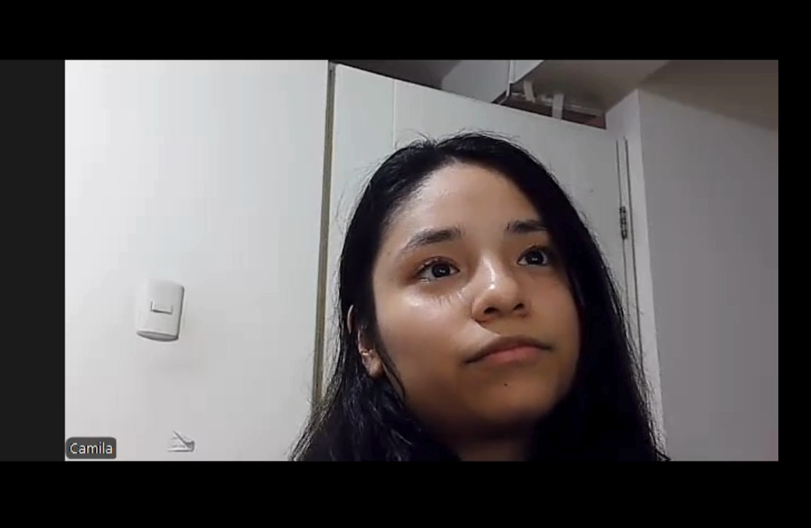

    <h1>UNIVERSIDAD PERUANA  DE CIENCIAS APLICADAS</h1>
        
    <h2>1ACC0238 - Aplicaciones para Dispositivos Móviles</h2>
        
<strong>NRC:</strong> 353

        
<strong>Carrera:</strong> Ingeniería de Software

        
<strong>Ciclo:</strong> 6

        
<strong>Profesor:</strong> Jorge Luis Mayta Guillermo

    <h3>"Informe de Trabajo Final"</h3>
    <h4>TB1</h4>
        
<strong>Tema:</strong> Gestion de ganaderia 

        
<strong>Producto:</strong> VacApp de Bovinova

        
<strong>Abril 2025</strong>

    <h3>Integrantes:</h3>
        <ul>
            <li>Gómez Vallejos, Sergio André - U20221D401</li>
            <li>Rojas Velasquez, Maycol Jhordan - U202219984</li>
            <li>Aranda Vallejos, Oscar Gabriel - U202218167</li>
            <li>Ticona Panduro, Estrella del Pilar - U202210659</li>
            <li>Durand Vera, Gianfranco Angel - U20201f640</li>
            <li>Miranda Sinarahua, Piero Stephano - U20181g752</li>
        </ul>

  <strong>Registro de versiones de informe:</strong> 

| Entregables | Fecha       | Autor                             | Descripción de modificación                                                                                      |  
|-------------|-------------|-----------------------------------|------------------------------------------------------------------------------------------------------------------|

**Project Report Collaboration Insights**

### URL del Repositorio 
https://github.com/orgs/Bovinova/repositories

  Tabla de contenido
  

1. [CAPÍTULO I: Presentacion](#CAPÍTULO-I-Introducción) 
    1.1. [Startup Profile](#Startup-Profile) 
      1.1.1. [Descripción de la Startup](#Descripción-de-la-Startup) 
      1.1.2. [Perfiles de integrantes del equipo](#Perfiles-de-integrantes-del-equipo) 
   1.2. [Solution Profile](#Solution-Profile) 
      1.2.1. [Antecedentes y problemática](#Antecedentes-y-problemática) 
      1.2.2. [Lean UX Process](#Lean-UX-Process) 
        1.2.2.1 [Lean UX Problem Statements](#Lean-UX-Problem-Statements) 
        1.2.2.2 [Lean UX Assumptions](#Lean-US-Assumptions) 
        1.2.2.3 [Lean UX Hypothesis Statements](#Lean-UX-Hypothesis-Statements) 
        1.2.2.4 [Lean UX Canvas](#Lean-UX-Canvas)  
    1.3. [Segmentos objetivo](#Segmentos-objetivo)  
2. [CAPÍTULO II: Requirements Elicitation & Analysis](#Capítulo-II-Requirements-Elicitation--Analysis)  
   2.1. [Competidores](#Competidores)  
      2.1.1. [Análisis competitivo](#Análisis-competitivo)  
      2.1.2. [Estrategias y tácticas frente a competidores](#Estrategias-y-tácticas-frente-a-competidores)  
   2.2. [Entrevistas](#Entrevistas)  
      2.2.1. [Diseño de entrevistas](#Diseño-de-entrevistas)  
      2.2.2. [Registro de entrevistas](#Registro-de-entrevistas)  
      2.2.3. [Análisis de entrevistas](#Análisis-de-entrevistas)  
   2.3. [Needfinding](#Needfinding)  
      2.3.1. [User Personas](#User-Personas)  
      2.3.2. [User Task Matrix](#User-Task-Matrix)  
      2.3.3. [User Journey Mapping](#User-Journey-Mapping)  
      2.3.4. [Empathy Mapping](#Empathy-Mapping)  
      2.3.5. [As-is Scenario Mapping](#As-is-Scenario-Mapping)  
   2.4. [Ubiquitous Language](#Ubiquitous-Language)  
3. [CAPÍTULO III: Requirements Specification](#Capítulo-III-Requirements-Specification)  
   3.1. [To-Be Scenario Mapping](#To-Be-Scenario-Mapping)  
   3.2. [User Stories](#User-Stories)  
   3.3. [Impact Mapping](#Impact-Mapping)  
   3.4. [Product Backlog](#Product-Backlog)  
4. [CAPÍTULO IV: Solution Software Design](#capítulo-iv-solution-software-design)  
   4.1. [Strategic-Level Domain-Driven Design](#strategic-level-domain-driven-design)  
      4.1.1. [EventStorming](#eventstorming)  
         4.1.1.1. [Candidate Context Discovery](#candidate-context-discovery)  
         4.1.1.2. [Domain Message Flows Modeling](#domain-message-flows-modeling)  
         4.1.1.3. [Bounded Context Canvases](#bounded-context-canvases)  
      4.1.2. [Context Mapping](#context-mapping)  
      4.1.3. [Software Architecture](#software-architecture)  
         4.1.3.1. [Software Architecture Context Level Diagrams](#software-architecture-context-level-diagrams)  
         4.1.3.2. [Software Architecture Container Level Diagrams](#software-architecture-container-level-diagrams)  
         4.1.3.3. [Software Architecture Deployment Diagrams](#software-architecture-deployment-diagrams)  
   4.2. [Tactical-Level Domain-Driven Design](#tactical-level-domain-driven-design)  
      4.2.X. [Bounded Context: &lt;Bounded Context Name&gt;](#bounded-context-bounded-context-name)  
         4.2.X.1. [Domain Layer](#domain-layer)  
         4.2.X.2. [Interface Layer](#interface-layer)  
         4.2.X.3. [Application Layer](#application-layer)  
         4.2.X.4. [Infrastructure Layer](#infrastructure-layer)  
         4.2.X.5. [Bounded Context Software Architecture Component Level Diagrams](#bounded-context-software-architecture-component-level-diagrams)  
         4.2.X.6. [Bounded Context Software Architecture Code Level Diagrams](#bounded-context-software-architecture-code-level-diagrams)  
            4.2.X.6.1. [Bounded Context Domain Layer Class Diagrams](#bounded-context-domain-layer-class-diagrams)  
            4.2.X.6.2. [Bounded Context Database Design Diagram](#bounded-context-database-design-diagram)  

   # STUDENT OUTCOME
El curso contribuye al cumplimiento del Student Outcome ABET: 
##### ABET – EAC - Student Outcome 7 
Criterio: La capacidad de adquirir y aplicar nuevos conocimientos según sea
necesario, utilizando estrategias de aprendizaje apropiadas.

| **Criterio específico** | **Acciones realizadas** | **Conclusiones** |  
|-------------------------|------------------------|------------------|  
| Actualiza conceptos y conocimientos necesarios para su desarrollo profesional y en especial para su proyecto en soluciones de software | 1. Gómez Vallejos, Sergio André ------    2. Rojas Velasquez, Maycol Jhordan ------    3. Aranda Vallejos, Oscar Gabriel ------    4. Ticona Panduro, Estrella del Pilar ------    5. Durand Vera, Gianfranco Angel:  TB1   Realice las capas de Domain e Interface, además de el Component Level Diagrams, para el Bounded Context Staff Administration, asi como entrevistas hacia el segundo segmento    6. Miranda Sinarahua, Piero Stephano ------    |------- |  
| Reconoce la necesidad del aprendizaje permanente para el desempeño profesional y el desarrollo de proyectos en soluciones de software |  1. Gómez Vallejos, Sergio André ------    2. Rojas Velasquez, Maycol Jhordan ------    3. Aranda Vallejos, Oscar Gabriel ------    4. Ticona Panduro, Estrella del Pilar ------    5. Durand Vera, Gianfranco Angel:  TB1   Durante esta entrega, comprendí la importancia del aprendizaje permanente en mi desarrollo profesional y en la creación de soluciones de software efectivas. Al desarrollar declaraciones de problemas y suposiciones bajo Lean UX, reforcé mi compromiso con la actualización constante de conocimientos para garantizar que cada proyecto se ejecute con la máxima eficiencia y calidad.    6. Miranda Sinarahua, Piero Stephano ------    | ---- |

# OBJETIVOS SMART

| Estudiante | Objetivo SMART |
|------------|-----------|
|Maycol Jhordan Rojas Velasquez | Mi Objetivo es poder alcanzar un desempeño profesional en analisis forense y en el diseño de nuevas apliaciones moviles, que ayuden en la sociedad, siguiendo todo lo aprendido y gestionando correctamente las buenas practicas. |
| Gianfranco Durand Vera | Mi objetivo es profundizar en el uso de la arquitectura clean en el desarrollo de aplicaciones móviles con el fin de construir aplicaciones robustas y escalables que mejoren la experiencia de usuario y la eficiencia de los productos digitales. |

# 1. CAPÍTULO I: Presentacion
## 1.1. Startup Profile
### 1.1.1. Descripción de la Startup

__Nombre del Start:__ VacApp

VacApp es una avanzada aplicación movil diseñada para capacitar a los ganaderos en la gestión eficiente y sostenible de su ganado. Esta plataforma ofrece una amplia gama de herramientas integrales que permiten a los usuarios realizar un seguimiento detallado de la salud, alimentación y reproducción de sus animales, lo que facilita una mejor toma de decisiones en la granja. Con PecuarioPro, los ganaderos pueden optimizar sus operaciones y maximizar sus ingresos, al tiempo que promueven prácticas agrícolas sostenibles y éticas, lo que contribuye al bienestar de los animales y al desarrollo sostenible de la industria ganadera.

### **Colaboraciones Estrategicas:**

En Bovinova, estamos comprometidos a establecer solidad alianzas con cadenas de ganaderia, pequeños ganaderos y empresas ganaderas. Trabajamos en estrecha colaboración con estos socios para garantizar que nuestras soluciones tecnológicas respondan a sus necesidades operativas, facilitando la gestión diaria y mejorando la satisfacción del cliente. Invitamos a los ganaderos a integrar nuestras soluciones para optimizar la administración de ganado, la gestión de alimentacion, y la atención al cliente, creando una experiencia más fluida y eficiente.

### **Innovación y Tecnología**
Nuestra plataforma utiliza tecnologías avanzadas para ofrecer una experiencia optimizada en la gestión ganadera. Desde el monitoreo de la salud, alimentación y reproducción del ganado, hasta la automatización de procesos clave en la granja, **VacApp** busca transformar la forma en que los ganaderos administran sus actividades diarias. Queremos que cada productor pecuario se sienta respaldado por una solución tecnológica que le permita tomar decisiones informadas, mejorar la eficiencia operativa y promover una producción sostenible y ética.

### **Comunidad y Funciones Sociales**
**VacApp** no es solo una herramienta de gestión; es también un espacio de aprendizaje y colaboración entre ganaderos. La plataforma incluye funciones que permiten a los usuarios compartir buenas prácticas, estrategias de manejo y mantenerse actualizados con las últimas innovaciones en el sector pecuario. Esta comunidad activa fomenta la mejora continua, el intercambio de conocimientos y el fortalecimiento de una red ganadera comprometida con el desarrollo sostenible y el bienestar animal.

### **Visión**
Visualizamos un mundo donde la tecnología y la ganadería se integran para impulsar una producción más eficiente, responsable y rentable. Nuestro objetivo es que **VacApp** sea sinónimo de innovación en el manejo ganadero, un aliado indispensable para los productores que desean evolucionar hacia un modelo más moderno, conectado y sostenible. Aspiramos a liderar una transformación positiva en la industria, basada en la tecnología, la ética y el compromiso con el campo.

### **Misión**
Nos esforzamos por ofrecer una plataforma integral que empodere a los ganaderos con herramientas inteligentes de gestión, mejorando su productividad y calidad de vida. Estamos decididos a utilizar la tecnología como motor de cambio en el sector pecuario, contribuyendo al bienestar animal, la sostenibilidad ambiental y el desarrollo económico de las comunidades rurales. **VacApp**, impulsado por **Bovinova**, será símbolo de excelencia, innovación y compromiso con el futuro de la ganadería.

### 1.1.2. Perfiles de integrantes del equipo

| Integrante | Descripción |
| ---- | --- |
|  | Sergio André Gómez Vallejos – Ingeniería de Software – u20221d401   Soy una persona resiliente que, sin importar cuántas veces caiga, siempre encuentra la manera de levantarse. Tengo habilidades sociales sólidas y una amplia experiencia en la resolución de problemas de código. Suelo ser el miembro más activo de mi equipo de trabajo. Me apasionan los lenguajes de programación y la tecnología, y constantemente me esfuerzo por alcanzar mis objetivos y contribuir al desarrollo del startup. |
|  |Aranda Vallejos, Oscar Gabriel - U202218167   |
||Maycol Jhordan Rojas Velasquez – Ingeniería de Software – u202219984 Elegí la carrera de Ingeniería de Software debido a mi gusto por la innovación y la implementación de la tecnología en cualquier rubro  social, de una manera creativa y en todos los aspectos. Me considero una persona creativa, en busca de ideas, estrategias con mente nueva. También me gusta escuchar ideas de mi equipo, dar ideas de mejora, evaluar las ventajas y desventajas . Además, tengo conocimientos de programación en C + +, HTML, Python,Angular,Backend en Java. Además, Tengo un enfoque responsable y dedicado mediante un aprendizaje rápido así puedo ayudar a mis compañeros en sus dudas. Por otro lado, mis hobbies son ver series, jugar , escuchar música, nadar y  manejar.|
| | Ticona Panduro, Estrella del Pilar - U202210659   |
|  | Durand Vera, Gianfranco Angel - U20201f640   Soy estudiante de la carrera de Ingeniería de Software en la Universidad Peruana de Ciencias Aplicadas, actualmente me encuentro en el septimo ciclo, escogí esta carrera porque me gusta mucho la programación. Tengo experiencia en lenguajes de programación como C#, Python, Kotlin y TypeScript.|
|| Miranda Sinarahua, Piero Stephano - U20181g752   | 

## 1.2. Solution Profile
## 1.2.1 Antecedentes y problemática

### 1.2.2. Lean UX Process
#### 1.2.2.1. Lean UX Problem Statements

En un entorno donde los pequeños y medianos productores pecuarios dependían de métodos manuales y poco eficientes para gestionar la información de su ganado, nuestra aplicación móvil **VacApp** se destacó al ofrecer una solución moderna, accesible y optimizada para el trabajo en campo.
Esta propuesta atrajo inicialmente a ganaderos que buscaban digitalizar sus operaciones y mejorar su productividad.
Sin embargo, con el tiempo, el mercado ha comenzado a saturarse debido al ingreso de nuevos competidores con soluciones móviles similares y mayor presupuesto.
Esto ha generado un aumento en los costos de adquisición de nuevos usuarios, un estancamiento en nuestra participación de mercado y mayores exigencias en soporte, lo cual afecta nuestra rentabilidad y limita la inversión en nuevas funcionalidades.

#### 1.2.2.2. Lean UX Assumptions

**User Assumptions**

1. Los ganaderos, sin importar su nivel tecnológico, valorarán una app móvil fácil de usar, con interfaz intuitiva y accesible desde diferentes dispositivos.

2. Los usuarios están dispuestos a adoptar tecnología si les permite ahorrar tiempo y mejorar la gestión de su ganado.

3. Los usuarios usarán la aplicación incluso en áreas de baja conectividad si funciona correctamente offline.

4. Los usuarios confiarán en la app si ven beneficios concretos en su productividad y en la salud del ganado.

5. Los ganaderos prefieren soluciones prácticas y rápidas, por lo tanto, las funciones más utilizadas deben estar siempre accesibles con pocos pasos.

**Business Assumptions**

1. Si digitalizamos los registros del ganado, los usuarios podrán mejorar la organización y el control de su inventario animal.

2. Si ofrecemos recordatorios automáticos y herramientas para gestionar la salud del ganado, los ganaderos reducirán los costos por enfermedades y mejorarán el bienestar animal.

3. Si proporcionamos herramientas para planificar la alimentación, los productores optimizarán el uso de recursos y reducirán desperdicios.

4. Si permitimos un seguimiento eficiente de la fertilidad y reproducción, los ganaderos incrementarán la productividad de sus animales.

5. Si ofrecemos una experiencia fluida y confiable en dispositivos móviles incluso sin conexión, mejoraremos la adopción en zonas rurales con conectividad limitada.

6. Si garantizamos privacidad y seguridad de los datos, los usuarios confiarán más en la plataforma y estarán dispuestos a almacenar información crítica en ella.

#### 1.2.2.3. Lean UX Hypothesis Statements

1. **Creemos que** los ganaderos valorarán una app fácil de usar con interfaz intuitiva,
**porque** podrán gestionar su ganado sin necesidad de capacitación extensa.
**Lo sabremos** cuando al menos el 70% complete el registro de animales en su primer uso sin asistencia.

2. **Creemos que** los usuarios adoptarán la aplicación si les permite ahorrar tiempo en tareas diarias,
**porque** desean enfocarse en actividades productivas más que en tareas administrativas.
**Lo sabremos** cuando se reduzca en un 40% el tiempo promedio que reportan en registros manuales.

3. **Creemos que** los ganaderos en zonas rurales usarán la app si funciona offline,
**porque** tienen conectividad limitada en sus áreas de trabajo.
**Lo sabremos** cuando el 60% de los usuarios active la app en modo sin conexión al menos una vez por semana.

4. **Creemos que** los usuarios confiarán en la plataforma si garantizamos la privacidad de sus datos,
**porque** manejan información sensible sobre su producción y operaciones.
**Lo sabremos** cuando menos del 5% exprese preocupaciones sobre seguridad en encuestas de retroalimentación.

5. **Creemos que** si destacamos funciones clave como salud animal, alimentación y reproducción,
**los usuarios las usarán frecuentemente** para gestionar su ganado.
**Lo sabremos** cuando estas funciones representen al menos el 70% del uso total dentro de la app.

6. **Creemos que** los usuarios percibirán beneficios concretos en productividad y salud del ganado,
**porque** tendrán herramientas para tomar decisiones informadas.
**Lo sabremos** cuando el 60% reporte mejoras en rendimiento animal tras tres meses de uso.

#### 1.2.2.4. Lean UX Canvas

## 1.3. Segmentos objetivo

### Descripción de cada segmento objetivo:

La aplicación VacApp ha sido diseñada pensando en las diversas realidades del sector ganadero peruano, abarcando tanto a pequeños productores independientes como a grandes empresas dedicadas a la actividad pecuaria. Cada segmento presenta necesidades, objetivos y desafíos específicos que nuestra plataforma busca atender con soluciones tecnológicas prácticas, accesibles y sostenibles.

A continuación, se detalla el perfil de nuestros principales segmentos objetivos, identificando sus características, motivaciones y problemáticas, con el fin de adaptar y mejorar constantemente nuestros servicios para ofrecerles el mayor valor posible.

#### Productores Ganadores independientes:
Este segmento objetivo de nuestra plataforma se centra en los ganaderos independientes comprometidos y preocupados por obtener ganancias de manera ética y sostenible, mientras garantizan una excelente calidad en el cuidado de sus animales en propiedad. Este grupo comprende a ganaderos que poseen una variedad de animales, tales como ovejas, vacas, reses, corderos, gallinas, entre otros, y que residen en Perú. Su principal objetivo es asegurarse de que el estado y cuidado de sus animales sea óptimo, priorizando el bienestar y la salud de estos. Además, están interesados en llevar a cabo prácticas de venta honestas, con un enfoque en productos más naturales y de alta calidad. Como obtener información de nuevos métodos de cuidado animal.

#### Empresas Ganaderas:
El segmento objetivo de nuestra plataforma se dirige específicamente a grandes empresas corporativas involucradas en la gestión y cuidado de animales. Estas empresas se destacan por su firme compromiso con prácticas éticas y sostenibles en la producción ganadera. Su principal preocupación radica en garantizar que sus animales reciban una alimentación precisa, óptima y honesta, priorizando la salud y el bienestar de cada individuo. Asimismo, estas empresas se preocupan por brindar un cuidado individual a cada animal, asegurándose de que reciban la atención necesaria para su desarrollo y bienestar. Asimismo, contar con un sistema integral de gestión veterinaria, que garantiza un acceso constante y adecuado a servicios de atención médica veterinaria para sus animales.

### Datos cuantitativos del problema:

#### Productores Ganadores independientes:
Se han registrado numerosos incidentes en los que los productores ganaderos peruanos no reciben una compensación justa en los mercados, y enfrentan dificultades significativas en la gestión del cuidado de sus animales debido a la escasez de recursos económicos y la limitada accesibilidad a servicios veterinarios para consultas y atención adecuada. Estas circunstancias han creado desafíos sustanciales para los ganaderos, quienes luchan por mantener la salud y el bienestar de sus animales mientras buscan asegurar su propio sustento económico en un entorno cada vez más desafiante y competitivo. Se estima que al menos el 15% de los animales muertos en las granjas se debe a la falta de acceso oportuno a servicios veterinarios adecuados, lo que genera pérdidas económicas significativas para los productores, estimadas en un 20% de sus ingresos anuales debido a la falta de compensación justa de los mercados hacia ellos.

#### Empresas Ganaderas:
En el Perú, el bienestar animal en las empresas ganaderas es a menudo insuficiente, con un preocupante porcentaje del 60% de las operaciones que no cumplen con estándares aceptables en este aspecto. Esta deficiencia se refleja en condiciones de vida inadecuadas para el ganado, como la falta de espacio y la alimentación deficiente, lo que afecta negativamente su salud y bienestar. Además, la gestión de residuos en estas empresas es inadecuada en aproximadamente un 70% de los casos, lo que resulta en una incorrecta disposición de los desechos animales y una potencial contaminación del medio ambiente. Esta situación representa un desafío significativo para la industria ganadera, ya que no solo compromete el bienestar de los animales, sino que también puede tener repercusiones negativas en la salud pública y el medio ambiente.

### Variables geográficas, demográficas y psicológicas:

#### Variable geográfica:
- País: Perú
- Ciudad: zonas rurales 

#### Variable demográfica:
- Género: Femenino / Masculino.
- Ocupación: Productores ganaderos 
- Estado civil: Todos los estados
- Edad y etapa de ciclo de vida:
- Ciudadanos mayores a 18 años.

#### Variable psicográfica:
- Nivel Socioeconómico (NSE): todos los niveles socioeconomicos
- Características de personalidad:
 - Altruismo 
 - Perseverante
 - Honestidad

# 2. CAPÍTULO II: Requirements Elicitation & Analysis
## 2.1. Competidores
### 2.1.1. Análisis competitivo
### 2.1.2. Estrategias y tácticas frente a competidores

## 2.2. Entrevistas
### 2.2.1. Diseño de entrevistas
### 2.2.2. Registro de entrevistas

**Segmento #2: Empresas Ganaderas**

*Entrevistada:* Camila Sanchez 
*Sexo:*  Femenino 
*Edad:* 23 
*Inicio de la Entrevista:*  
*Duración de la Entrevista:*  

*Resumen de la Entrevista*:

Camila Sánchez, de 23 años, cuenta con cinco años de experiencia como trabajadora en el sector ganadero. Actualmente participa en la gestión de una empresa con más de 2000 cabezas de ganado, número que puede variar según nacimientos o ventas estacionales. La gestión actual se basa mayormente en registros manuales y hojas de Excel, lo cual genera errores y retrasos.

Camila considera fundamental contar con una plataforma digital que centralice la información, mejore la coordinación del personal y permita una mejor toma de decisiones. Entre los retos más importantes que enfrentan están la gestión de recursos, el bienestar animal y la rentabilidad del negocio.

En cuanto a funcionalidades deseadas, menciona la planificación de tareas, seguimiento del desempeño del personal, generación de reportes, comunicación interna y gestión de incidentes. También valora informes sobre producción, análisis de costos, salud animal y herramientas para identificar áreas de mejora.

Para la interacción con proveedores, ve útil una plataforma que facilite la comunicación, el seguimiento de pedidos, la gestión de inventarios y la negociación. Finalmente, destaca la importancia de que la plataforma se adapte a sus procesos y sea personalizable en aspectos como roles, alertas, datos del ganado e informes, con el fin de mejorar la eficiencia y reducir errores, siempre priorizando el bienestar animal y la rentabilidad.

### 2.2.3. Análisis de entrevistas

## 2.3. Needfinding
### 2.3.1. User Personas
### 2.3.2. User Task Matrix
### 2.3.3. User Journey Mapping
### 2.3.4. Empathy Mapping
### 2.3.5. As-is Scenario Mapping

## 2.4. Ubiquitous Language

# 3. CAPÍTULO III: Requirements Specification
## 3.1. To-Be Scenario Mapping
## 3.2. User Stories
## 3.3. Impact Mapping
## 3.4. Product Backlog

# 4. CAPÍTULO IV: Solution Software Design
## 4.1. Strategic-Level Domain-Driven Design
### 4.1.1. EventStorming
#### 4.1.1.1. Candidate Context Discovery

#### 4.1.1.2. Domain Message Flows Modeling

#### 4.1.1.3. Bounded Context Canvases
### 4.1.2. Context Mapping
### 4.1.3. Software Architecture
#### 4.1.3.1. Software Architecture Context Level Diagrams
#### 4.1.3.2. Software Architecture Container Level Diagrams
#### 4.1.3.3. Software Architecture Deployment Diagrams

## 4.2. Tactical-Level Domain-Driven Design
### 4.2.3. Bounded Context: Staff Administration
#### 4.2.3.1. Domain Layer

| **Clase**             | **Tipo**        | **Propósito**                                                                                 |
|-----------------------|-----------------|-----------------------------------------------------------------------------------------------|
| StaffMember           | Entity          | Representa al empleado ganadero con atributos como id, nombre, rol, estado, campaña asignada. |
| EmployeeStatus        | Value Object    | Define el estado del empleado: activo, eliminado, pendiente.                                  |
| IStaffRepository      | Interface       | Expone métodos para registrar, editar, eliminar y listar empleados.                           |
| StaffDomainService    | Domain Service	| Aplica reglas como validación de estado antes de eliminar o actualizar.                       |

#### 4.2.3.2. Interface Layer

| **Clase**              | **Tipo**     | **Propósito**                                                                 |
|------------------------|--------------|-------------------------------------------------------------------------------|
| AddStaffViewModel      | ViewModel    | Coordina el registro del empleado y maneja eventos desde el formulario.      |
| SearchStaffViewModel   | ViewModel    | Gestiona los criterios de búsqueda y presenta los resultados.                |
| EditStaffViewModel     | ViewModel    | Muestra datos actuales del empleado y permite su modificación.               |
| DeleteStaffViewModel   | ViewModel    | Lógica para confirmar y ejecutar la eliminación de un empleado.             |
| StaffListPage          | Screen       | Muestra lista de empleados filtrables por nombre y estado.                   |
| StaffRegistrationPage  | Screen       | Formulario de registro de un nuevo miembro del staff.                        |
| StaffController        | Controller   | Coordina la lógica de negocio relacionada al staff y comunica con los ViewModels. |

#### 4.2.3.3. Application Layer
#### 4.2.3.4. Infrastructure Layer
#### 4.2.3.5. Bounded Context Software Architecture Component Level Diagrams

#### 4.2.3.6. Bounded Context Software Architecture Code Level Diagrams
##### 4.2.3.6.1. Bounded Context Domain Layer Class Diagrams
##### 4.2.3.6.2. Bounded Context Database Design Diagram

